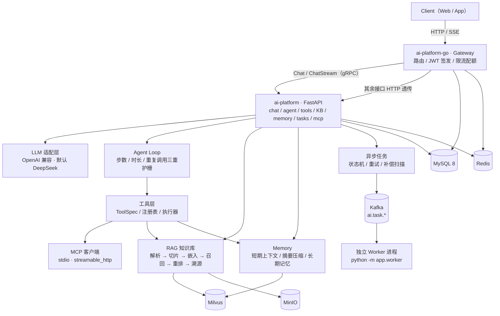

# Personal AI Assistant｜个人智能 Agent 平台

> 基于 **Go + Python** 分层构建的个人智能 AI Assistant 平台。
> Go 侧负责 API 网关、用户与会话台账、AI 调用编排、配额限流与 JWT 签发；
> Python 侧负责 LLM 应用能力 —— Agent 工具调用、RAG 知识库、Memory、MCP 外部工具接入与异步任务。
>
> 两侧按「**一份数据只有一个权威属主**」切分，通过 HTTP + SSE（默认）与 gRPC（`Chat` / `ChatStream`）衔接，
> 使 AI 服务可以**独立启动、独立压测、独立验收**。

**简介** | [架构](#架构) | [技术栈](#技术栈) | [已实现能力](#已实现能力) | [质量门禁](#质量门禁) | [快速开始](#快速开始) | [文档索引](#文档索引) | [现状与差距](#现状与差距)

| 子项目 | 语言 / 框架 | 职责 | 当前状态 |
| --- | --- | --- | --- |
| [`ai-platform`](./ai-platform) | Python 3.12 / FastAPI + LangChain | LLM 编排、Agent、RAG、Memory、MCP、异步任务、可观测 | ✅ **已交付**（M1–M8） |
| [`ai-platform-go`](./ai-platform-go) | Go 1.24 / Gin + Kratos(gRPC) | 对外网关、用户与鉴权、会话与消息台账、AI 编排、配额限流 | ✅ **已交付**（M1–M6） |

---

## 架构



**分层与数据权威归属**（完整表见 [`ai-platform-go/README.md`](./ai-platform-go/README.md) §1.2）：

| 数据 / 能力 | 权威属主 | 说明 |
| --- | --- | --- |
| 用户、凭据、刷新令牌 | **Go** | Python 不感知，只读 JWT 的 `sub` 作为 `user_id` |
| 会话 `conversation`、消息台账 `message` | **Go** | Python 仅持有 `conversation_id` 引用，不建表 |
| 对话摘要、短期上下文（`ctx:{id}`）、长期记忆 | **Python** | Go 侧透传，不碰该 Key 空间 |
| 知识库 / 文档 / 切片元数据、AI 任务 `task` | **Python** | Go 侧透传 + 配额校验，无本地副本 |
| 原始文件（MinIO）、向量（Milvus）、消息队列（Kafka） | **Python 独占** | Go 侧不引入这三个客户端 |
| 配额、用量、计费 | **Go** | Python 只上报 `usage`，不扣减 |

> 两侧共用同一个 MySQL 库（`ai_platform`，合计 15 张表），但**每张表只有一个建表脚本来源**：
> AI 独占 7 张 + 共享 2 张在 [`ai-platform/deploy/mysql`](./ai-platform/deploy/mysql)，
> 网关独占 6 张在 [`ai-platform-go/deploy/mysql`](./ai-platform-go/deploy/mysql)。

---

## 技术栈

### Go 网关层（`ai-platform-go`，已实现）

下表按 `go.mod` 的**直接依赖**与代码实际引用核对（不是设计文档的愿望清单）：

| 层次 | 选型 | 说明 |
| --- | --- | --- |
| 语言 | **Go 1.24** | `go.mod` 固定 `go 1.24.0`；本机 1.24.8。**不要上调该行**——会触发 `GOTOOLCHAIN=auto` 联网下载新工具链，并连带要求升级 `x/crypto`、`x/net`、`gin` 等一串依赖 |
| 对外 HTTP / SSE | **Gin v1.11.0** | 路由、中间件链、错误信封、SSE 全部由 Gin 承担 |
| 对内 gRPC 客户端 | **Kratos v2.8.4**（**仅**用于拨号） | 只有 `internal/data/ai/grpc.go` 引用它，用于 `Chat` / `ChatStream` 的 `DialInsecure`；对外 HTTP 不经过 Kratos，也不存在「Gin 套 Kratos HTTP server」 |
| ORM / 关系库 | **GORM v1.31.2** + `driver/mysql` | 业务台账（用户 / 会话 / 消息 / 用量） |
| 缓存 / 限流 / 配额 | **`redis/go-redis/v9` v9.22.0** | 独立 Key 前缀，不与 Python 的 `ctx:` / `lock:` / `rate:` 重名 |
| 鉴权 | **`golang-jwt/jwt/v5` v5.3.1** | HS256，自研 claims；JWT 由网关**签发**，Python 只校验 |
| 口令哈希 | `golang.org/x/crypto` | argon2id |
| ID | `oklog/ulid/v2` | 会话 / 消息 ID |
| 配置 | **`joho/godotenv` + 环境变量** | `.env` 由 `ENV_FILE` 指定绝对路径，启动时校验；**未引入** Nacos / viper / YAML 配置 |
| 可观测 | **OpenTelemetry Go SDK v1.31.0** + **Prometheus client_golang v1.21.1** | OTLP(gRPC) 导出 + `gw_*` 指标；指标走**独立端口**，主应用不暴露 `/metrics` |
| 测试 | **标准库 `testing`** | 30 个 `*_test.go` / 234 个 `Test*`；**未引入** testify 或 testcontainers-go，真基础设施用例靠环境变量开关（`GW_LIVE_REDIS` 等） |

### Python AI 服务层（`ai-platform`，已实现）

| 层次 | 选型 | 说明 |
| --- | --- | --- |
| 语言 | **Python 3.12** | `torch` / `transformers` / `FlagEmbedding` 对更高版本适配尚不完整，故由 `.python-version` 固定 |
| Web 框架 | **FastAPI** + Uvicorn | 全异步；`create_app(settings)` 支持注入配置，便于多实例验收 |
| 校验 / 配置 | **Pydantic v2** + pydantic-settings | 配置唯一来源 `app/core/config.py`，启动期 `validate_for_startup()` |
| LLM 编排 | **LangChain** + **LangGraph** | 主链路为自研 Agent Loop；`langgraph` 状态图保留为占位 |
| LLM 供应商 | **OpenAI 兼容协议** | 默认 DeepSeek；换 Moonshot / 百炼 / 本地 vLLM 只改 `base_url` + 模型名 |
| 向量化（Embedding） | **硅基流动云端 API**（默认，OpenAI 兼容、真批量）/ 火山方舟多模态 / Transformers + Sentence Transformers（本地档） | 默认 `Qwen/Qwen3-Embedding-0.6B`（1024 维，不占本机算力）；本地档 `BAAI/bge-m3`（1024 维） |
| 重排序（Rerank） | **硅基流动云端 `/v1/rerank`**（默认）/ **FlagEmbedding**（本地档） | 默认 `Qwen/Qwen3-Reranker-0.6B`（20 条候选 320ms）；本地档 `BAAI/bge-reranker-v2-m3` |
| 向量库 | **Milvus**（PyMilvus + langchain-milvus） | 知识库切片集合 + 长期记忆集合，标量倒排索引支撑多租户过滤 |
| 文档解析 | pypdf / python-docx / BeautifulSoup4 / Markdown | PDF · DOCX · Markdown · HTML · TXT，扩展名 + 魔数双校验 |
| 工具协议 | **MCP Python SDK** | `stdio` 与 `streamable_http` 两种传输，命名空间 `mcp__{server}__{tool}` |
| 流式输出 | **SSE** | 自研帧构造 + 心跳 + 断连收尾；`curl -N` 可直接观察逐段到达 |
| 鉴权 | PyJWT（HS256） | 仅校验 Go 侧签发的 JWT |
| 对内 gRPC 服务端 | **grpcio / grpcio-tools** | `python -m app.grpc`，实现 `Chat` / `ChatStream`；默认关闭（`GRPC_ENABLED=false`）且只监听回环 |
| 关系库 | **MySQL 8** + SQLAlchemy Core（asyncmy） | 异步驱动；连接池按 DSN 进程内共享 + 引用计数销毁 |
| 缓存 / 任务态 | **Redis** | 短期上下文（LTRIM + TTL）、幂等键、退避重试 ZSET、pub/sub 事件总线 |
| 消息队列 | **Kafka**（aiokafka） | `ai.task.<type>` 主题，由独立 Worker 进程消费 |
| 对象存储 | **MinIO** | 原始文档字节流 |
| 可观测性 | **OpenTelemetry** SDK + OTLP(gRPC)、**Prometheus** Client | Jaeger 链路（trace id 与日志/响应头同值）+ 独立指标端口 + Grafana 看板；19 个 `ai_*` 指标 |
| 依赖 / 环境 | **uv** | `uv.lock` 锁定，`--extra redis/kafka/mysql/minio` 按需装可选依赖 |
| 质量门禁 | **ruff** + **mypy** + **pytest**(asyncio / cov) | 见 [`质量门禁`](#质量门禁) |

### 基础设施与工程化

| 类别 | 选型 |
| --- | --- |
| 容器化与本地编排 | **Docker Compose**（Redis / Kafka / MySQL / Milvus / MinIO / Jaeger / Prometheus / Grafana 一键起） |
| 部署目标 | Kubernetes（Deployment + Service，水平扩展）—— 设计目标，仓库内暂无清单 |
| 链路追踪 | OpenTelemetry → Jaeger |
| 指标与看板 | Prometheus → Grafana（Provisioning 自动加载数据源与看板） |
| 契约真源 | `ai-platform-go/proto/aiplatform/v1/chat.proto`，两侧各自生成；生成物不手改，也不参与 lint |

---

## 已实现能力

### Go 网关（`ai-platform-go`）

- **认证与用户**：注册 / 登录 / 刷新 / 登出，argon2id 口令哈希，JWT（HS256）签发，
  刷新令牌轮换与「旧令牌重放即失效」。
- **会话与消息台账**：会话 CRUD、归档、软删除、自动标题；消息按 `seq` 单调递增落库，
  是**消息事实的唯一属主**（Python 不建表）。
- **AI 调用编排**：`Chat` 走 gRPC 一元调用，`ChatStream` 走 gRPC 服务端流；
  网关负责首帧改写（`conversation_id` / `message_id` 由 Go 生成）、断连传播、`partial` 落库。
- **字节级透传**：知识库 / 文档 / 上传 / 记忆 / 工具 / MCP / 任务 / 模型等接口以 HTTP 透传方式转发给
  `ai-platform`，并在透传前做配额校验；网关**不引入** Milvus / MinIO / Kafka 客户端。
- **配额与限流**：5 维限流 + 配额预扣与回滚 + 三态熔断器；`413` 由 `Content-Length` 判定，
  不读请求体；伪造 `X-Forwarded-For` 仍会被限流。
- **可观测性**：OTel 尾采样、`gw_*` 指标走独立端口、日志脱敏、留存（retention）定时任务。
- **中间件链**（顺序固定）：`recovery → trace/otel → logging → metrics → cors → 幂等键 → 鉴权 → 限流`。

### Python AI 服务（`ai-platform`）

- **对话与流式输出**：`POST /chat`（非流式）与 `POST /chat/stream`（SSE：`meta → reference* → token* → usage → done`）；
  上下文按 `system → memory → summary → history → rag → query` 确定性装配，并在 token 预算内裁剪；回答中的 `[n]` 与 `references[].index` 打通实现**来源溯源**。
- **Agent 工具调用循环**：`app/agent/loop.py` 实现「推理 → 工具调用 → 结果回注 → 再推理」，
  带**步数 / 总时长 / 重复调用**三重护栅，产出完整 `tool_calls` 轨迹与降级原因；`use_tools=true` 时对话请求自动转交 Agent 链路。
- **工具层**：`ToolSpec` + 注册表（重名 fail-fast）+ 执行器（读并发 / 写串行、超时、结果截断、错误归一）
  + 6 个内置工具（`kb_retrieve` / `calculator` / `current_time` / `http_fetch` / `memory_save` / `memory_search`）。
  工具参数以 pydantic 模型为**单一事实来源**（`model_json_schema()`），参数不合法作为「可回复的结果」回注给模型而非报错。
- **MCP 接入**：配置校验（`${VAR}` 展开、未知字段报错）、`stdio` 与 `streamable_http` 两种传输、
  多 Server 并发启动与总超时、单 Server 状态机（懒重连 + 行内熔断）、工具命名空间与 allow/deny 名单、`write_tools` 审计。
- **RAG 知识库**：上传 → 解析 → 结构感知切片 → 嵌入 → 落库；检索链路为召回 → 合并相邻 → 重排 → token 预算裁剪；
  知识库 / 文档 / 切片全量 CRUD 与检索调试接口（返回召回与重排分数、耗时）。
- **Memory 三层**：短期上下文（内存 + Redis 两套实现、分布式锁、摘要覆盖过滤）、
  摘要压缩（四段结构 / 增量合并 / 防抖）、长期记忆（哈希 + 语义双层去重、`0.85/0.92` 双阈值、过期与清空冷静期、独立 system 段注入）。
- **异步任务**：显式迁移白名单的状态机 + 幂等键 + 乐观锁；三个执行器 `none` / `inline` / `kafka`；
  退避重试 ZSET（Lua 原子认领）、补偿扫描、独立 Worker 进程、`GET /tasks/{id}/events`（SSE 进度流：快照 + 增量 + 心跳）。
- **可观测性**：19 个 `ai_*` Prometheus 指标（`endpoint` 标签取**路由模板**，无高基数字段）、
  独立指标端口（主应用不暴露 `/metrics`）、OTel 链路（Jaeger trace id == 日志 trace id == 响应头）、熔断器状态机。

`ai-platform` 共 **41 条 HTTP 路由**（`app/api/**` 的 41 个 `@router.*` 装饰器），
完整接口表见 [`ai-platform/README.md`](./ai-platform/README.md)；
Go 侧对外路由与透传清单见 [`ai-platform-go/docs/08-实现进度与运行手册.md`](./ai-platform-go/docs/08-实现进度与运行手册.md)。

---

## 质量门禁

以下是**本次在本机（Windows / PowerShell）实测**的结果，命令与原始输出摘要一并给出。
Python 部分在 `ai-platform/` 下执行，Go 部分在 `ai-platform-go/` 下执行。

### Python（`ai-platform`）

| 命令 | 实测结果 |
| --- | --- |
| `ruff format --check .` | `232 files already formatted`（exit 0） |
| `ruff check .` | `All checks passed!`（exit 0） |
| `mypy app` | `Success: no issues found in 147 source files`（exit 0） |
| `pytest` | **1698 collected / 1688 passed / 10 skipped / 0 failed**，112.8 s |
| `pytest --cov=app` | **89%**（11561 语句 / 1315 未覆盖；门槛 70%） |

> 实测说明：本次运行未启动 Redis / MySQL / Milvus / MinIO，因此 10 个
> `@pytest.mark.integration` 用例按设计**跳过**（不可达时 1 秒内 skip），
> 覆盖率 89% 亦受此影响；接入真实基础设施后该数字会回升。

测试分层：`tests/unit`（纯逻辑）、`tests/contract`（接口契约，**默认跑**）、`tests/integration`（真基础设施，不可达时 skip）。
外部依赖一律走替身（`tests/support/`：脚本化 LLM、确定性向量化、假 MCP Server），
因此「片段顺序」「断连是否停掉上游」「熔断是否真的打开」这类行为都能被机械断言。

### Go（`ai-platform-go`）

| 命令 | 实测结果 |
| --- | --- |
| `gofmt -l .` | 无输出（无文件需要格式化） |
| `go build ./...` | exit 0 |
| `go vet ./...` | exit 0 |
| `go test ./...` | **全部包 `ok`**，21.1 s，exit 0 |

规模：**93** 个非测试 `.go` 源文件 + **30** 个 `*_test.go` / **234** 个 `Test*` 函数；
`internal/` **5** 层（`biz` / `conf` / `data` / `server` / `service`），`pkg/` **11** 个可复用包。

> 实测说明：`go test ./...` 默认只跑不需要外部依赖的用例；
> 真 Redis / MySQL 用例由 `GW_LIVE_REDIS` 等环境变量开启。
> 网关的接口级验收（`tools/curl_stage1..6.ps1`）需要实际启动两侧服务与基础设施，
> 本次**未执行**，其历史结果见 [`docs/08`](./ai-platform-go/docs/08-实现进度与运行手册.md) §9。

---

## 快速开始

### 1. Python AI 服务

```powershell
# 前置：Python 3.12（由 .python-version 固定，uv 自动托管）+ uv ≥ 0.5
cd ai-platform

uv sync                                  # 按 uv.lock 建 .venv 并装依赖
Copy-Item .env.example .env              # 至少填真实的 OPENAI_API_KEY（默认用 DeepSeek）
uv run uvicorn app.main:app --reload     # 默认 INFRA_BACKEND=memory：无需任何外部依赖即可跑通

# Swagger UI : http://127.0.0.1:8000/docs
# 健康检查   : http://127.0.0.1:8000/api/v1/health
```

切到**真实基础设施**（Redis / MySQL / Milvus / MinIO / Kafka）：

```powershell
uv sync --extra redis --extra kafka --extra mysql --extra minio
docker compose -f deploy/infra/compose.yml up -d redis            # 任务仓储 / 事件总线 / 重试队列
docker compose -f deploy/infra/compose.yml --profile kafka up -d  # 单节点 Kafka
# MySQL 建表（幂等，无 DROP）：AI 侧 001 → 002 → 003 → 004，网关侧见下一步
$env:INFRA_BACKEND="real"; $env:TASK_RUNNER="kafka"
uv run uvicorn app.main:app --reload
uv run python -m app.worker                                        # 另开终端：独立 Worker 进程
```

开**对内 gRPC 服务端**（供 Go 网关的 `Chat` / `ChatStream` 使用）：

```powershell
$env:GRPC_ENABLED="true"          # 默认 false；未开启时 python -m app.grpc 以退出码 2 报错
$env:GRPC_HOST="127.0.0.1"        # 默认只听回环
uv run python -m app.grpc         # 默认端口 50051
```

### 2. Go 网关

```powershell
cd ai-platform-go

# 建表（同一库 ai_platform；网关独占的 6 张表）
mysql --default-character-set=utf8mb4 -u root -p -e "source deploy/mysql/001_gateway_tables.sql"
mysql --default-character-set=utf8mb4 -u root -p -e "source deploy/mysql/002_test_accounts.sql"

Copy-Item .env.example .env       # 至少填 MYSQL_DSN / JWT_SECRET
go build -o bin/server.exe ./cmd/server
$env:ENV_FILE = "<repo>\ai-platform-go\.env"
.\bin\server.exe
```

自检（无需外部依赖）：

```powershell
gofmt -l .        # 期望无输出
go build ./...
go vet ./...
go test ./...
```

> `INFRA_BACKEND=memory` 时 Python 侧所有存储走进程内实现（本地开发 / 测试）；
> `real` 下任一外部依赖初始化失败**不会**让服务起不来，对应仓储降级为 `503 DEPENDENCY_UNAVAILABLE`。
> 细节见 [`ai-platform/README.md`](./ai-platform/README.md) 与 [`docs/14-接口 curl 示例.md`](./ai-platform/docs/14-接口%20curl%20示例.md)。

---

## 仓库结构

```text
ai-assistant/
├── 预期设计文档.md          # 全平台高层设计（Go + Python 分层、模块划分、技术选型）
├── 项目实现总结.md          # 一页式全景：两端接口、实现要点、取舍、优化建议
├── ai-platform/             # ✅ Python AI 服务
│   ├── app/                 # 147 个 .py：core / api / schemas / llm / application / tools /
│   │                        #   agent / mcp / rag / memory / infrastructure / tasks / worker / grpc
│   ├── docs/                # 15 篇：SRS 01–11 + 实现问题记录 12 + 技术设计说明 13 + curl 示例 14 + 注释规范 15
│   ├── deploy/              # MySQL 建表与自检 / 本地基础设施 / 可观测栈（Grafana 看板）
│   ├── tests/               # 76 个文件：unit / contract / integration / support（替身）
│   ├── tools/               # curl_e2e.ps1（一键接口冒烟）、gen_grpc_stubs.ps1、kafka_e2e_check.py 等
│   └── pyproject.toml       # 依赖、ruff / mypy / pytest 配置的唯一事实来源 + uv.lock
└── ai-platform-go/          # ✅ Go 网关服务
    ├── cmd/                 # server（对外 HTTP/SSE 入口）、hashpw（argon2id 离线哈希工具）
    ├── api/                 # protobuf 生成的 Go 代码（不手改）
    ├── proto/               # 契约真源 chat.proto，两侧共用
    ├── internal/            # 5 层：biz / conf / data / server / service
    ├── pkg/                 # 11 个可复用包：errs httpx ids clockx cryptox jwtx logx cursor ssex metricsx otelx
    ├── deploy/mysql/        # 网关独占 6 张表 + 测试账号 + 自检脚本
    ├── docs/                # 01–07 SRS + 08 运行手册 + 09–11 耗时归因与优化清单
    └── tools/               # curl_stage1..6.ps1（分阶段验收）、gen_proto.ps1、cost_report.ps1
```

---

## 文档索引

按「需求 → 实现 → 故障 → 设计 → 实测」的顺序阅读：

| 文档 | 内容 |
| --- | --- |
| [`项目实现总结.md`](./项目实现总结.md) | **一页式全景**（建议先读）：两端接口清单、各能力域的内部实现、关键设计取舍、质量保障与门禁数字、**按优先级排的优化建议**（含本机实测依据）、现状与差距、文件地图 |
| [`预期设计文档.md`](./预期设计文档.md) | 全平台高层设计：分层架构、模块职责、技术选型、数据流 |
| [`ai-platform/docs/README.md`](./ai-platform/docs/README.md) | Python 侧 SRS 总览：范围边界、文档索引、阅读路径、术语、**现状与差距** |
| [`ai-platform/docs/01`–`11`](./ai-platform/docs) | 需求规格：总体需求 · 接口规范与错误码 · 对话与流式 · Agent 与工具 · MCP · RAG · Memory · 异步任务 · 数据模型 · 非功能与可观测 · 验收标准 |
| [`ai-platform/docs/12-实现问题记录.md`](./ai-platform/docs/12-实现问题记录.md) | **故障史**：实现中真实踩到的坑（症状 / 根因 / 修法 / 留下的防线） |
| [`ai-platform/docs/13-技术设计说明.md`](./ai-platform/docs/13-技术设计说明.md) | **技术设计**：分层、装配、错误处理、各链路设计、扩展点与已知取舍 |
| [`ai-platform/docs/14-接口 curl 示例.md`](./ai-platform/docs/14-接口%20curl%20示例.md) | **实测**：每个接口的 curl 命令 + 真实依赖下的响应（含 409 / 404 等正确负例）+ 一键验证脚本 |
| [`ai-platform/docs/15-代码注释规范.md`](./ai-platform/docs/15-代码注释规范.md) | **注释规范**：意图优先、必须同步、公共接口要文档化；含本仓库的**豁免裁决**与机器守门方式 |
| [`ai-platform-go/README.md`](./ai-platform-go/README.md) | Go 侧 SRS 总览：范围边界、**数据权威归属表**、技术选型说明、术语表 |
| [`ai-platform-go/docs/01`–`07`](./ai-platform-go/docs) | Go 侧 SRS：总体需求 · 接口与鉴权 · 用户与会话 · AI 编排与网关 · 数据模型 · 非功能 · 验收标准 |
| [`ai-platform-go/docs/08-实现进度与运行手册.md`](./ai-platform-go/docs/08-实现进度与运行手册.md) | Go 侧实现进度、环境与运行手册、各阶段验收结果 |
| [`ai-platform-go/docs/09`–`11`](./ai-platform-go/docs) | **耗时归因与优化清单**（09 OPT-* / 10 UP-*）+ **优化项实测记录**（11：本机实测数字、与预期不符的结论、复现命令） |

---

## 现状与差距

**未完成部分**（不隐瞒）：

1. **Kubernetes 清单与 CI 流水线尚未编写** —— 仓库内只有 Docker Compose（本地基础设施与可观测栈）。
2. **没有检索评测集** —— 召回类改动缺少量化验收手段，是当前最大的流程缺口。
3. **`ai-platform` 的少量占位**：`app/agent/graph/`（LangGraph 状态图）为未接入的占位；
   MCP 的 `prompts` / `sampling` 能力按 SRS 明示不做。
4. **网关侧未做**：审计查询接口（`GET /audit-logs`，仅落库未提供查询）、
   容器化部署与 `SIGTERM` 实机验收（Windows 不提供 `SIGTERM`，属独立工作项）；
   网关对记忆 / 工具 / MCP 只做透传，不含本土逻辑。
5. **一处已知长期运行缺陷**：长驻的 Python gRPC 进程在持续运行数小时后，
   所有 `Chat` 会退化为 `503 DEPENDENCY_UNAVAILABLE`，重启进程即恢复（见 `ai-platform-go/docs/08` §6.4）。

**文档与实现的口径不一致**（以**代码与本文实测数字**为准，待回写文档）：

| 项 | 文档口径 | 实际情况 |
| --- | --- | --- |
| Go 测试依赖 | `ai-platform-go/README.md` §2 列了 `testify` + `testcontainers-go`；另列 Nacos 注册发现与 `go-playground/validator` 校验 | `go.mod` 中**没有** Nacos SDK、`testcontainers-go`、`testify`；`validator` 仅作为 Gin 的**间接**依赖存在，项目代码 0 处引用。Nacos 只有配置字段，无实现（默认 `AI_DISCOVERY_ENABLED=false` 直连） |
| Go 路由条数 | 59 条（6 健康 + 53 业务） | `internal/server/http.go` 有 58 处路由注册；健康检查组在根与 `/api/v1` 下**各注册一次**（展开为 6 条）。两者相差 1~2 条，待逐条对齐 |
| Python 用例数 | 曾记 1,284 / 1,616 等 | 本次实测 **1698 collected / 1688 passed / 10 skipped** |
| Python 覆盖率 | 90% | 本次实测 **89%**（未起基础设施，10 个集成用例跳过） |
| Python 指标数 | 曾记 20 | `app/infrastructure/observability/metrics.py` 实测 **19** 个 `ai_*` |
| Python 路由数 | 41（openapi） / 42（curl 冒烟） | `app/api/**` 实测 **41** 个 `@router.*` |
| Go 验收总数 | 474（网关单侧）/ 477（全栈） | 均为**历史文档记录**，本次未复跑 |

**设计文档与实现的有意偏差**（以代码为准，均已写入对应 SRS）：

| 项 | 设计文档 | 实际实现 | 原因 |
| --- | --- | --- | --- |
| 向量库 | Qdrant | **Milvus**（HNSW/COSINE + 标量倒排索引） | 生态与 `langchain-milvus` 集成更顺；且 Milvus 已在本机验证 |
| 内部通信 | gRPC | `Chat` / `ChatStream` 走 **gRPC**；其余接口走 **HTTP 透传**（SSE 不进 gRPC） | 少一层 proto 维护成本；SSE 天然适合流式透传，取消传播可用连接断开表达 |
| 对外 HTTP 框架 | Kratos 或 Gin 二选一 | **Gin 承担全部对外 HTTP/SSE**；Kratos 仅用于对内 gRPC 拨号 | 避免「Gin 套在 Kratos HTTP server 上」的叠加复杂度 |
| 微服务拆分 | User / Conversation / Task 三个服务 | Go 侧**单进程多模块** | 三者共享同一 MySQL 事务边界，拆进程会引入分布式事务而无收益 |

另外，设计文档在 Go 侧也列出了 MinIO 与 Kafka，实际由 Python **独占**：
`ai-platform-go` 的 Redis Key 空间与基础设施客户端均已按此裁定收窄。

---

## 版本与许可

- 文档版本记录见 [`ai-platform/docs/README.md`](./ai-platform/docs/README.md)（Python 侧）与
  [`ai-platform-go/README.md`](./ai-platform-go/README.md)（Go 侧）。
- 仓库暂未声明开源许可（个人作品集项目）。
