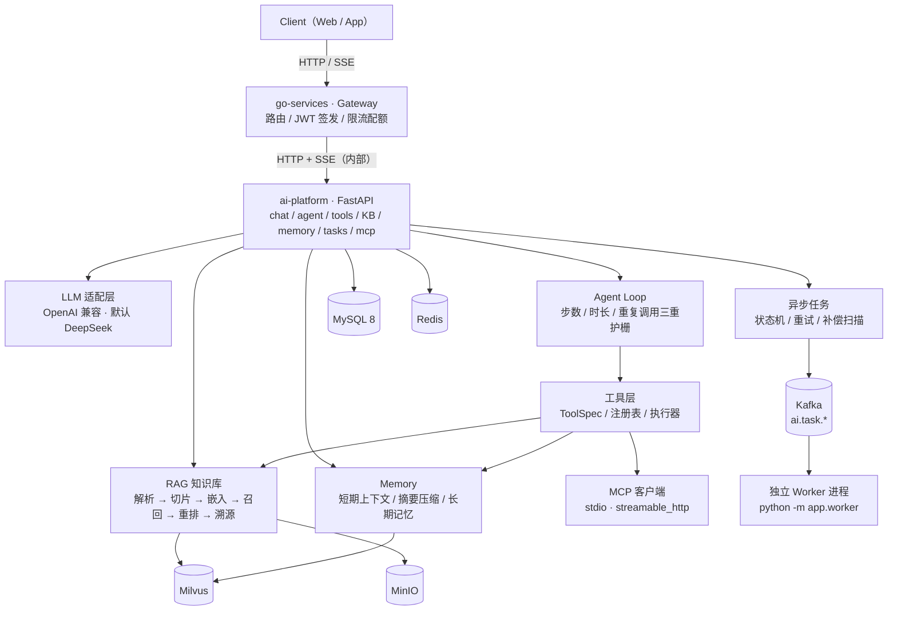

# Personal AI Assistant｜个人智能 Agent 平台

> 基于 **Go + Python** 分层构建的个人智能 AI Assistant 平台。
> Go 侧负责 API 网关、用户与会话台账、AI 调用编排、配额限流与 JWT 签发；
> Python 侧负责 LLM 应用能力 —— Agent 工具调用、RAG 知识库、Memory、MCP 外部工具接入与异步任务。
>
> 两侧按「**一份数据只有一个权威属主**」切分，通过 HTTP + SSE（内部调用）与共享 JWT 约定衔接，
> 使 AI 服务可以**独立启动、独立压测、独立验收**。

**简介** | [架构](#架构) | [技术栈](#技术栈) | [已实现能力](#已实现能力) | [质量门禁](#质量门禁) | [快速开始](#快速开始) | [文档索引](#文档索引) | [现状与差距](#现状与差距)

| 子项目 | 语言 / 框架 | 职责 | 当前状态 |
| --- | --- | --- | --- |
| [`ai-platform`](./ai-platform) | Python 3.12 / FastAPI + LangChain | LLM 编排、Agent、RAG、Memory、MCP、异步任务、可观测 | ✅ **已交付**（M1–M8；1284 个测试用例、45 次接口冒烟 0 非预期） |
| `go-services` | Go / Kratos（或 Gin） | 对外网关、用户与鉴权、会话与消息台账、AI 编排、配额限流 | 📋 **仅有 SRS 与建表脚本**（Go 代码待建，暂未纳入本仓库，见 [`现状与差距`](#现状与差距)） |

---

## 架构



**分层与数据权威归属**（完整表见 `go-services/README.md` §1.2；该目录暂未纳入本仓库，见 [`现状与差距`](#现状与差距)）：

| 数据 / 能力 | 权威属主 | 说明 |
| --- | --- | --- |
| 用户、凭据、刷新令牌 | **Go** | Python 不感知，只读 JWT 的 `sub` 作为 `user_id` |
| 会话 `conversation`、消息台账 `message` | **Go** | Python 仅持有 `conversation_id` 引用，不建表 |
| 对话摘要、短期上下文（`ctx:{id}`）、长期记忆 | **Python** | Go 侧透传，不碰该 Key 空间 |
| 知识库 / 文档 / 切片元数据、AI 任务 `task` | **Python** | Go 侧透传 + 配额校验，无本地副本 |
| 原始文件（MinIO）、向量（Milvus）、消息队列（Kafka） | **Python 独占** | Go 侧不引入这三个客户端 |
| 配额、用量、计费 | **Go** | Python 只上报 `usage`，不扣减 |

---

## 技术栈

### Python AI 服务层（`ai-platform`，已实现）

| 层次 | 选型 | 说明 |
| --- | --- | --- |
| 语言 | **Python 3.12** | `torch` / `transformers` / `FlagEmbedding` 对 3.14 适配尚不完整，故由 `.python-version` 固定 |
| Web 框架 | **FastAPI** + Uvicorn | 全异步；`create_app(settings)` 支持注入配置，便于多实例验收 |
| 校验 / 配置 | **Pydantic v2** + pydantic-settings | 配置唯一来源 `app/config.py`，启动期 `validate_for_startup()` |
| LLM 编排 | **LangChain** + **LangGraph** | 主链路为自研 Agent Loop；`langgraph` 状态图保留为占位 |
| LLM 供应商 | **OpenAI 兼容协议** | 默认 DeepSeek；换 Moonshot / 百炼 / 本地 vLLM 只改 `base_url` + 模型名 |
| 向量化（Embedding） | **Transformers** + **Sentence Transformers** | 默认 `BAAI/bge-m3`（1024 维，本地 CPU 推理） |
| 重排序（Rerank） | **FlagEmbedding** | 默认 `BAAI/bge-reranker-v2-m3` 交叉编码器 |
| 向量库 | **Milvus**（PyMilvus + langchain-milvus） | 知识库切片集合 + 长期记忆集合，标量倒排索引支撑多租户过滤 |
| 文档解析 | pypdf / python-docx / BeautifulSoup4 / Markdown | PDF · DOCX · Markdown · HTML · TXT，扩展名 + 魔数双校验 |
| 工具协议 | **MCP Python SDK** | `stdio` 与 `streamable_http` 两种传输，命名空间 `mcp__{server}__{tool}` |
| 流式输出 | **SSE** | 自研帧构造 + 心跳 + 断连收尾；`curl -N` 可直接观察逐段到达 |
| 鉴权 | PyJWT（HS256） | 仅校验 Go 侧签发的 JWT |
| 关系库 | **MySQL 8** + SQLAlchemy Core（asyncmy） | 异步驱动；连接池按 DSN 进程内共享 + 引用计数销毁 |
| 缓存 / 任务态 | **Redis** | 短期上下文（LTRIM + TTL）、幂等键、退避重试 ZSET、pub/sub 事件总线 |
| 消息队列 | **Kafka**（aiokafka） | `ai.task.<type>` 主题，由独立 Worker 进程消费 |
| 对象存储 | **MinIO** | 原始文档字节流 |
| 可观测性 | **OpenTelemetry** SDK + OTLP(gRPC)、**Prometheus** Client | Jaeger 链路（trace id 与日志/响应头同值）+ 独立指标端口 + 18 面板看板 |
| 依赖 / 环境 | **uv** | `uv.lock` 锁定，`--extra redis/kafka/mysql/minio` 按需装可选依赖 |
| 质量门禁 | **ruff** + **mypy** + **pytest**(asyncio / cov) | 见 [`质量门禁`](#质量门禁) |

### Go 网关层（`go-services`，规划中）

| 层次 | 选型 | 说明 |
| --- | --- | --- |
| 语言 | **Go 1.24+** | 泛型、`log/slog`、`net/http` 流式响应 |
| HTTP 框架 | **Kratos v2**（或 Gin） | 设计文档同时列了两者，SRS 已裁定**二选一不叠加** |
| ORM | **GORM** + MySQL 8 | 业务台账（用户 / 会话 / 消息 / 用量） |
| 缓存 | `redis/go-redis/v9` | 缓存、限流、配额计数（独立 Key 前缀） |
| 内部调用 | `net/http` + SSE（默认）；gRPC + Protobuf（可选） | 调用 `ai-platform`；gRPC 需先满足 SRS 的三条前置条件 |
| 注册发现 | Nacos | 解析 `ai-platform` 地址 |
| 校验 | `go-playground/validator` | 请求体校验 |
| 可观测 | OpenTelemetry Go SDK + Prometheus | Trace / Metric |
| 测试 | `testing` + `testify` + `testcontainers-go` | 单元 / 集成 |

### 基础设施与工程化

| 类别 | 选型 |
| --- | --- |
| 容器化与本地编排 | **Docker Compose**（Redis / Kafka / MySQL / Milvus / MinIO / Jaeger / Prometheus / Grafana 一键起） |
| 部署目标 | Kubernetes（Deployment + Service，水平扩展）—— 设计目标，仓库内暂无清单 |
| 链路追踪 | OpenTelemetry → Jaeger |
| 指标与看板 | Prometheus → Grafana（Provisioning 自动加载数据源与看板） |

---

## 已实现能力

`ai-platform` 已交付 42 个「路径 + 方法」组合，覆盖以下能力域（完整接口表见 [`ai-platform/README.md`](./ai-platform/README.md#已实现接口)）：

- **对话与流式输出**：`POST /chat`（非流式）与 `POST /chat/stream`（SSE：`meta → reference* → token* → usage → done`）；
  上下文按 `system → memory → summary → history → rag → query` 确定性装配，并在 token 预算内裁剪；回答中的 `[n]` 与 `references[].index` 打通实现**来源溯源**。
- **Agent 工具调用循环**：`app/agent/loop.py` 实现「推理 → 工具调用 → 结果回注 → 再推理」，
  带**步数 / 总时长 / 重复调用**三重护栅，产出完整 `tool_calls` 轨迹与降级原因；`use_tools=true` 时对话请求自动转交 Agent 链路。
- **工具层**：`ToolSpec` + 注册表（重名 fail-fast）+ 执行器（读并发 / 写串行、超时、结果截断、错误归一）
  + 6 个内置工具（`kb_retrieve` / `calculator` / `current_time` / `http_fetch` / `memory_save` / `memory_search`）。
  工具参数以 pydantic 模型为**单一事实来源**（`model_json_schema()`），参数不合法作为「可回复的结果」回注给模型而非报错。
- **MCP 接入**：配置校验（`${VAR}` 展开、未知字段报错）、`stdio` 与 `streamable_http` 两种传输、
  多 Server 并发启动与总超时、单 Server 状态机（懒重连 + 行内熔断）、工具命名空间与 allow/deny 名单、`write_tools` 审计。
- **RAG 知识库**：上传 → 解析 → 结构感知切片 → 嵌入 → 落库；检索链路为召回 → 合并相邻 → BGE 重排 → token 预算裁剪；
  知识库 / 文档 / 切片全量 CRUD 与检索调试接口（返回召回与重排分数、耗时）。
- **Memory 三层**：短期上下文（内存 + Redis 两套实现、分布式锁、摘要覆盖过滤）、
  摘要压缩（四段结构 / 增量合并 / 防抖）、长期记忆（哈希 + 语义双层去重、`0.85/0.92` 双阈值、过期与清空冷静期、独立 system 段注入）。
- **异步任务**：显式迁移白名单的状态机 + 幂等键 + 乐观锁；三个执行器 `none` / `inline` / `kafka`；
  退避重试 ZSET（Lua 原子认领）、补偿扫描、独立 Worker 进程、`GET /tasks/{id}/events`（SSE 进度流：快照 + 增量 + 心跳）。
- **可观测性**：20 个 Prometheus 指标（`endpoint` 标签取**路由模板**，无高基数字段）、
  独立指标端口（主应用不暴露 `/metrics`）、OTel 链路（Jaeger trace id == 日志 trace id == 响应头）、熔断器状态机。

---

## 质量门禁

在 `ai-platform/` 目录下执行（`uv run` 前缀省略）：

| 命令 | 实测结果 |
| --- | --- |
| `ruff format --check .` | `222 files already formatted` |
| `ruff check .` | `All checks passed!` |
| `mypy app` | `Success: no issues found in 131 source files` |
| `pytest` | **1284 passed, 4 skipped**（约 83 s，含真 Redis / MySQL / Milvus / MinIO 集成用例） |
| `pytest --cov=app` | **90%**（`docs/11` 门槛 70%） |
| `tools/curl_e2e.ps1` | **45 次请求 → 39 个 2xx + 6 个白名单内的正确负例 + 0 个非预期**，退出码即结论 |

测试分层：`tests/unit`（纯逻辑）、`tests/contract`（接口契约，**默认跑**）、`tests/integration`（真基础设施，不可达时 1 秒内 skip）。
外部依赖一律走替身（`tests/support/`：脚本化 LLM、确定性向量化、假 MCP Server），
因此「片段顺序」「断连是否停掉上游」「熔断是否真的打开」这类行为都能被机械断言。

---

## 快速开始

```powershell
# 前置：Python 3.12（由 .python-version 固定，uv 自动托管）+ uv ≥ 0.5
cd ai-platform

uv sync                                  # 按 uv.lock 建 .venv 并装依赖
Copy-Item .env.example .env              # 至少填真实的 OPENAI_API_KEY（默认用 DeepSeek）
uv run uvicorn app.main:app --reload     # 默认 INFRA_BACKEND=memory：无需任何外部依赖即可跑通

# Swagger UI : http://127.0.0.1:8000/docs
# 健康检查   : http://127.0.0.1:8000/api/v1/health
```

切到**真实基础设施**（Redis / MySQL / Milvus / MinIO / Kafka）：

```powershell
uv sync --extra redis --extra kafka --extra mysql --extra minio
docker compose -f deploy/infra/compose.yml up -d redis            # 任务仓储 / 事件总线 / 重试队列
docker compose -f deploy/infra/compose.yml --profile kafka up -d  # 单节点 Kafka
# MySQL 建表（幂等，无 DROP）：
#   deploy/mysql/001_init_schema.sql → 002 → 003
$env:INFRA_BACKEND="real"; $env:TASK_RUNNER="kafka"
uv run uvicorn app.main:app --reload
uv run python -m app.worker                                        # 另开终端：独立 Worker 进程
```

> `INFRA_BACKEND=memory` 时所有存储走进程内实现（本地开发 / 测试）；
> `real` 下任一外部依赖初始化失败**不会**让服务起不来，对应仓储降级为 `503 DEPENDENCY_UNAVAILABLE`。
> 细节见 [`ai-platform/README.md`](./ai-platform/README.md) 与 [`docs/14-接口 curl 示例.md`](./ai-platform/docs/14-接口%20curl%20示例.md)。

---

## 仓库结构

```text
ai-assistant/
├── 预期设计文档.md          # 全平台高层设计（Go + Python 分层、模块划分、技术选型）
├── ai-platform/             # ✅ Python AI 服务
│   ├── app/                 # 131 个源文件：core / api / schemas / llm / services / tools /
│   │                        #   agent / mcp / rag / memory / storage / tasks / worker / observability
│   ├── docs/                # 15 篇：SRS 01–11 + 实现问题记录 12 + 技术设计说明 13 + curl 示例 14
│   ├── deploy/              # MySQL 建表与自检 / 本地基础设施 / 可观测栈（Grafana 看板）
│   ├── tests/               # 74 个文件：unit / contract / integration / support（替身）
│   ├── tools/               # curl_e2e.ps1（一键接口冒烟）、kafka_e2e_check.py（跨进程验真）
│   └── pyproject.toml       # 依赖与工具配置的唯一事实来源 + uv.lock
└── go-services/             # 📋 Go 侧 SRS（7 篇）+ MySQL 建表与自检脚本，Go 代码待建
                             #    当前未纳入本仓库（见 .gitignore），待实现后一并提交
```

---

## 文档索引

按「需求 → 实现 → 故障 → 设计 → 实测」的顺序阅读：

| 文档 | 内容 |
| --- | --- |
| [`预期设计文档.md`](./预期设计文档.md) | 全平台高层设计：分层架构、模块职责、技术选型、数据流 |
| [`ai-platform/docs/README.md`](./ai-platform/docs/README.md) | Python 侧 SRS 总览：范围边界、文档索引、阅读路径、术语、**现状与差距** |
| [`ai-platform/docs/01`–`11`](./ai-platform/docs) | 需求规格：总体需求 · 接口规范与错误码 · 对话与流式 · Agent 与工具 · MCP · RAG · Memory · 异步任务 · 数据模型 · 非功能与可观测 · 验收标准 |
| [`ai-platform/docs/12-实现问题记录.md`](./ai-platform/docs/12-实现问题记录.md) | **故障史**：实现中真实踩到的坑（症状 / 根因 / 修法 / 留下的防线） |
| [`ai-platform/docs/13-技术设计说明.md`](./ai-platform/docs/13-技术设计说明.md) | **技术设计**：分层、装配、错误处理、各链路设计、扩展点与已知取舍 |
| [`ai-platform/docs/14-接口 curl 示例.md`](./ai-platform/docs/14-接口%20curl%20示例.md) | **实测**：每个接口的 curl 命令 + 真实依赖下的响应（含 409 / 404 等正确负例）+ 一键验证脚本 |
| `go-services/docs/01`–`07` | Go 侧 SRS：总体需求 · 接口与鉴权 · 用户与会话 · AI 编排与网关 · 数据模型 · 非功能 · 验收标准（目录暂未纳入本仓库） |

---

## 现状与差距

**未完成部分**（不隐瞒）：

1. **Go 侧尚无任何代码** —— `go-services/` 目前只有 7 篇接口级 SRS 与 MySQL 建表 / 自检脚本，
   没有 `go.mod`、没有 `.go` 文件。最高优先级的缺口是 **JWT 签发契约与网关调用契约**（两个服务之间的接缝）。
   该目录当前被根 `.gitignore` 排除，待 Go 代码落地后纳入仓库。
2. **Kubernetes 清单与 CI 流水线尚未编写** —— 仓库内只有 Docker Compose（本地基础设施与可观测栈）。
3. **`ai-platform` 的少量占位**：`app/agent/graph/`（LangGraph 状态图）为未接入的占位；
   MCP 的 `prompts` / `sampling` 能力按 SRS 明示不做。

**设计文档与实现的三处有意偏差**（以代码为准，均已写入对应 SRS）：

| 项 | 设计文档 | 实际实现 | 原因 |
| --- | --- | --- | --- |
| 向量库 | Qdrant | **Milvus**（3.0，HNSW/COSINE + 标量倒排索引） | 生态与 `langchain-milvus` 集成更顺；且 Milvus 已在本机验证 |
| 内部通信 | gRPC | **HTTP + SSE**（默认），gRPC 保留为可选项 | 少一层 proto 维护成本；SSE 天然适合流式透传，取消传播可用连接断开表达 |
| 微服务拆分 | User / Conversation / Task 三个服务 | Go 侧**单进程多模块**（`internal/user`、`internal/conversation`、`internal/orchestrator`） | 三者共享同一 MySQL 事务边界，拆进程会引入分布式事务而无收益 |

另外，设计文档在 Go 侧也列出了 MinIO 与 Kafka，实际由 Python **独占**：
`go-services` 的 Redis Key 空间与基础设施客户端均已按此裁定收窄。

---

## 版本与许可

- 文档版本记录见 [`ai-platform/docs/README.md`](./ai-platform/docs/README.md)（Python 侧）与
  `go-services/README.md`（Go 侧，目录暂未纳入本仓库）。
- 仓库暂未声明开源许可（个人作品集项目）。
