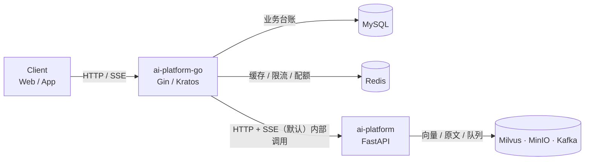

# ai-platform-go 需求规格说明书（SRS）

> 本目录是 **Go 侧后端服务（Gateway + 用户/会话/编排）** 的需求规格说明书。
>
> - 上游输入：[`../预期设计文档.md`](../预期设计文档.md)（Go + Python 全平台高层设计）
> - 平行文档：[`../ai-platform/docs/README.md`](../ai-platform/docs/README.md)（Python AI 服务的 SRS）
> - 本目录覆盖设计文档中的 **Backend 域**：Go Gateway、用户与鉴权、会话与消息、AI 服务编排、任务与配额。

## 1. 范围边界

| 项目 | 说明 |
| --- | --- |
| **覆盖** | Go 服务对外 HTTP/SSE 契约、JWT 签发规范、会话与消息台账、对 `ai-platform` 的调用编排、配额与限流、数据模型、非功能指标、验收标准 |
| **不覆盖** | LLM/Agent/RAG/Memory/异步入库的内部实现（属 `ai-platform`）、前端、K8s 清单与 CI 脚本细节 |
| **依赖但不由本服务提供** | AI 能力（内部调用 `ai-platform`）、向量检索、文档解析 |

### 1.1 两服务定位

| 维度 | ai-platform-go | ai-platform |
| --- | --- | --- |
| 对外可见 | **是**（客户端唯一入口） | 否（仅内网 / 独立验收） |
| 身份 | JWT **签发方** | JWT **校验方** |
| 协议 | HTTP + SSE（对外与对内，默认）；可选 gRPC（仅在满足 [04-§2.2](./docs/04-AI服务编排与网关.md) 三条前置条件时切换） | HTTP server（对内）；可为独立验收单独开 gRPC |
| 存储 | MySQL（业务台账）、Redis（缓存/限流） | MySQL（AI 元数据）、Milvus、Redis、MinIO、Kafka |
| 无状态 | 是（会话状态在 Redis/MySQL，不在内存） | 是 |

### 1.2 数据与能力权威归属表

> 这张表是本套需求最重要的约定。设计文档中 Go 与 Python 都声称管理「会话上下文、知识库、任务、MinIO、Redis」，属于**重叠**。此表逐条消歧：**每份数据只有一个权威属主**，另一方只能透传，禁止双写。

| 数据 / 能力 | 权威属主 | ai-platform-go 行为 | ai-platform 行为 |
| --- | --- | --- | --- |
| 用户、凭据、刷新令牌 | **ai-platform-go** | 读写 | 不感知（只读 JWT 的 `sub`） |
| 会话（`conversation`） | **ai-platform-go** | 读写，**ID 生成者** | 只持有 `conversation_id` 引用，不建表 |
| 消息台账（`message`） | **ai-platform-go** | 读写 | 不落库（仅生成与上报内容） |
| 对话摘要 `conversation_summary` | **ai-platform** | 透传 | 读写 |
| 短期上下文 `ctx:{id}`（Redis） | **ai-platform** | **不碰该 Key** | 读写 |
| 长期记忆 `user_memory` | **ai-platform** | 透传 | 读写 |
| 知识库 / 文档 / 切片元数据 | **ai-platform** | 透传 + 配额校验 | 读写 |
| AI 执行任务 `task` | **ai-platform** | 透传 + 聚合展示 | 读写 |
| 原始文件（MinIO） | **ai-platform** | **只转发字节流，不落盘、不写对象** | 读写 |
| 向量（Milvus） | **ai-platform** | 不感知 | 读写 |
| 配额、用量、计费 | **ai-platform-go** | 读写 | 只上报 `usage`，不扣减 |
| 业务缓存（会话列表、用户信息） | **ai-platform-go** | 读写 | 不感知 |

**推论（必须遵守）**：

1. `ai-platform-go` **MUST NOT** 出现 Milvus / MinIO / Kafka 的客户端代码 —— 这些基础设施只属于 `ai-platform`。设计文档中 Go 侧列出的 MinIO / Kafka 依赖据此**取消**（Kafka 由 Python 独占生产与消费）。
2. `ai-platform-go` 的 Redis Key 空间 MUST 使用独立前缀（见 [05-§3](./docs/05-数据模型.md)），不得与 `ai-platform` 的 `ctx:` / `lock:` / `rate:` 前缀重名。
3. AI 元数据（KB/文档/任务）在 Go 侧**没有本地副本**。需要列表展示时实时透传调用，或做**只读**短 TTL 缓存（TTL ≤ 30s 且允许过期不一致）。
4. 会话 ID 的权威属主是 `ai-platform-go`：网关调用 `ai-platform` 时 MUST 总是携带 `conversation_id`。`ai-platform` 在 `conversation_id` 为空时自建会话的行为**仅用于其独立验收场景**，生产链路 MUST NOT 依赖它（见 [04-§6](./docs/04-AI服务编排与网关.md)）。

## 2. 技术栈与选型说明

| 层次 | 选型 | 说明 |
| --- | --- | --- |
| 语言 | Go 1.24（`go.mod` 钉 `go 1.24.0`） | 泛型、`log/slog`、`net/http` 流式响应；依赖已对齐到「声明 ≤ 1.24」的版本，可在装有 Go 1.24.8 的机器上**离线构建**（详见 [08-§2.1](./docs/08-实现进度与运行手册.md)） |
| HTTP 框架 | **Gin v1.11** | 对外 HTTP/SSE 入口：路由、中间件链、错误信封 、SSE 都在这一层（v1.12 要求 `go ≥ 1.25`，见 [08-§2.1](./docs/08-实现进度与运行手册.md)） |
| 内部调用 | **Kratos v2 gRPC**（仅 `Chat` / `ChatStream`）+ `net/http` 透传（KB / 文档 / 任务 / 记忆 / MCP） | 调用 `ai-platform`；**SSE 不进 gRPC**，否则要重写一套流控（见 [04-§2.2](./docs/04-AI服务编排与网关.md)） |
| 注册发现 | Nacos | 解析 `ai-platform` 的地址（HTTP 基地址或 gRPC 端口） |
| ORM | GORM + MySQL 8 | 业务台账 |
| 缓存 | `redis/go-redis/v9` | 缓存、限流、配额计数 |
| 配置 | `.env` + 环境变量（`ENV_FILE` 指定绝对路径）+ 启动时校验 | 12-Factor；`.env` 存在但解析失败即退出，不静默回退默认值 |
| 校验 | `go-playground/validator` | 请求体校验（不引入 protoc-gen-validate） |
| 可观测 | OpenTelemetry Go SDK + Prometheus | Trace / Metric |
| 测试 | `testing` + `testify` + `testcontainers-go` | 单元 / 集成 |

> **Gin 与 Kratos 的分工（已决策，不再二选一）**：设计文档把 `Gin` 与 `Kratos` 并列在「Web框架」一行。
> 两者的职责在这里**不重叠**，因为传输边界不同：
> - **对外**（浏览器/客户端 → 网关）一律 **Gin HTTP/SSE**。错误信封、`Retry-After`、CORS、
>   安全头、SSE 心跳这些都在 Gin 的中间件链里，换成 Kratos 的 HTTP transport 要重写一遍。
> - **对内**（网关 → `ai-platform`）的 `Chat` / `ChatStream` 走 **Kratos v2 gRPC**，
>   以便统一超时/重试/熔断/trace 与错误码映射；其余接口（KB / 文档 / 任务 / 记忆 / MCP）
>   维持 HTTP 透传 —— 包一层 gRPC 只是多一次序列化，不产生任何价值。
> - **不叠加**：不会出现「Gin 套在 Kratos HTTP server 上」。两个框架各自管一侧。
> - §九.4 的约束仍然生效：**不得把 `ChatStream`/SSE 压进普通 unary gRPC**；
>   流式部分在 gRPC 侧用 server-streaming，或维持 HTTP 透传。
> - 该决策要求 `ai-platform` 侧**新增** gRPC server（不改动已有实现、不动现有测试）。

> **关于微服务拆分**：设计文档画了 `User Service` / `Conversation Service` / `Task Service` 三个框。**建议实现为单进程多模块**（`internal/user`、`internal/conversation`、`internal/orchestrator`），而非三个独立进程：
> - 三者共享同一 MySQL 事务边界（如「建会话 + 写首条消息」需原子），拆进程会引入分布式事务；
> - 个人项目量级下，多进程只增加部署与排障成本，不带来收益；
> - Kratos 的 `internal/service` + `internal/biz` + `internal/data` 分层已足够表达模块边界，**未来**需要拆分时按模块目录平移即可。
> 若评审明确要求"微服务"，则 MUST 明确跨服务的会话创建事务方案（Saga 或最终一致）后再拆。

## 3. 文档索引

| # | 文档 | 内容 | 主要需求 ID 前缀 |
| --- | --- | --- | --- |
| — | **README.md**（本文件） | 范围、权威归属、选型、索引、术语 | — |
| 规范 | [代码生成规范.md](./代码生成规范.md) | 目录结构、分层与**依赖方向**、文件与命名、错误处理（写码前必读；§四/§六 是硬约束） | — |
| 01 | [总体需求与范围](./docs/01-总体需求与范围.md) | 目标、场景、优先级、里程碑、接缝风险清单 | `REQ-GEN` |
| 02 | [接口规范与鉴权](./docs/02-接口规范与鉴权.md) | 通用约定、错误信封、**JWT 签发契约**、限流与配额 | `REQ-AUTH` |
| 03 | [用户与会话服务](./docs/03-用户与会话服务.md) | 注册登录、用户资料、会话 CRUD、消息台账 | `REQ-CONV` |
| 04 | [AI 服务编排与网关](./docs/04-AI服务编排与网关.md) | 接口契约、AI 调用与超时、SSE 透传、取消传播、降级 | `REQ-ORCH` |
| 05 | [数据模型](./docs/05-数据模型.md) | MySQL 表结构、Redis Key 规范、明确不建的表 | `REQ-DATA` |
| 06 | [非功能需求与可观测性](./docs/06-非功能需求与可观测性.md) | 性能、安全、链路追踪、指标、配置表、部署 | `REQ-NFR` |
| 07 | [验收标准与测试策略](./docs/07-验收标准与测试策略.md) | 测试分层、**JWT 互操作测试**、跨服务 E2E、CI | `REQ-TEST` |
| 08 | [实现进度与运行手册](./docs/08-实现进度与运行手册.md) | 目录结构、本地运行、测试账号、**分阶段实现进度与踩坑记录** | — |
| 09 | [验收耗时归因与优化清单](./docs/09-验收耗时归因与优化清单.md) | **每个接口 / 每条需求实测花多久**、六类原因、OPT-01~OPT-10 优化项与验收方式 | — |
| 10 | [大文件上传与索引优化清单](./docs/10-大文件上传与索引优化清单.md) | **8MB 上传为什么慢**、与 OpenAI `file_search` 的逐项对照、UP-01~UP-10（截断可见 / 进度可观测 / 切分配方 / 直传对象存储） | `REQ-ORCH-005` |

> **可执行资产**（不只是文档）：
> - [`deploy/mysql/001_gateway_tables.sql`](./deploy/mysql/001_gateway_tables.sql) —— 网关独占的 6 张表，幂等且无 `DROP`
> - [`deploy/mysql/002_test_accounts.sql`](./deploy/mysql/002_test_accounts.sql) —— 分阶段测试账号（`u_test_*`，幂等可重跑）
> - [`deploy/mysql/verify_schema.sql`](./deploy/mysql/verify_schema.sql) —— 自检，对应 `AC-DATA-07..10`
> - [`tools/curl_stage1.ps1`](./tools/curl_stage1.ps1) —— M1 接口验收（99 项断言，FAIL 时非 0 退出）
> - [`tools/curl_stage5.ps1`](./tools/curl_stage5.ps1) / [`tools/curl_stage6.ps1`](./tools/curl_stage6.ps1) —— M5 / M6 验收（40 / 57 项断言）
> - [`tools/run_all_stages.ps1`](./tools/run_all_stages.ps1) —— **一次跑完 M1→M6** 并汇总成一张表。六条脚本**不是顺序无关的**（共享 Redis 限流桶、按日累计的配额、上游 AI 的健康），这个脚本把三层污染显式处理掉，见 [08-§9.5](./docs/08-实现进度与运行手册.md)
> - [`tools/cost_report.ps1`](./tools/cost_report.ps1) —— 从网关日志 + 阶段输出算**接口 / 需求维度**的实际耗时（见 [09](./docs/09-验收耗时归因与优化清单.md)）
> - [`tools/falsify_m4.ps1`](./tools/falsify_m4.ps1) —— 变异测试：把源码改坏一处，验证对应单测**真的会红**
> - [`cmd/hashpw`](./cmd/hashpw) —— argon2id 离线哈希工具
>
> **实现记录与运行手册**见 [08-实现进度与运行手册](./docs/08-实现进度与运行手册.md)（怎么跑、每阶段交付了什么、踩过哪些坑）。
>
> ⚠️ **与 `ai-platform` 共用一个库 `ai_platform`（合计 15 张表）**：建库与 AI 侧 7 张表由
> `ai-platform/deploy/mysql/001_init_schema.sql` 完成；`idempotency_record` / `audit_log`
> 是**共享表**，只在那里定义一次（详见 [05-§2](./docs/05-数据模型.md)）。

## 4. 阅读路径

- **先看全局** → README §1.2 权威归属表（避免双写是最容易犯的错）
- **要写鉴权** → 02-§3 JWT 签发契约（与 `ai-platform/docs/02` 必须逐字对齐）
- **要写网关转发** → 04（契约 + SSE 透传 + 取消传播）
- **要建库建表** → 05
- **要做验收/答辩** → 07 → 06

## 5. 术语表

| 术语 | 含义 |
| --- | --- |
| 网关 | `ai-platform-go` 对外暴露的 HTTP/SSE 入口，客户端的唯一入口 |
| 台账 | 权威的业务数据记录（用户、会话、消息、用量） |
| 编排 | 网关对 `ai-platform` 的一次或多次调用及其结果组装 |
| 透传 | 不改写语义地把请求转发给 `ai-platform` 并把响应原样返回 |
| 接缝 | 两个服务之间必须严格对齐的契约点（JWT、错误码、trace、ID） |
| Access Token | 短期 JWT，客户端每次请求携带 |
| Refresh Token | 长期不透明随机串，仅用于换取新的 Access Token |
| 配额 | 用户在某周期内可用的资源上限（消息数、token 数、存储量） |
| 降级 | AI 侧不可用时，网关以明确标记的方式返回受限结果 |

## 6. 文档约定

- 需求关键词遵循 RFC 2119：**MUST / SHOULD / MAY**。
- 需求 ID 形如 `REQ-<模块>-<三位序号>`；验收 ID 形如 `AC-<模块>-NN`。
- 路径统一省略公共前缀 `/api/v1`。
- JSON 字段一律 `snake_case`，与 `ai-platform` 现有 Pydantic 模型保持一致。
- **错误信封、ID 格式、时间格式、SSE 帧格式 MUST 与 `ai-platform/docs/02-接口规范与错误码.md` 完全一致** —— 这是接缝，不是各自选择。
- 时间一律 RFC 3339 UTC 毫秒：`2026-09-28T10:00:00.123Z`。
- 资源 ID 为带前缀字符串：`u_` / `cv_` / `msg_` / `rt_`（refresh token） / `req_`，后接 26 位 Crockford Base32（ULID）。

## 7. 现状与差距（截至 2026-09-30）

| 模块 | 代码现状 | 需求状态 |
| --- | --- | --- |
| Go 服务 | **M1–M6 已实现**：`cmd/server`；`pkg/{errs,httpx,ids,clockx,cryptox,jwtx,logx,cursor,ssex,metricsx,otelx}`；`internal/{conf,biz,service,server}` + `internal/data`（仓储）与 `internal/data/{mysql,redis,ai}`（引擎/出网客户端）。已按 [代码生成规范](./代码生成规范.md) §四/§六 完成**依赖倒置**（仓储接口归 `biz`、实现在 `data`，`biz` 不 import `data`）；**一条命令跑完全套**：`tools/run_all_stages.ps1`（`curl_stage1.ps1` 99 项、`curl_stage2.ps1` 198 项、`curl_stage3.ps1` 29 项、`curl_stage4.ps1` 51 项、`curl_stage5.ps1` 40 项、`curl_stage6.ps1` 57 项断言；**2026-09-30 实测 474 PASS / 0 FAIL**） | **M1–M6 完成**（剩余可选项见 [08-§8.4 / §9.4](./docs/08-实现进度与运行手册.md)） |
| 接口契约 | HTTP 侧已存在（`ai-platform` 的 OpenAPI，可直接用）；**gRPC 侧 proto 已落库**：`proto/aiplatform/v1/chat.proto`（`Chat` + `ChatStream`） | **已完成**：生成物在 `api/aiplatform/v1/`（Go）与 `ai-platform/app/grpc/aiplatform/v1/`（Python），两侧从同一个 proto 生成；其余接口按 [04-§2.1](./docs/04-AI服务编排与网关.md) 以 OpenAPI 为真源透传 |
| JWT 签发 | **已实现**（`pkg/jwtx`，HS256，claim 与 02-§3.2 逐字对齐） | 完成；与 `ai-platform` 的互操作联调已在 M3 验收中跑通（真用户令牌经 gRPC metadata 传到 AI） |
| 会话台账 | 表已建，服务已实现（M2） | **M2 已完成**：会话 CRUD/归档/软删级联、消息台账（`seq` 分配）、自动标题；**M3 已接上编排**（`send` 返回 user + assistant 两条） |
| 流式对话 | **M4 已完成**：SSE 透传（`pkg/ssex` + `internal/service/stream.go`）、取消传播、`partial` 落库、累积上限 | **M4 已完成**：S1/S6 跑通，首帧（`meta`）增量实测 **10.7~12.0ms ≤ 30ms**，断连后 **< 31ms** 可见 `partial` 行（详见 [08-§7](./docs/08-实现进度与运行手册.md)） |
| 配额扣减 | **M5 已完成**：`internal/biz/quota{,_repo}.go` + `internal/service/quota.go`（预扣/回滚/回读，`used` 权威在网关）；`internal/data/redis/counter.go` 的两个 Lua 脚本 | **M5 已完成**：`ai-platform` 只上报 `usage`，扣减与判决全在网关；`429 QUOTA_EXCEEDED` **不产生 AI 调用**（实测被拦那次计数只 +1）。详见 [08-§8](./docs/08-实现进度与运行手册.md) |
| 限流 / 降级 | **M5 已完成**：`internal/biz/{ratelimit,circuit,ai_proxy}.go`、`internal/server/middleware/ratelimit.go` | **M5 已完成**：五维限流（按真实 IP，伪造 `X-Forwarded-For` 无效）、三态熔断（`AC-ORCH-08`：打开后拒绝路径 **9~13ms**）。详见 [08-§8](./docs/08-实现进度与运行手册.md) |
| 上传流式转发 | **M5 已完成**：`internal/service/upload.go`（前置 `Content-Length` 判限 + `io.Copy`） | **M5 已完成**：`AC-ORCH-05` 网关 RSS 峰值增量 **0.4MB**；`413 PAYLOAD_TOO_LARGE` 不读 body。详见 [08-§8](./docs/08-实现进度与运行手册.md) |
| 可观测 | **M6 已完成**：`pkg/metricsx`（19 族 + 连接池）、`pkg/otelx`（含**尾部采样**）、`pkg/logx/redact.go`、`internal/biz/retention.go`、`internal/service/health.go` + `internal/data/ai/probe.go` | **M6 已完成**：`AC-NFR-05/08/09` 均通过；`/health` 的 4 个 check 全部**准确或明确 disabled**。详见 [08-§9](./docs/08-实现进度与运行手册.md) |
| 数据库表结构 | `deploy/mysql/001_gateway_tables.sql`（网关 6 张）+ `002_test_accounts.sql` + `verify_schema.sql` | **已完成**：与 AI 侧同库（`ai_platform`，合计 15 张表），已在本机 MySQL 8.0 执行，两侧自检断言全部符合预期，重复执行无错 |

> **最高优先级的缺口是契约与 JWT**：这两个接缝一旦各方独立实现，返工成本最高。建议在写任何业务代码之前先完成 [02-§3](./docs/02-接口规范与鉴权.md) 与 [04-§2](./docs/04-AI服务编排与网关.md) 并让两侧评审通过。
>
> **另一个需要回改 `ai-platform` 文档的缺口（接缝 J9）**：网关清理 AI 侧上下文等后台调用需要内部服务凭据，而 `ai-platform/docs/02-接口规范与鉴权.md` 目前只定义了用户 JWT 校验。需在其文档补充内部凭据方案（见 [07-§3 `AC-TEST-10`](./docs/07-验收标准与测试策略.md)）。

## 8. 版本记录

| 版本 | 日期 | 变更 |
| --- | --- | --- |
| v1.0 | 2026-09-28 | 首版，依据 `预期设计文档.md` 拆解为 7 篇接口级 SRS |
| v1.1 | 2026-09-28 | 数据模型与 `ai-platform` 对齐：`user_id` 统一 `VARCHAR(64)`、补 `deploy/mysql/` 可执行建表与自检脚本（`REQ-DATA-007..010`、`AC-DATA-07..10`） |
| v1.2 | 2026-09-28 | **改为与 `ai-platform` 共用一个库** `ai_platform`（15 张表）；`idempotency_record` / `audit_log` 改为共享表且只定义一份（并集列）；`quota_usage` 改业务键即主键并补 `created_at`；`u_` / `rt_` 前缀纳入 `ai-platform/docs/02` §1 的前缀集合 |
| v1.3 | 2026-09-29 | **M1（鉴权与用户闭环）落地**：新增 [08-实现进度与运行手册](./docs/08-实现进度与运行手册.md)；补分阶段测试账号脚本与 `curl_stage1.ps1`；`go.mod` 建立 |
| v1.4 | 2026-09-29 | **按 [`代码生成规范.md`](./代码生成规范.md) 重构代码结构**：对外 Gin HTTP/SSE、对内 Kratos gRPC（仅 `Chat`/`ChatStream`）；`httpx` 从 `internal/` 移入 `pkg/`；`internal/middleware` → `internal/server/middleware`；`cmd/gateway` → `cmd/server`；仓储接口归 `biz`、实现归 `data`（§四/§六 依赖倒置）；响应 DTO 归 `service`。详见 [08-§1.4](./docs/08-实现进度与运行手册.md) |
| v1.5 | 2026-09-29 | **工具链基线钉回 Go 1.24**：`go.mod` 由 `go 1.26.0` → `go 1.24.0`，避免默认 `GOTOOLCHAIN=auto` 在每次构建前联网下载新工具链；连带把 `gin` 降到 v1.11.0、`x/crypto` 降到 v0.45.0（其余 x/* 随之下落）。已验证 `GOPROXY=off` 下 build/vet 通过。详见 [08-§2.1](./docs/08-实现进度与运行手册.md) |
| v1.6 | 2026-09-29 | **M3（编排闭环）落地**：`proto/aiplatform/v1/chat.proto`（契约真源）+ 两侧生成物；`internal/data/ai` 的 Kratos gRPC 客户端与 HTTP 透传客户端；`send` 接上编排（503 → 200 + `assistant_message`）；19 条透传路由；`tools/curl_stage3.ps1` **29 项断言全通过**。踩坑与决策见 [08-§6](./docs/08-实现进度与运行手册.md)，其中最关键的一条：**Kratos 客户端默认给每次调用套 2s 超时**（需 `WithTimeout(0)`）。 |
| v1.7 | 2026-09-30 | **M4（流式闭环）落地**：`pkg/ssex`（与 AI `format_frame` 同形）、`internal/biz/{chat_stream,message_stream}.go`（`pump` 统一管心跳/三类超时/退出/取消 + 累积器）、`internal/service/stream.go`（逐帧写超时 + Flush）、`internal/data/ai/{grpc_stream,http_stream}.go`（双通道）、proto 新增 `ChatStream` + `StreamMeta.degraded_reasons`、AI 侧 `ChatStream`；`tools/curl_stage4.ps1` **50 项断言全通过**（stage1/2/3 回归 99/198/29 不变）。修掉两个真缺陷（超时 `reason` 丢失、零事件失败落空白消息），并把一条「自以为的缺陷」证伪改正（Go 1.23+ 的 `Timer.Reset`）。详见 [08-§7](./docs/08-实现进度与运行手册.md) |
| v1.8 | 2026-09-30 | **M5（配额与降级）落地**：配额预扣/回滚/回读、五维限流、三态熔断 + 降级编排、上传流式转发；`tools/curl_stage5.ps1` **36 项断言全通过**（stage1–4 回归 99/198/29/50 不变）。修掉**三个真缺陷**，其中一个是 **P0 自死锁**：`AICircuitBreaker.logf` 持锁时调 `Snapshot()`（同一把 `sync.Mutex`）→ 连续 10 次上游失败**触发熔断的那一步把自己锁死**，且**一行日志都没有**（卡住的正是写日志那步）。另两个是「降级兜底把错误吃掉」：Redis 脚本返回形状与 helper 不匹配导致配额**被静默绕过**；裸邮箱当 Redis key 片段（`@` 不在白名单）导致账号维度限流**静默失效**。三处都补了守卫（AST 钉住「脚本→helper」、看门狗把死锁变成具名失败）。详见 [08-§8](./docs/08-实现进度与运行手册.md) |
| v1.9 | 2026-09-30 | **M6（可观测）落地**：`pkg/metricsx` 19 族（`*Vec` 全预置，否则 §5.5 的比率型告警**永不触发**）、`pkg/otelx` **尾部采样**（头部一律记录、结束时按 trace 决定导出）、`pkg/logx/redact.go` 日志脱敏、`retention.go` 定时调度接入、`/health` 补齐；`tools/curl_stage6.ps1` **56 项断言全通过**。修掉两个 **`/health` 真缺陷**：缺 `checks.circuit_breaker`（docs/06-§5.4 列为接口的一部分）、`checks.ai_platform` 因探针自 M3 起传 `nil` 而**恒为 `false`** → `status` 永远 `degraded`（恒定的健康字段比没有更坏，它占住了值班时最该看的信号）；新增 `internal/data/ai/probe.go`（独立 2s 超时）。另修掉三处**验收环节**问题，其中一条是脚本互相污染：限流桶按 IP 存在 **Redis（跨实例共享）**，而 stage5 结尾故意把登录限流打满 → 紧跟其后的 stage6 第一个 login 就 429。详见 [08-§9](./docs/08-实现进度与运行手册.md) |
| v1.10 | 2026-09-30 | **一次跑完整套验收**：新增 [`tools/run_all_stages.ps1`](./tools/run_all_stages.ps1)（M1→M6 汇总成一张表，**A/B 两套实例档案**：A 放宽限流+配额跑 M1–M4/M6，B 全走生产默认只喂 M5）。把「六条脚本不是顺序无关的」这件事**显式处理**掉：①按实例隔离；②等 `login_ip` 窗口（**按 IP 存 Redis、跨实例共享**）；③等 AI 后台向量化排空。关键发现：**两层「按日/按窗累计」的污染表象都是 429**，靠网关日志的 `code=`（`RATE_LIMITED` vs `QUOTA_EXCEEDED`）区分。另修 3 处：M4 一条把**别的要求的阈值套错对象**的延迟断言（`AC-NFR-01` 的对象是 `GET /conversations`，改按中位数判定并新增忠实断言）、**断连后配额可被稳定绕过**的真缺陷（`QuotaService.commit` 用请求 ctx，见 [08-§8.3](./docs/08-实现进度与运行手册.md) 第 6 条）、`curl_stage5.ps1` 因 `-NoNewWindow` 与终端**共用控制台**而导致整棵树随终端消失（第 7 条）。详见 [08-§9.5](./docs/08-实现进度与运行手册.md) |