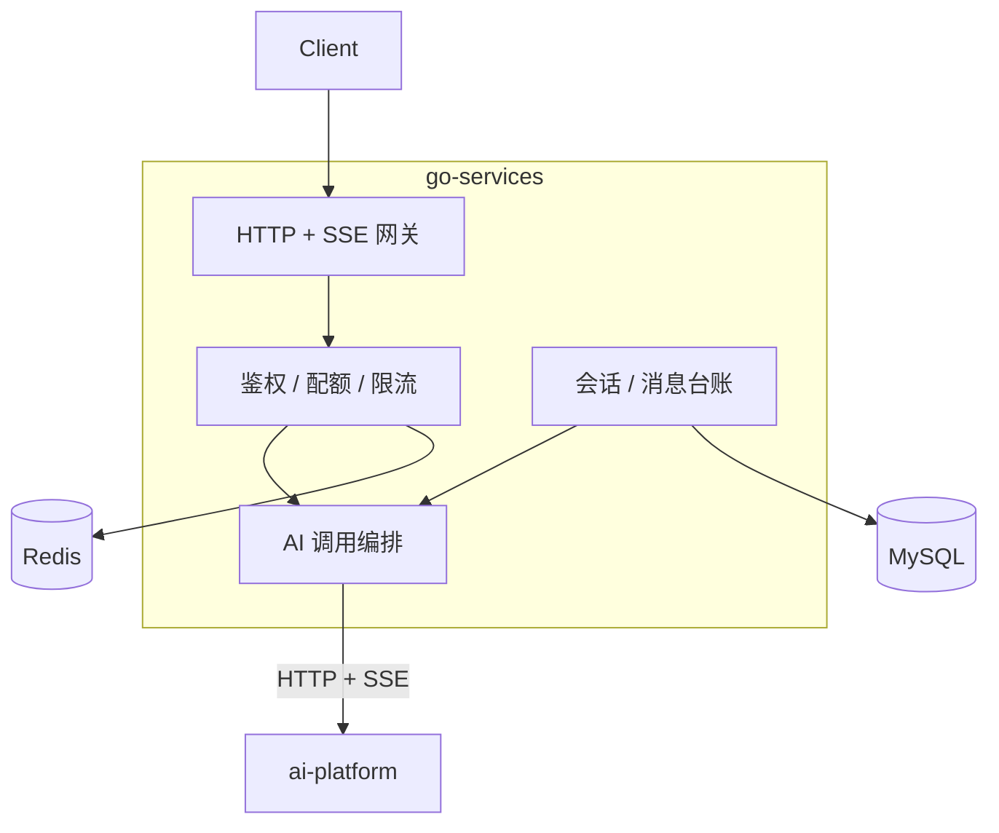

# 01 · 总体需求与范围

## 1. 背景与目标

`go-services` 是个人智能助手平台的**唯一对外入口**与**业务台账持有者**。它把客户端请求转成对 `ai-platform` 的 AI 能力调用，同时负责身份、会话、消息、配额这些「与 AI 无关但与业务强相关」的职责。

### 1.1 业务目标

| 编号 | 目标 | 可度量结果 |
| --- | --- | --- |
| `REQ-GEN-001` | 提供唯一的对外入口与统一鉴权 | 所有业务接口经网关鉴权；JWT 签发被 `ai-platform` 100% 接受 |
| `REQ-GEN-002` | 保证会话与消息的权威台账 | 消息不丢不重；刷新页面可完整恢复历史（含流式中断的半截回答） |
| `REQ-GEN-003` | 端到端流式体验不打折 | 客户端首 token 延迟 ≈ `ai-platform` 首 token 延迟 + ≤ 30ms |
| `REQ-GEN-004` | 配额可控制、可审计 | 超配额在网关侧即拦截，不产生 AI 侧调用与费用 |
| `REQ-GEN-005` | AI 侧故障时体验可预期 | AI 不可用时返回明确降级提示，而非超时/挂起 |
| `REQ-GEN-006` | 全链路可排障 | 同一 `trace_id` 贯穿客户端 → 网关 → `ai-platform` |

### 1.2 设计原则

| 原则 | 说明 |
| --- | --- |
| **单一权威** | 每份数据只有一个属主（见 [README §1.2](../README.md)），禁止双写 |
| **薄网关** | 网关只做鉴权、配额、台账、透传、编排；**不复制 AI 业务逻辑** |
| **零重写透传** | AI 侧的错误码、SSE 事件、`trace_id` 原样透传，网关不重新包装 |
| **失败快速可见** | 依赖不可用时立即返回明确错误码，禁止无限等待 |
| **状态在外部** | 进程内存不存业务状态，可任意水平扩展 |
| **契约先行** | 接口契约（OpenAPI / 或 proto）与 JWT 规范先评审、后实现（见 §7） |

## 2. 系统定位

### 2.1 职责划分

**网关做**：路由、JWT 校验与签发、配额扣减、限流、请求校验、会话消息落库、把请求转成对 `ai-platform` 的 HTTP 调用、把响应/流式事件转回 HTTP/SSE。

**网关不做**：Prompt 组装、上下文裁剪、向量检索、重排、工具执行、文档解析、记忆抽取、任务执行。

### 2.2 明确不做的需求（Out of Scope）

- 任何 LLM / Embedding / Rerank 的调用与编排逻辑（属 `ai-platform`）。
- Milvus / MinIO / Kafka 的客户端代码（属 `ai-platform`，见 [README §1.2](../README.md) 推论 1）。
- 知识库、文档、切片元数据的存储（属 `ai-platform`，网关只透传）。
- 前端 UI 与会话内容渲染、Markdown 解析。
- 模型计费单价计算（网关只记录用量，定价规则由运营配置）。
- Kubernetes 集群方案与 CI 流水线细节。

## 3. 角色与核心场景

| 角色 | 说明 |
| --- | --- |
| 终端用户 | 通过客户端登录、建会话、提问、上传文档、查看历史 |
| 客户端（Web/App） | 持有 Access/Refresh Token，使用 HTTP + SSE |
| `ai-platform` | 内网 AI 服务，提供 AI 能力，信任网关注入的 `user_id` |
| 运维/开发 | 查看指标、链路、配额与审计 |

### 3.1 核心场景

| ID | 场景 | 触发 | 期望结果 | 关联需求 |
| --- | --- | --- | --- | --- |
| S1 | 登录并对话 | 用户登录后提问 | 流式逐 token 显示，响应结束后消息已落库 | `REQ-AUTH-001`、`REQ-ORCH-003`、`REQ-CONV-004` |
| S2 | 刷新页面恢复历史 | 用户重开客户端 | 完整历史（含工具调用轨迹与引用来源）按时间正序展示 | `REQ-CONV-004/005` |
| S3 | 新建会话并首轮提问 | 用户新建会话 | 网关生成 `cv_*`，AI 侧据此读写上下文 | `REQ-CONV-001`、`REQ-ORCH-006` |
| S4 | 上传文档入库 | 拖入 PDF | 立即返回 `task_id`；网关转发字节流不落盘；轮询任务状态 | `REQ-ORCH-005/007` |
| S5 | 超配额 | 免费用户超额提问 | 网关直接 `429 QUOTA_EXCEEDED`，**不产生 AI 调用** | `REQ-AUTH-006` |
| S6 | 流式中途断网 | 客户端断开 | 网关 1s 内取消上游调用；已生成部分作为 `partial` 消息落库 | `REQ-ORCH-004` |
| S7 | AI 服务不可用 | `ai-platform` 宕机 | 网关返回 `503 AI_UNAVAILABLE` 并带可读提示；非 AI 接口（历史、配额）仍可用 | `REQ-ORCH-008` |
| S8 | 跨服务排障 | 用户投诉答错 | 用响应中的 `trace_id` 同时在网关与 AI 侧查到同一条链路 | `REQ-NFR-006` |
| S9 | 登出后令牌失效 | 用户登出 | Refresh Token 立即作废；改密码 / `logout_all` 时旧 access 因 `ver` 不匹配立即失效（普通登出下 access 在剩余 TTL ≤ 30min 内仍可用，靠客户端丢弃） | `REQ-AUTH-004` |
| S10 | 令牌续期 | Access 过期 | 用 Refresh Token 静默换新，用户无感 | `REQ-AUTH-003` |

## 4. 功能范围与优先级

**P0** = MVP 必须有；**P1** = 完整体验必需；**P2** = 增强项。

| 模块 | 功能 | 优先级 | 需求 ID | 详见 |
| --- | --- | --- | --- | --- |
| 鉴权 | 注册 / 登录 / 密码哈希 | P0 | `REQ-AUTH-001` | [02](./02-接口规范与鉴权.md) |
| 鉴权 | JWT 签发（含 `iss`/`aud`/`sub`/`ver`） | P0 | `REQ-AUTH-002` | [02](./02-接口规范与鉴权.md) |
| 鉴权 | 刷新令牌 | P0 | `REQ-AUTH-003` | [02](./02-接口规范与鉴权.md) |
| 鉴权 | 登出与令牌撤销 | P1 | `REQ-AUTH-004` | [02](./02-接口规范与鉴权.md) |
| 鉴权 | 用户资料 `/me` | P0 | `REQ-AUTH-005` | [02](./02-接口规范与鉴权.md) |
| 配额 | 周期配额与超限拦截 | P0 | `REQ-AUTH-006` | [02](./02-接口规范与鉴权.md) |
| 配额 | 用量查询与明细 | P1 | `REQ-AUTH-007` | [02](./02-接口规范与鉴权.md) |
| 限流 | 网关侧多维限流 | P0 | `REQ-AUTH-008` | [02](./02-接口规范与鉴权.md) |
| 会话 | 会话 CRUD | P0 | `REQ-CONV-001` | [03](./03-用户与会话服务.md) |
| 会话 | 会话自动标题 | P1 | `REQ-CONV-002` | [03](./03-用户与会话服务.md) |
| 会话 | 会话归档/软删与级联 | P1 | `REQ-CONV-003` | [03](./03-用户与会话服务.md) |
| 消息 | 消息台账读写与分页 | P0 | `REQ-CONV-004/005` | [03](./03-用户与会话服务.md) |
| 消息 | 流式部分结果落库 | P0 | `REQ-CONV-006` | [03](./03-用户与会话服务.md) |
| 编排 | 接口契约与 AI 调用 | P0 | `REQ-ORCH-001/002` | [04](./04-AI服务编排与网关.md) |
| 编排 | SSE 透传与事件保真 | P0 | `REQ-ORCH-003` | [04](./04-AI服务编排与网关.md) |
| 编排 | 取消与超时传播 | P0 | `REQ-ORCH-004` | [04](./04-AI服务编排与网关.md) |
| 编排 | 文件上传流式转发 | P0 | `REQ-ORCH-005` | [04](./04-AI服务编排与网关.md) |
| 编排 | 会话上下文一致性 | P0 | `REQ-ORCH-006` | [04](./04-AI服务编排与网关.md) |
| 编排 | 任务透传与聚合展示 | P1 | `REQ-ORCH-007` | [04](./04-AI服务编排与网关.md) |
| 编排 | 降级、熔断、重试 | P1 | `REQ-ORCH-008/009` | [04](./04-AI服务编排与网关.md) |
| 数据 | 业务表与索引 | P0 | `REQ-DATA-001..004` | [05](./05-数据模型.md) |
| 数据 | Redis Key 空间隔离 | P0 | `REQ-DATA-005` | [05](./05-数据模型.md) |
| 数据 | 与 AI 侧共库、共享表单一权威、字段宽度对齐、脚本可自检 | P0 | `REQ-DATA-007..010` | [05](./05-数据模型.md) |
| 非功能 | 性能与并发 | P0 | `REQ-NFR-001..003` | [06](./06-非功能需求与可观测性.md) |
| 非功能 | 安全 | P0 | `REQ-NFR-004/005` | [06](./06-非功能需求与可观测性.md) |
| 非功能 | 可观测性 | P1 | `REQ-NFR-006..008` | [06](./06-非功能需求与可观测性.md) |
| 非功能 | 配置与部署 | P0 | `REQ-NFR-009/010` | [06](./06-非功能需求与可观测性.md) |

## 5. 非功能红线摘要

完整指标见 [06](./06-非功能需求与可观测性.md)。

| 项 | 红线 |
| --- | --- |
| 网关自身额外延迟 | P95 ≤ 30ms（不含 AI 侧耗时） |
| 非 AI 接口（历史/配额/会话列表） | P95 ≤ 100ms |
| 并发 SSE 连接 | 单实例 ≥ 500 |
| 鉴权开销 | ≤ 3ms（JWT 验签 + `ver` 校验，至多一次 Redis 读） |
| 配额校验 | ≤ 5ms |
| 可用性 | 无 AI 依赖时 99.9%（月度） |
| 数据隔离 | 任何读写 MUST 携带 `user_id` 条件 |
| 密码存储 | Argon2id（禁止 MD5/SHA1/明文） |
| Token 传输 | 仅 HTTPS；Token MUST NOT 出现在 URL 与日志中 |

## 6. 约束与假设

### 6.1 技术约束

| 约束 | 说明 |
| --- | --- |
| Go 版本 | 1.24+ |
| 框架 | Go-Kratos内部通信  或 Gin Http对外接口， |
| 内部通信 | 内网 HTTP/JSON + SSE（默认，见 [04-§2](./04-AI服务编排与网关.md)）；若评审要求 gRPC，则按其三条前置条件执行 |
| 注册发现 | Nacos（本地开发可用静态地址，见 [06-§6](./06-非功能需求与可观测性.md)） |
| 数据库 | MySQL 8，`utf8mb4`，时间列 `DATETIME(3)` 存 UTC |
| Redis | 单实例（开发）/ 哨兵（生产），Key 前缀与 `ai-platform` 隔离 |
| 质量门槛 | `go build ./...`、`go vet ./...`、`golangci-lint run`、`go test ./...` 全绿 |

### 6.2 假设

- A1：客户端有能力消费 SSE，并能忽略未知 `event:` 类型（这样新增事件不破坏兼容）。
- A2：`ai-platform` 会信网关注入的 `user_id`（其 SRS 已要求无 token 接口白名单 + JWT 校验），故网关 MUST NOT 把用户可控值作为 `user_id` 传给 AI 侧。
- A3：`ai-platform` 已完成 [其上需求文档](../ai-platform/docs/README.md) 中 P0 部分。
- A4：会话上下文由 `ai-platform` 的 Redis 维护，网关**不缓存对话内容**（避免两处不一致）。
- A5：单用户量级为个人/小团队（≤ 1 万用户），无需分库分表。
- A6：本地开发可用 docker compose 起 MySQL/Redis；`ai-platform` 可本机直连。

## 7. 接缝风险清单（本文档核心）

以下 **9 项**是「两侧各自实现就会出错」的地方，MUST 在编码前对齐并写进契约测试。

| # | 接缝 | 风险 | 强制约定 | 关联 |
| --- | --- | --- | --- | --- |
| J1 | **JWT 签发/校验** | Go 签发缺少 `aud=ai-platform` 或缺 `sub`，AI 侧全部 401 | Go MUST 签发 `iss=ai-assistant`、`aud=ai-platform`、`sub=<user_id>`；算法与密钥与 AI 侧一致；MUST 有互操作测试 | [02-§3](./02-接口规范与鉴权.md)、`AC-TEST-01/02` |
| J2 | **错误码** | 网关把 AI 的错误重新包装成自己的码，客户端无法按码分支 | 网关 MUST 原样透传 `error.code/message/details/retryable`，**并保留原 `trace_id`** | [02-§4](./02-接口规范与鉴权.md)、`AC-TEST-04` |
| J3 | **trace 传递** | 两侧各生成一个 trace，排障时链路断开 | 网关 MUST 通过 `traceparent`（HTTP header / gRPC metadata）注入 W3C Trace Context，并复用 AI 侧返回的 `trace_id` | [06-§5.1](./06-非功能需求与可观测性.md)、`AC-TEST-05` |
| J4 | **conversation_id 归属** | 两侧都生成会话 ID，上下文与台账错位 | 网关是唯一生成者；调 AI 时 MUST 总是传 `conversation_id`；AI 的自建行为只用于其独立验收 | [04-§6](./04-AI服务编排与网关.md)、`AC-TEST-06` |
| J5 | **接口契约真源** | 两侧对字段名/类型/必填性理解不同，联调时才发现 | 按 [04-§2.1](./04-AI服务编排与网关.md) 选定的传输方式确定唯一真源（HTTP → OpenAPI；gRPC → proto）；MUST 有字段级快照测试 | [04-§2](./04-AI服务编排与网关.md)、`AC-TEST-03` |
| J6 | **SSE 事件保真** | 网关解析后重发，丢失 `tool_call` 或改变顺序 | 网关 MUST 按事件顺序逐个透传，**不得合并、不得丢弃未知事件**；仅允许追加自己的心跳 | [04-§4](./04-AI服务编排与网关.md)、`AC-TEST-07` |
| J7 | **配额与用量** | 两侧都扣减，或都不扣导致费用失控 | 扣减**只在网关**；AI 只上报 `usage`；网关 MUST 在调用前预扣、失败后回滚 | [02-§5](./02-接口规范与鉴权.md)、`AC-TEST-08` |
| J8 | **Redis Key 冲突** | 两侧都用 `rate:` / `ctx:` 前缀，互相覆盖 | 网关 Key 统一前缀 `gw:`（见 [05-§3](./05-数据模型.md)）；MUST NOT 读写 `ctx:`/`lock:`/`embed:`/`dedupe:` | [05-§3](./05-数据模型.md)、`AC-TEST-09` |
| J9 | **内部服务凭据** | AI 侧只有用户 JWT 校验，网关的「删会话时清理 AI 上下文」等后台调用无凭据可用；若复用用户 token 则会被 30min TTL 打断 | AI 侧 MUST 新增 `INTERNAL_SERVICE_TOKEN` 支持（来源 IP 白名单 + 接口范围限制）；网关 MUST NOT 复用用户 token 做后台调用 | [04-§3.2](./04-AI服务编排与网关.md)、`AC-TEST-10` |

> 权威归属（[README §1.2](../README.md)）+ 本清单（J1–J9）= 双服务协作的全部硬约束。其余细节两侧可各自演进。

## 8. 里程碑与交付物

| 阶段 | 范围 | 出口标准 | 对应需求 |
| --- | --- | --- | --- |
| M0 契约冻结 | 接口契约、JWT 规范、错误码映射表 | 两侧评审通过；`AC-TEST-01/02` 就绪 | J1、J5 |
| M1 鉴权闭环 | 注册登录、JWT 签发、`/me`、中间件 | Go 签发的 token 可被 `ai-platform` 接受 | `REQ-AUTH-001..005` |
| M2 会话闭环 | 会话 CRUD、消息台账 | S2、S3 跑通 | `REQ-CONV-001..006` |
| M3 编排闭环 | AI 调用客户端、非流式对话、非 AI 接口透传 | S1（非流式）跑通 | `REQ-ORCH-001/002/006` |
| M4 流式闭环 | SSE 透传、取消传播、部分结果落库 | S1、S6 跑通，首 token 增量 ≤ 30ms | `REQ-ORCH-003/004` |
| M5 配额与降级 | 配额、限流、熔断降级、任务与上传透传 | S4、S5、S7 跑通 | `REQ-AUTH-006..008`、`REQ-ORCH-005/007/008` |
| M6 可观测 | Trace 跨服务、指标、结构化日志、审计 | S8、S9、S10 跑通 | `REQ-NFR-006..008` |

**每阶段交付物**：可运行代码 + 契约变更记录 + OpenAPI（或 proto）文档 + 验收用例执行结果。

## 9. 需求追踪矩阵

| 需求 ID | 模块文档 | 验收用例（见 07） | 里程碑 |
| --- | --- | --- | --- |
| `REQ-GEN-001..006` | 01（本文件） | 由各模块 `AC-*` 覆盖 | 全阶段 |
| `REQ-AUTH-001..008` | 02 | `AC-AUTH-01..10` | M1 / M5 |
| `REQ-CONV-001..006` | 03 | `AC-CONV-01..10` | M2 |
| `REQ-ORCH-001..009` | 04 | `AC-ORCH-01..12` | M3 / M4 / M5 |
| `REQ-DATA-001..010` | 05 | `AC-DATA-01..10` | M2 |
| `REQ-NFR-001..010` | 06 | `AC-NFR-01..10` | M1 / M6 |
| `REQ-TEST-001..005` | 07 | 自身即测试要求 | M0 起 |
| 接缝 J1–J9 | §7 + 02/04/05 | `AC-TEST-01..10` | M0 起 |
