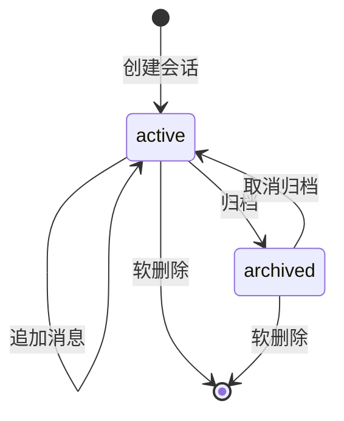
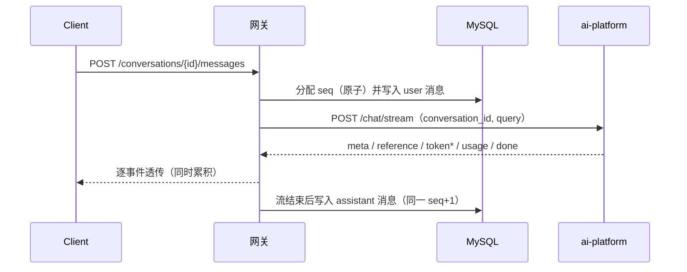

# 03 · 用户与会话服务

> 关联：需求 ID `REQ-CONV-*`；鉴权见 [02](./02-接口规范与鉴权.md)；表结构见 [05](./05-数据模型.md)；与 AI 侧的上下文交互见 [04-§6](./04-AI服务编排与网关.md)。

## 1. 会话模型

| 字段 | 类型 | 说明 |
| --- | --- | --- |
| `id` | string | `cv_*`，**由网关生成**（接缝 J4） |
| `user_id` | string | 属主；所有查询 MUST 带此条件 |
| `title` | string | 会话标题，≤ 100 字符 |
| `title_source` | `"auto" \| "manual"` | 是否被用户改过 |
| `status` | `"active" \| "archived"` | 归档后不可发消息但可读 |
| `message_count` | int | 消息总数（同时用作 `seq` 分配器，见 [05-§2.3](./05-数据模型.md)） |
| `last_message_at` | string \| null | 用于会话列表排序 |
| `model` | string \| null | 该会话默认模型；`null` = 用全局默认 |
| `kb_ids` | string[] | 该会话默认检索范围；`[]` = 检索该用户全部 KB |
| `metadata` | object | 透传埋点，如 `{"client":"web"}` |
| `pinned` | bool | 置顶（P2） |
| `created_at` / `updated_at` / `deleted_at` | string | RFC 3339 UTC |

**状态机**



不变式：

- 会话 ID **只由网关生成**；调用 `ai-platform` 时 MUST 总是携带它（接缝 J4）。
- 只有 `active` 会话可追加消息；`archived` 会话追加消息返回 `409 CONVERSATION_ARCHIVED`。
- 软删除后所有读写 MUST 视同不存在（`404 CONVERSATION_NOT_FOUND`），包括已存在的消息。

## 2. 会话接口

### 2.1 `POST /conversations`

| 字段 | 类型 | 必填 | 默认 | 约束 | 说明 |
| --- | --- | --- | --- | --- | --- |
| `title` | string | 否 | `null` | ≤ 100 字符 | 不传则首轮提问后自动生成 |
| `model` | string | 否 | `null` | 须在可用模型白名单内 | 会话级模型偏好 |
| `kb_ids` | string[] | 否 | `[]` | ≤ 10 个 | 会话默认检索范围 |
| `metadata` | object | 否 | `{}` | 键值 ≤ 64 字符 | 透传 |

响应 `201`：会话对象。

要求：

- `Idempotency-Key` 支持（见 [02-§7](./02-接口规范与鉴权.md)）。
- 创建会话 MUST NOT 调用 `ai-platform`（AI 侧无会话实体，其上下文是懒创建的）→ 创建接口 P95 ≤ 50ms。
- `kb_ids` 非空时 SHOULD 校验这些 KB 属于当前用户（**调用 AI 侧查询**或读短 TTL 缓存）；不存在则 `400 INVALID_ARGUMENT`（`details.fields[].reason="kb_not_found"`）。

### 2.2 其它会话接口

| 方法 | 路径 | 说明 | 成功码 |
| --- | --- | --- | --- |
| `GET` | `/conversations` | 分页列出；支持 `status`、`pinned`、`keyword`（标题模糊）过滤 | 200 |
| `GET` | `/conversations/{conversation_id}` | 详情 | 200 |
| `PATCH` | `/conversations/{conversation_id}` | 改 `title`（→ `title_source=manual`）、`model`、`kb_ids`、`pinned` | 200 |
| `POST` | `/conversations/{conversation_id}/archive` | 归档 | 200 |
| `POST` | `/conversations/{conversation_id}/unarchive` | 取消归档 | 200 |
| `DELETE` | `/conversations/{conversation_id}` | 软删除（级联见 §6） | 204 |
| `GET` | `/conversations/{conversation_id}/context` | **透传** AI 侧上下文预算视图（排障用） | 200 |
| `DELETE` | `/conversations/{conversation_id}/context` | **透传**清空 AI 侧短期上下文（保留消息台账） | 204 |
| `GET` | `/conversations/{conversation_id}/summary` | **透传**摘要 | 200 |
| `POST` | `/conversations/{conversation_id}/summary/rebuild` | **透传**重建摘要 | 202 |

> `context` / `summary` 三类接口的**实现细节**（Token 预算、裁剪顺序、摘要四段结构）完全属 `ai-platform`，网关只做鉴权 + 归属校验 + 透传 + 原样返回。网关 MUST NOT 缓存其响应。

### 2.3 需求

| ID | 需求 |
| --- | --- |
| `REQ-CONV-001` | 服务 MUST 是会话 ID 的唯一生成者，生成格式为 `cv_` + 26 位 ULID；MUST NOT 接受客户端传入自定义 `conversation_id` |
| `REQ-CONV-003` | 归档/软删 MUST 有明确状态语义：`archived` 可读不可写；软删后读写均 404，且消息 MUST 一并不可见 |

## 3. 会话自动标题（`REQ-CONV-002`）

| 项 | 约定 |
| --- | --- |
| 触发 | 首条 `user` 消息落库后，且 `title_source == "auto"` 且 `title` 为空 |
| 算法 | 取首条消息 `content`：去掉换行、连续空白折叠为单空格、去除 Markdown 标记（`` ` `` `#` `*` `[` `]`），截断至 `AUTO_TITLE_MAX_CHARS`（默认 30）字符，末尾加 `…`（若被截断） |
| 兜底 | 处理后长度 < 2 字符时用固定值 `新对话` + 创建日期（如 `新对话 09-28`） |
| 成本 | **MUST NOT 调用 LLM**（避免消耗配额与引入延迟） |
| 覆盖 | 用户 `PATCH title` 后 `title_source=manual`，此后 MUST NOT 再自动生成 |

> 为什么不用 LLM 生成标题：它会让「发第一条消息」引入一次额外的模型调用，既消耗配额又可能失败，收益（标题更漂亮）远不抵成本。若确需 LLM 标题，应作为 P2 异步任务并在 UI 上渐进替换。

## 4. 消息台账

### 4.1 消息模型

| 字段 | 类型 | 说明 |
| --- | --- | --- |
| `id` | string | `msg_*` |
| `conversation_id` | string | 所属会话 |
| `user_id` | string | 冗余属主，用于隔离校验与批量清理 |
| `seq` | int | 会话内自增序号，从 1 开始，**排序以此为准** |
| `role` | `"user" \| "assistant"` | 只存两类；工具轨迹作为 assistant 的附加结构 |
| `content` | string | 消息正文（Markdown） |
| `status` | `"completed" \| "partial" \| "failed"` | 流式中断 → `partial`；生成失败 → `failed` |
| `finish_reason` | string \| null | 透传 AI 的值：`stop` / `length` / `max_steps` / `canceled` |
| `references` | array | 引用来源（结构见 `ai-platform/docs/06-§6`） |
| `tool_calls` | array | 工具调用轨迹（`ToolCallTrace` 数组） |
| `usage` | object \| null | `{prompt_tokens, completion_tokens, total_tokens}` |
| `model` | string \| null | 实际模型名（取 AI 返回值） |
| `degraded` | bool | 是否降级 |
| `degraded_reasons` | string[] | 降级原因码 |
| `elapsed_ms` | int \| null | AI 侧耗时 |
| `trace_id` | string \| null | 该轮次的 trace，便于排障（接缝 J3） |
| `created_at` | string | 落库时间 |

**设计取舍**：`references` / `tool_calls` / `usage` 存为 **JSON 列** 而不是拆表。理由：它们只随消息整体读写、不做跨消息聚合查询，拆表会带来 3 个 JOIN 却无查询收益。

### 4.2 落库时机与 `seq` 分配



**`seq` 分配 MUST 原子**，用 MySQL 的 `LAST_INSERT_ID` 技巧（单次往返，无需额外锁）：

```sql
UPDATE conversation SET message_count = LAST_INSERT_ID(message_count + 1) WHERE id = ? AND deleted_at IS NULL;
SELECT LAST_INSERT_ID() AS next_seq;
```

- `seq` 由 `user` 消息与 `assistant` 消息共用同一序列（即 user=1, assistant=2, user=3…），保证严格排序。
- 排序规则：`ORDER BY seq ASC`；**MUST NOT** 依赖 `created_at`（同毫秒并发会乱序）。
- 每个会话 MUST 保证 `(conversation_id, seq)` 唯一（唯一索引），冲突即视为 bug 并告警。

### 4.3 消息接口

| 方法 | 路径 | 说明 | 成功码 |
| --- | --- | --- | --- |
| `POST` | `/conversations/{conversation_id}/messages` | 发送提问（非流式） | 200 |
| `POST` | `/conversations/{conversation_id}/messages/stream` | 发送提问（SSE 流式） | 200 |
| `GET` | `/conversations/{conversation_id}/messages` | 分页读取历史 | 200 |
| `GET` | `/messages/{message_id}` | 单条消息详情 | 200 |
| `DELETE` | `/messages/{message_id}` | 从台账删除（不改变 AI 侧上下文） | 204 |

`POST .../messages` 请求（= `ai-platform` 的 `ChatRequest` 子集 + 网关字段）：

| 字段 | 类型 | 必填 | 默认 | 说明 |
| --- | --- | --- | --- | --- |
| `content` | string | 是 | — | 用户提问，1..8000 字符（去空白后非空） |
| `use_rag` | bool | 否 | `true` | 是否检索 |
| `kb_ids` | string[] | 否 | 会话的 `kb_ids` | 本次覆盖 |
| `use_memory` | bool | 否 | `true` | 是否读写上下文与长期记忆 |
| `use_tools` | bool | 否 | `false` | 是否启用 Agent Loop |
| `model` | string | 否 | 会话的 `model` | 本次覆盖 |
| `temperature` | number | 否 | `null` | 0..2 |
| `top_k` / `rerank_top_n` / `score_threshold` | number | 否 | `null` | 透传 AI 侧 |
| `attachments` | object[] | 否 | `[]` | 附件（P2：需先上传为文档） |

`GET .../messages` 查询参数：

| 参数 | 默认 | 说明 |
| --- | --- | --- |
| `limit` | 20 | 1..100 |
| `cursor` | — | 游标 |
| `order` | `desc` | `desc`（倒序，用于「加载更多」）或 `asc`（正序，用于首屏渲染） |

响应：

```json
{
  "items": [
    {
      "id": "msg_01J8ZR5M2Q7X4C9T6B3N8V1K0D",
      "conversation_id": "cv_01J8ZQ3K7N9P2V6R4T8W1Y5B3C",
      "seq": 2,
      "role": "assistant",
      "content": "根据《售后政策 v3》，自签收之日起 **7 个自然日** 内可无理由退款。[1]",
      "status": "completed",
      "finish_reason": "stop",
      "references": [
        {
          "index": 1,
          "chunk_id": "chk_01J8ZQ9F4H2L7P3T6R8V1B5N0C",
          "doc_id": "doc_01J8ZQ1A2B3C4D5E6F7G8H9J0K",
          "kb_id": "kb_01J8ZQ3K7N9P2V6R4T8W1Y5B3C",
          "doc_name": "售后政策 v3.pdf",
          "page": 4,
          "score": 0.8123,
          "snippet": "自签收之日起 7 个自然日内……",
          "content_sha256": "9f2c..."
        }
      ],
      "tool_calls": [
        { "call_id": "call_abc", "name": "kb_retrieve", "arguments": {"query": "退款政策"}, "status": "ok", "summary": "命中 5 个片段", "elapsed_ms": 412 }
      ],
      "usage": { "prompt_tokens": 812, "completion_tokens": 64, "total_tokens": 876 },
      "model": "deepseek-flash",
      "degraded": false,
      "degraded_reasons": [],
      "elapsed_ms": 2043,
      "trace_id": "4bf92f3577b34da6a3ce929d0e0e4736",
      "created_at": "2026-09-28T10:00:02.100Z"
    }
  ],
  "next_cursor": "eyJzZXEiOjEsImNyZWF0ZWRfYXQiOiIyMDI2LTA5LTI4VDEwOjAwOjAwLjAwMFoifQ==",
  "has_more": true
}
```

### 4.4 需求

| ID | 需求 |
| --- | --- |
| `REQ-CONV-004` | 每条 `user` 与 `assistant` 消息 MUST 落库，且 MUST 完整保存 `references`/`tool_calls`/`usage`，使客户端刷新后可还原与流式时一致的展示 |
| `REQ-CONV-005` | 消息 MUST 以 `seq` 严格排序；`seq` 分配 MUST 原子，同一会话并发写入 MUST NOT 产生重复 `seq` |
| `REQ-CONV-006` | 流式请求在客户端断连或超时结束 MUST 落库 `status="partial"` 的 assistant 消息（保留已生成内容），MUST NOT 丢弃 |

## 5. 流式链路的落库策略

| 阶段 | 落库动作 |
| --- | --- |
| 收到请求、校验通过、配额预扣成功 | 写入 `user` 消息（`seq = n`） |
| 收到 AI 的 `done` | 写入 `assistant` 消息（`seq = n+1`，`status=completed`） |
| 收到 AI 的 `error` 帧 | 写入 `assistant` 消息（`status=failed`，`content` 为已累积内容，`finish_reason` 按错误映射） |
| 客户端断连 / 总超时 | 写入 `assistant` 消息（`status=partial`，`finish_reason="canceled"`） |
| 进程崩溃 | **可能丢失该 assistant 消息**（可接受）；`user` 消息已在库，重发时由 `Idempotency-Key` 去重 |

**写库 MUST 在响应结束后异步执行**（`errgroup` / 独立 goroutine + 超时），MUST NOT 阻塞 `done` 帧的发送。若写库失败：记 ERROR 日志 + 指标 `gw_message_persist_failed_total`，客户端仍视为成功（消息可在下次重试）。

`usage` MUST 在写库**之前**就提交给配额模块累加（接缝 J7），因为它是计费依据，比消息落库更重要。

## 6. 删除与级联

| 操作 | 网关侧 | AI 侧 |
| --- | --- | --- |
| 删单条消息 | 硬删该行（MUST 校验属主） | 不动（历史已进上下文，无法局部回滚） |
| 清空上下文 | 保留消息台账 | **透传**调用 AI `DELETE /conversations/{id}/context` |
| 软删会话 | `deleted_at` 置位；消息 MUST 一并不可见（查询 JOIN 会话过滤） | **异步**调用 AI 清理该会话上下文与摘要；失败仅记日志（AI 侧 `ctx:` Key 有 7 天 TTL 兜底，摘要记录由 AI 侧定期清理任务处理） |
| 物理清理 | 每日任务删除 `deleted_at` 早于 `RETENTION_DAYS`（默认 30 天）的会话与消息 | — |

> **为什么 AI 侧清理是「异步 + 可失败」**：删除会话属于用户可见的低风险操作，不应因 AI 侧抖动而失败或阻塞。而 AI 侧短期上下文有 TTL（7 天）、摘要数据不参与跨会话检索，残留的隐私风险与实现复杂度相比是可接受的。若合规要求「立即彻底清除」，则 MUST 改为同步调用 + 失败重试队列，并在验收中加一致性断言。

## 7. 验收标准

| ID | 关联需求 | 验收点 |
| --- | --- | --- |
| `AC-CONV-01` | `REQ-CONV-001` | 创建会话返回的 `id` 匹配 `^cv_[0-9A-HJKMNP-TV-Z]{26}$`；请求体里传 `id` 被忽略（生成的 ID 与之不同） |
| `AC-CONV-02` | `REQ-CONV-001` | 用用户 B 的 token 访问用户 A 的 `cv_id` → 404（不是 403） |
| `AC-CONV-03` | `REQ-CONV-002` | 首轮提问内容为 `  你好\n\n世界  ` → `title` 为 `你好 世界`；`title_source=auto` |
| `AC-CONV-04` | `REQ-CONV-002` | 手工 `PATCH title` 后再发消息 → 标题不再变化（`title_source=manual`） |
| `AC-CONV-05` | `REQ-CONV-003` | 向 `archived` 会话发消息 → `409 CONVERSATION_ARCHIVED`；`unarchive` 后可正常发送 |
| `AC-CONV-06` | `REQ-CONV-004` | 完成一次含 RAG 的流式对话后，`GET /messages` 的 assistant 项含非空 `references` 与 `usage.total_tokens > 0`，且与流式过程中推送的值一致 |
| `AC-CONV-07` | `REQ-CONV-005` | 同一会话并发发起 5 次非流式提问 → 10 条消息的 `seq` 恰为 1..10 无重复；`ORDER BY seq` 结果稳定 |
| `AC-CONV-08` | `REQ-CONV-006` | 流式收到 3 个 token 后强制断开客户端 → 库中存在 `status=partial` 的 assistant 消息，且 `content` 为已收到的 3 个 token 拼接 |
| `AC-CONV-09` | `REQ-CONV-004` | 让 AI 返回 `error` 帧 → 落库 `status=failed` 的消息，且 `GET /messages` 仍能正常返回（不因失败消息报错） |
| `AC-CONV-10` | §6 | 软删会话后：`GET /conversations/{id}` 404、`GET .../messages` 404；物理清理任务运行后 MySQL 中该会话与消息为 0 条 |
