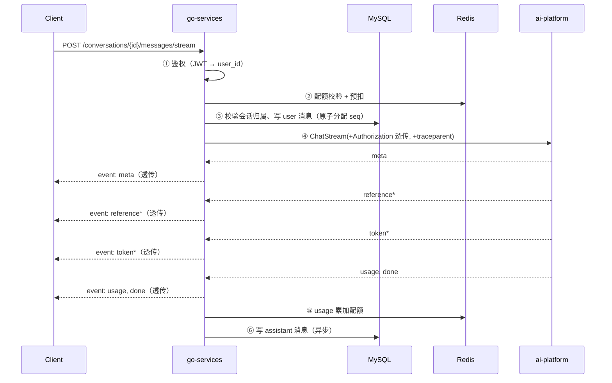

# 04 · AI 服务编排与网关

> 关联：需求 ID `REQ-ORCH-*`；接缝 J2–J9 见 [01-§7](./01-总体需求与范围.md)；鉴权见 [02-§3](./02-接口规范与鉴权.md)；会话与消息落库见 [03-§4](./03-用户与会话服务.md)。

## 1. 编排总览



**编排职责边界**：网关只做「校验 → 转发 → 落库 → 透传」。MUST NOT 解析 Prompt、MUST NOT 修改事件内容、MUST NOT 在网关侧做任何 AI 判断。

## 2. 契约层：唯一真源与传输选择

### 2.1 关键决策（与设计文档的偏差及理由）

设计文档写着「通过 gRPC 实现 Go 与 Python 之间的通信」。本 SRS **建议以内网 HTTP/JSON + SSE 作为默认传输**，理由：

| 维度 | HTTP/JSON + SSE | gRPC |
| --- | --- | --- |
| 契约真源 | `ai-platform` 已产出的 OpenAPI（Pydantic 模型）**一份** | 需额外维护 proto，与 Pydantic **两份**，易漂移 |
| 流式透传 | SSE 直接 `io.Copy`，事件天然保真（接缝 J6 自动满足） | 需为 9 类事件建模 `oneof`，映射层是新增故障点 |
| 上传/下载 | `multipart` 与 `presigned URL` 直接转发 | 需 client-streaming + 分块重组 |
| Python 侧成本 | 零改动（接口已存在） | 需引入 `grpcio` + proto 生成 + 独立 server + 端口 |
| 调试 | `curl -N` 即可复现 | 需 `grpcurl` / 写客户端 |
| 内网性能差 | JSON 序列化，实测 P95 增量 < 5ms（AI 侧耗时以百毫秒计） | 略优，但对本场景无实质收益 |

**结论**：

- `REQ-ORCH-001`：默认传输 **MUST** 为 HTTP/JSON + SSE，以 `ai-platform` 的 OpenAPI 为唯一契约真源。
- `REQ-ORCH-002`：若项目要求使用 gRPC（如答辩明确要求「gRPC 服务间通信」），MUST 满足以下三条，否则不允许切换：
  1. proto 落库为独立路径（如 `proto/aiplatform/v1/*.proto`）并纳入双方 CI，**与 HTTP 契约有字段级快照测试**；
  2. gRPC 事件映射表（§2.3）逐条实现并有「事件保真」测试（`AC-ORCH-03`）；
  3. 保留 HTTP 通道用于独立验收（`ai-platform` 的 SRS 要求其可独立验收）。
- 下文 §3–§5 的**语义规则对两种传输同样适用**，实现时只需替换传输层。

> **实施注记（2026-09-29，M3 已落地）**：项目按架构决策选择了 **用 gRPC 承载 `Chat` /
> `ChatStream`**，即走 `REQ-ORCH-002` 分支 —— §2.2 的「gRPC 方法（若采用）」一列
> 因此不再是假设。三条前置的满足情况：
>
> 1. **proto 落库且与 HTTP 契约有快照测试** ✓：真源是网关仓库内的
>    `proto/aiplatform/v1/chat.proto`，两侧从**同一个文件**生成代码；
>    字段级快照测试见 `internal/data/ai/contract_test.go`（Go）与
>    `tests/unit/test_grpc_server.py`（Python），对应 `AC-ORCH-02`。
>    **当前只有 `Chat` 落了 proto** —— `ChatStream` / `ChatEvent` 属 M4。
> 2. **事件映射表逐条实现**：§2.3 那张表 M4 才适用，本阶段不涉及。
> 3. **保留 HTTP 通道** ✓，而且比「保留」更进一步：§7 的 **19 条透传路由全部走 HTTP**，
>    `Chat` 也保留 `internal/data/ai/httpchat.go` 作为未开 gRPC 时的降级通道 ——
>    `ai-platform` 的独立验收不受影响。
>
> **需要把「已选择 gRPC」的代价也记下来，而不是只记收益**：多出 `grpcio` 依赖、
> 独立的 server 进程与端口（50051）、以及一份要各自生成两遍的 proto。这些都在 §2.1
> 的表格里预见过；真正**没预见**的是框架默认值这类隐性成本 ——
> Kratos 客户端会给每次调用套一个 2 秒超时，见
> [08-§6.4 第 1 条](./08-实现进度与运行手册.md)。

### 2.2 调用清单（网关 → AI）

| 网关场景 | 路径（HTTP） | gRPC 方法（若采用） | 幂等 | 可重试 |
| --- | --- | --- | --- | --- |
| 非流式对话 | `POST /chat` | `Chat` | 否 | 否 |
| 流式对话 | `POST /chat/stream` | `ChatStream`（server-stream） | 否 | 否 |
| Agent 非流式 | `POST /agent/run` | `AgentRun` | 否 | 否 |
| Agent 流式 | `POST /agent/run/stream` | `AgentRunStream` | 否 | 否 |
| KB 列表/详情/创建/改/删 | `/knowledge-bases*` | `ListKbs`… | 读幂等 | 读可重试 |
| 文档上传 | `POST /knowledge-bases/{id}/documents` | `IngestDocument` | 是（幂等键） | 否 |
| 文档列表/详情/切片 | `/documents*` | `ListDocuments`… | 是 | 是 |
| 检索调试 | `POST /knowledge-bases/{id}/search` | `Search` | 是 | 是 |
| 任务查询/取消/重试 | `/tasks*` | `GetTask`… | 是 | 是 |
| 上下文/摘要 | `/conversations/{id}/context|summary*` | `GetContext`… | 是 | 是 |
| 记忆 CRUD | `/memories*` | `ListMemories`… | 部分 | 读可重试 |
| 工具列表/调试调用 | `/tools*` | `ListTools`… | 是 | 是 |
| MCP 状态/重载 | `/mcp/servers*` | `ListMcpServers`… | 是 | 是 |
| 健康 | `/health/ready` | `Check` | 是 | 是 |

### 2.3 流式事件映射

`ai-platform` 的 SSE 事件与 gRPC `ChatEvent` 一一对应（**若采用 gRPC 时必须实现本表**）：

| SSE `event` | gRPC `ChatEvent` oneof 分支 | 字段 |
| --- | --- | --- |
| `meta` | `meta` | `conversation_id`, `message_id`, `model`, `created_at`, `degraded` |
| `reference` | `reference` | `repeated Reference references` |
| `token` | `token` | `delta` |
| `tool_call` | `tool_call` | `call_id`, `name`, `arguments`(JSON string) |
| `tool_result` | `tool_result` | `call_id`, `name`, `status`, `summary`, `elapsed_ms` |
| `usage` | `usage` | `prompt_tokens`, `completion_tokens`, `total_tokens` |
| `error` | `error` | `code`, `message`, `retryable` |
| `done` | `done` | `finish_reason`, `elapsed_ms` |
| `ping` | *不映射* | 心跳由传输层自带（HTTP keepalive）；gRPC 用 keepalive ping |

```proto
// proto/aiplatform/v1/chat.proto（若采用 gRPC；此处为契约概要，非最终文件）
syntax = "proto3";
package aiplatform.v1;

service AiPlatform {
  rpc Chat(ChatRequest) returns (ChatResponse);
  rpc ChatStream(ChatRequest) returns (stream ChatEvent);
}

message ChatRequest {
  string query = 1;                    // 必填
  string conversation_id = 2;          // 网关 MUST 总是填（接缝 J4）
  bool   use_rag = 3;
  repeated string kb_ids = 4;
  bool   use_memory = 5;
  bool   use_tools = 6;
  string model = 7;
  optional double temperature = 8;
  optional int32  top_k = 9;
  optional int32  rerank_top_n = 10;
  optional double score_threshold = 11;
  map<string, string> metadata = 12;
  // 仅当 use_memory=false 时使用（网关从消息台账取最近 N 条）
  repeated ChatMessage history = 13;
}

message ChatEvent {
  oneof event {
    Meta       meta = 1;
    References reference = 2;
    Token      token = 3;
    ToolCall   tool_call = 4;
    ToolResult tool_result = 5;
    Usage      usage = 6;
    Error      error = 7;
    Done       done = 8;
  }
}
```

## 3. 调用规则

### 3.1 地址解析与连接

| 项 | 约定 |
| --- | --- |
| 地址来源 | `AI_PLATFORM_BASE_URL`（HTTP，默认 `http://ai-platform:8000`）；gRPC 用 Nacos 解析 `AI_PLATFORM_GRPC_TARGET` |
| 本地开发 | 直连 `http://127.0.0.1:8000`，不经 Nacos（`AI_DISCOVERY_ENABLED=false`） |
| 连接复用 | HTTP：`http.Transport` 连接池（`MaxIdleConnsPerHost=64`，`IdleConnTimeout=90s`）；gRPC：长连接 + keepalive 30s |
| 最大报文 | `AI_MAX_RESPONSE_MB`（默认 16）——文档切片/检索结果可能较大 |
| 压缩 | 请求/响应均允许 gzip；**流式响应 MUST NOT 压缩** |

### 3.2 凭据传递

| 场景 | 凭据 | 说明 |
| --- | --- | --- |
| 用户发起的请求 | **透传客户端的 `Authorization: Bearer <access_token>`** | AI 侧自行校验 JWT（其 SRS 要求）；网关 MUST NOT 自造 `user_id` header 让 AI 信任（防伪造） |
| 网关后台任务（如删会话时清理 AI 上下文） | `INTERNAL_SERVICE_TOKEN`（静态密钥，仅内网） | AI 侧需支持该凭据（**这是新发现的接缝 J9**，需在 AI 侧 SRS 补充）；MUST NOT 复用用户 token（其 TTL 只有 30 分钟） |
| 健康检查 | 无 | AI 侧 `/health/ready` 免鉴权 |

### 3.3 超时（接缝：网关 MUST 比 AI 宽松）

| 阶段 | AI 侧（其 SRS 规定） | 网关侧 | 理由 |
| --- | --- | --- | --- |
| 建连 | — | 3s | 内网建连应瞬时 |
| 首字节（流式） | 30s | **35s** | 让 AI 先超时并返回 `UPSTREAM_TIMEOUT`，错误码更准确 |
| 空闲（流式） | 120s | **150s** | 同上 |
| 总时长 | 300s | **360s** | 同上 |
| 非流式对话 | 60s | **70s** | 同上 |
| 元数据类接口 | 5s | **8s** | 同上 |
| 上传 | 1800s（任务超时） | **120s**（仅建任务） | 上传只到"建任务"为止 |

> 若网关先超时，会返回自己的 `AI_TIMEOUT` 而掩盖 AI 的真实错误码与 `trace_id`，排障时看不到根因。故固有「网关超时 > AI 超时」的要求。

### 3.4 重试与熔断

| 项 | 约定 |
| --- | --- |
| 重试范围 | **仅幂等读操作**（§2.2 中「可重试 = 是」的行）；`Chat`/`ChatStream`/`AgentRun*`/上传 **MUST NOT 重试**（会重复计费或重复入库） |
| 重试策略 | 最多 2 次，指数退避 100ms / 300ms + 抖动；仅对可重试错误码（`RETRIEVAL_FAILED`、`DEPENDENCY_UNAVAILABLE`、连接错误、`UPSTREAM_TIMEOUT`） |
| 熔断 | 连续 `CB_FAILURE_THRESHOLD`（默认 10）次失败 → 打开 `CB_OPEN_SECONDS`（默认 30s）；半开时放行 1 个探针请求 |
| 熔断粒度 | 整体一个熔断器（AI 是单体服务）；**按上游依赖区分**为 P2 |
| 打开期间 | 直接返回 `503 AI_UNAVAILABLE`（`retryable=true`），**不发起调用**；记指标 `gw_circuit_breaker_state{target="ai-platform"}` |
| 例外 | 健康检查 **MUST NOT** 参与熔断统计，否则 AI 抖动会让网关连探活都不做 |

### 3.5 需求

| ID | 需求 |
| --- | --- |
| `REQ-ORCH-009` | 网关 MUST 实现「超时宽松于 AI、幂等才重试、失败计数熔断」三条规则，且熔断打开时 MUST NOT 发起真实调用 |

## 4. SSE 透传（接缝 J6）

### 4.1 事件保真规则

| 规则 | 说明 |
| --- | --- |
| **透传优先** | AI 侧响应体（`text/event-stream`）MUST 原样写入客户端连接（`io.Copy` 级别的转发），MUST NOT 反序列化后重新序列化 |
| 顺序 | MUST 保持原顺序；MUST NOT 合并、缓存、重排 |
| 未知事件 | MUST 透传未知 `event:` 类型（客户端被要求忽略未知事件），MUST NOT 丢弃 |
| 网关追加 | 网关 MAY **追加**自己产生的事件，但仅限两类：`gw_degraded`（网关侧降级提示）与 `gw_persist_error`（落库失败提示）；MUST NOT 插入到 `token` 之间影响文本拼接（SHOULD 放在 `done` 之后） |
| 头部 | MUST 设置 `Content-Type: text/event-stream; charset=utf-8`、`Cache-Control: no-cache, no-transform`、`X-Accel-Buffering: no` |
| 压缩 | MUST NOT 启用 gzip（会破坏增量输出） |
| 缓冲 | 每帧写完 MUST `Flush()`；MUST 关闭任何应用层缓冲 |
| 心跳 | SHOULD 在 15s 无数据时发送 `event: ping`（与 AI 侧间隔一致，避免重复心跳可接受） |

### 4.2 响应形态

客户端看到的 SSE 与直接连 `ai-platform` 时**逐字节相同**（除网关可能追加的 `gw_*` 事件）。这既是需求也是验收方式：**用同一请求分别打 AI 与打网关，比对事件序列**。

### 4.3 需求

| ID | 需求 |
| --- | --- |
| `REQ-ORCH-003` | 网关 MUST 保真透传 AI 的 SSE 事件流（顺序、事件名、`data` 内容、未知事件均不改写），并 MUST `Flush` 每一帧 |

## 5. 取消与超时传播（`REQ-ORCH-004`）

| 触发 | 网关行为 | AI 侧期望 |
| --- | --- | --- |
| 客户端断开（`http.Request.Context()` Done） | 1s 内取消对 AI 的调用；若已累积部分文本，落库 `status=partial` | 收到取消信号，停止上游 LLM 流、取消在途工具任务（其 SRS `REQ-CHAT-006`） |
| 网关首字节超时 | 取消调用，客户端收到 `504 AI_TIMEOUT` | 调用被取消 |
| 网关空闲超时 | 同上，若已进入流式则发 `event: error`（`code=AI_TIMEOUT`）后关闭 | — |
| 服务优雅退出（`SIGTERM`） | 停止接受新请求；给在途流式请求 `GRACEFUL_SHUTDOWN_SECONDS`（默认 20s）完成，超时则取消并落部分结果 | 收到取消信号 |

**实现要求**：`context.Context` MUST 从 HTTP handler 一路传递到 AI 调用（`http.NewRequestWithContext`），MUST NOT 使用 `context.Background()` 发起 AI 调用（否则断开后调用继续跑，白烧 token）。

## 6. 会话上下文一致性（接缝 J4）

| 规则 | 说明 |
| --- | --- |
| `conversation_id` 唯一生成者 | 网关（见 [03-§2.3 `REQ-CONV-001`](./03-用户与会话服务.md)） |
| 调用 AI 时 | **MUST 总是携带 `conversation_id`**，包括首轮 |
| `use_memory` | 默认 `true` → 网关 **MUST NOT** 传 `history`（AI 从自己的 Redis 取上下文，传了会重复注入） |
| `use_memory=false` | 网关 MUST 从消息台账取最近 `HISTORY_FALLBACK_TURNS`（默认 10）轮，按 `seq` 正序填入 `history` |
| AI 自建会话 | `ai-platform` 在 `conversation_id` 为空时会自建（其 SRS 行为）—— 生产链路 MUST NOT 依赖此行为；若 AI 响应返回的 `conversation_id` 与请求不一致，网关 MUST 记 ERROR 日志 + 指标 `gw_session_mismatch_total` 并以**网关的 ID 为准**（继续使用自己的会话） |
| 上下文清空 | 走 AI 的 `DELETE /conversations/{id}/context`，网关不自行清理（Redis 属 AI） |

### 6.1 需求

| ID | 需求 |
| --- | --- |
| `REQ-ORCH-006` | 网关 MUST 作为 `conversation_id` 的权威来源并总是传递它；`use_memory=true` 时 MUST NOT 传递 `history`，避免上下文重复注入 |

## 7. 透传接口清单

以下接口在网关侧**只有四件事**：鉴权 → 归属校验 → 透传 → 原样返回（含错误信封）。MUST NOT 添加业务逻辑。

| 分组 | 网关路径 | 透传到 AI |
| --- | --- | --- |
| 知识库 | `/knowledge-bases*` | `/knowledge-bases*` |
| 文档 | `/documents*` | `/documents*` |
| 检索调试 | `/knowledge-bases/{kb_id}/search` | 同名 |
| 任务 | `/tasks*` | `/tasks*` |
| 上下文/摘要 | `/conversations/{id}/context`、`/conversations/{id}/summary*` | 同名（网关把 `id` 原样传，不做映射） |
| 记忆 | `/memories*`、`/memory-settings` | 同名 |
| 工具 | `/tools`、`/tools/{name}/invoke` | 同名（`invoke` 在 `prod` 下由 AI 返回 404，网关不额外处理） |
| MCP | `/mcp/servers*` | 同名 |
| 文档下载 | `GET /documents/{doc_id}/download` | 由网关获取 AI 的 presigned URL 后 **302 重定向**（不代理字节流） |

**归属校验的作用**：不能只依赖 AI 侧的 `user_id` 隔离 —— 网关还会校验「该 `kb_id`/`task_id` 是否属于当前用户」吗？**不需要重复校验**：AI 侧已保证（其 SRS `REQ-RAG-011` 要求跨用户 404）。网关只做「路径合法 + 鉴权 + 透传」。**唯一例外**是会话相关资源（会话在网关侧，需校验 `conversation_id` 属主）。

### 7.1 需求

| ID | 需求 |
| --- | --- |
| `REQ-ORCH-007` | 任务相关接口 MUST 提供聚合视图：`GET /tasks` 支持跨 `type` 过滤与分页，且 MUST NOT 在网关侧建立任务副本表 |

## 8. 文件上传转发（`REQ-ORCH-005`）

| 项 | 约定 |
| --- | --- |
| 传输 | 网关接收 `multipart/form-data`，**流式转发**给 AI（`io.Copy` 到上游请求体），MUST NOT 全量读入内存、MUST NOT 落盘、MUST NOT 写 MinIO（接缝：MinIO 属 AI） |
| 前置校验 | 网关 SHOULD 提前校验**大小**（`Content-Length` 或流式计数，超 `UPLOAD_MAX_MB` 立即 413）与**Content-Type**；扩展名/魔数校验由 AI 负责（避免重复实现文件类型白名单） |
| 幂等键 | `Idempotency-Key` MUST 透传给 AI（AI 据此返回同一 `task_id`） |
| 超时 | 网关 120s（AI 只做校验 + 建任务，其 P95 ≤ 200ms） |
| 响应 | 原样返回 AI 的 `202`，网关 MUST NOT 改写 `task_id` 或 `doc_id` |
| 并发 | 单用户上传并发受 [02-§5.3](./02-接口规范与鉴权.md) 限流约束 |
| 大文件 | 分块上传（P2）：网关提供 `POST /uploads/init` + `PUT /uploads/{id}/part` 直传对象存储的 presigned URL，完成后通知 AI —— 需 AI 侧新增「按对象键入库」接口。**方案细节与验收方式见 [`10-§5.3`](./10-大文件上传与索引优化清单.md)（UP-08）** |

> **已知缺口（待 SRS 定口径，本节尚未覆盖）**：① 超过 `MAX_DOC_CHUNKS` 时**静默截断**
> （实测 8MB 丢 **41%** 正文，接口仍回 `202`）；② 索引过程**零进度可观测**（客户端只有
> `task_id`，无法区分"在算"与"卡住"）。两条的立项、优先级、验收方式见
> [`10-大文件上传与索引优化清单`](./10-大文件上传与索引优化清单.md)（UP-01 / UP-02 / UP-05）。
>
> **上游（AI 侧）进展 —— 2026-09-30**：上面 ① ② 的**字段已经在上游落地**，网关侧仍**零改动**
> （只是把 AI 的 JSON 原样转发）：
>
> | 事实 | 上游字段 | 网关怎么拿到 |
> | --- | --- | --- |
> | 被截断了多少 | `document.chunks_total`（截断前产出数）+ `document.truncated`（是否丢尾）；保留量看既有的 `document.chunk_count` | `GET /documents*` 透传 |
> | 处理到哪一步 | `task.stage`（`PARSING`/`CHUNKING`/`EMBEDDING`/`INDEXED`）、`task.chunks_total`、`task.chunks_done` | `GET /tasks*` 透传（**不建副本表**，`REQ-ORCH-007`）；SSE `GET /tasks/{id}/events` 的 `progress` 帧也会带上分片计数 |
>
> ⚠️ **网关侧唯一的约束**：这些键靠"**透传不改结构**"才能到达调用方。
> 若日后把 `GET /tasks` / `GET /documents` 改成**强类型绑定后重新序列化**，
> 必须同步把新字段加进 Go 结构体，否则会**静默丢字段**（参见 `docs/10-§8-6`）。
> 正式契约（`docs/07` 的 AC 与本节响应表）尚未回写 —— 见 `docs/10-§8-4` 的 `AC-ORCH-13` / `AC-ORCH-14` 提案。

## 9. 降级策略（`REQ-ORCH-008`）

| 场景 | 网关行为 | 客户端可见 |
| --- | --- | --- |
| AI 不可达 / 熔断打开 | 非 AI 接口（会话、历史、配额）**照常可用**；AI 接口返回 `503 AI_UNAVAILABLE` + 可读提示 | 明确错误 + `retryable=true` |
| AI 过载（`OVERLOADED`） | 透传 `503 AI_OVERLOADED` | 明确错误 |
| AI 返回 `degraded=true`（RAG/记忆降级） | **透传**，并在 assistant 消息的 `degraded_reasons` 中保留 | 可用 UI 提示「本次未使用知识库」 |
| 消息落库失败 | 客户端仍视为成功；追加 `event: gw_persist_error`（在 `done` 之后）；记 ERROR + 指标 | 提示「历史可能未保存」 |
| Redis 不可用 | 配额改用本地内存计数（仅本实例、有上限）；`ver` 缓存失效 → 每次鉴权回源 MySQL（延迟上升，但**语义仍正确，不会放行已登出的 token**） | 正常（延迟略升） |
| MySQL 不可用 | 会话类接口返回 `503 DEPENDENCY_UNAVAILABLE`；纯透传接口（KB/任务）仍可用 | 明确错误 |
| Nacos 不可用 | 使用上一次解析到的地址（内存缓存）；地址从未解析成功则启动失败 | 不影响已启动实例 |

> **Redis 不可用时为什么比带黑名单的设计更安全**：本设计把「令牌是否已失效」的权威放在 MySQL（`token_version`），Redis 只是缓存。因此 Redis 挂了只会变慢，不会放行已失效的令牌；反过来也说明 `ver` 校验的 MySQL 回源路径 MUST 可用（这也是 `/health/ready` 检查 MySQL 而不检查 Redis 的原因）。
>
> 唯一真正降级的是**配额精度**：多实例时本地计数不共享，可能超发。MUST 在告警中体现，并在 Redis 恢复后以 MySQL 为准重建。

## 10. 验收标准

| ID | 关联需求 | 验收点 | 状态 |
| --- | --- | --- | --- |
| `AC-ORCH-01` | `REQ-ORCH-001` | 网关能完成一次非流式对话，且 AI 侧日志中出现了该请求（证明打通） | **已通过**：`tools/curl_stage3.ps1`（29 项，含一次真实模型调用），AI 侧日志可见对应请求 |
| `AC-ORCH-02` | `REQ-ORCH-002` | （若采用 gRPC）proto 与 HTTP 契约的字段级快照测试通过；字段缺失或类型不一致时 CI 失败 | **已通过**（`Chat` 部分）：`internal/data/ai/contract_test.go` + `tests/unit/test_grpc_server.py` |
| `AC-ORCH-03` | `REQ-ORCH-003` | 同一请求分别直连 AI 与经网关，抓取两侧 SSE 原始字节：**事件名序列与顺序完全一致**，`data` 内容语义一致 | **已通过**（2026-09-30）：`tools/curl_stage4.ps1` 钉住「事件顺序 `meta→reference*→token*→usage→done`」「帧格式为 `event:` + `data:` 两行」「帧内不含 `\r`」。**与 §4.2 字面「字节一致」的偏差及原因见 `docs/08-§7.5`** |
| `AC-ORCH-04` | `REQ-ORCH-004` | 流式中途断开客户端：AI 侧日志/指标出现 `canceled`；网关在 1s 内记录取消；**断连后 10s 内 AI 侧无新增 LLM token 消耗** | **部分通过**（2026-09-30，口径已细化）：断连后查到 `status=partial` + `finish_reason=canceled` 的行，且**内容保留、`user` 消息仍在**由 `tools/curl_stage4.ps1` 的 S6 一组断言钉住（`AC-CONV-08` 同源）；「取消穿透到上游生成器（`aclosing` 关上 LLM 流）」由 `tests/unit/test_grpc_server.py::test_chat_stream_cancellation_reaches_upstream` 覆盖。<br>⚠️ **仍未定性的两点**：①**「1s 内记录取消」这个延迟本身没有被可信地量过** —— 先前记的 `23.5ms / 30.2ms` 与本机对**真实模型**复测的 `1705ms / 2862.6ms` 差 70 倍，而「查得到 partial」只说明**落库最终发生了**，不等于「取消及时」；分辨二者需要 **AI 侧出现 `canceled` 的时刻**（AI 侧指标）；②**「断连后 10s 内 AI 侧无新增 LLM token 消耗」这一半需要 AI 侧指标**，仍待 AI 侧补齐。详见 `docs/08-§9.5` 第 4 条 |
| `AC-ORCH-05` | `REQ-ORCH-005` | 上传 50MB 文件经网关：网关进程 RSS 增长 < 50MB（证明流式转发，未全量读入内存） | **已通过**（2026-09-30）：`tools/curl_stage5.ps1` 上传 **8.00 MB**，网关 RSS **峰值增量 0.4 MB**（文件体积的 5%）；超过 `UPLOAD_MAX_MB` 的同一份文件得 `413 PAYLOAD_TOO_LARGE`。上传体积默认取 8MB 而非 AC 字面的 50MB，理由见 `docs/08-§8`（相对判据的分辨力与 49MB 会把 AI 侧事件循环拖死） |
| `AC-ORCH-06` | `REQ-ORCH-006` | 抓取 AI 侧收到的 `conversation_id` 与网关创建的 ID 相同；`use_memory=true` 时请求体中 `history` 为空 | **已通过**：stage3 断言回包 `user_message.conversation_id` 等于网关权威值；`use_memory=true` 不传 history 有单测 |
| `AC-ORCH-07` | `REQ-ORCH-006` | 让 AI（mock）返回一个不同的 `conversation_id` → 网关日志出现 `gw_session_mismatch_total` 告警，后续消息仍落在网关自己的会话下 | **已通过**（2026-09-30）：指标已预置并由 `tools/curl_stage6.ps1` 断言「零流量下可见」（`AC-NFR-09` 那一组）；「AI 返回不同 ID 仍落网关会话下」由 `internal/biz/orchestration_test.go::TestSendKeepsGatewayConversationOnUpstreamMismatch` 与 `TestSendDoesNotWarnWhenUpstreamEchoesSame` 一对用例钉住（前者改 ID 必须告警、后者回声不告警） |
| `AC-ORCH-08` | `REQ-ORCH-009` | 连续让 AI 返回 500 达 10 次 → 第 11 次请求网关**未发起**真实调用（AI 侧计数不变）并返回 `503 AI_UNAVAILABLE`；30s 后恢复 | **已通过**（2026-09-30）：`tools/curl_stage5.ps1` 把上游指向必然空闲端口，12 次探测全部 `503 AI_UNAVAILABLE`，`gw_circuit_breaker_state == 2`，`gw_ai_requests_total{result="rejected"} >= 1`（证明拒绝路径确实走到），拒绝耗时 **9~13 ms**。**修复前这一步自死锁且无日志** —— 见 `docs/08-§8.3` 第 3 条 |
| `AC-ORCH-09` | `REQ-ORCH-009` | 关闭 AI 服务后：`GET /conversations`、`GET /me/quota` 仍返回 200；`POST .../messages` 返回 503 | **已通过**：`tools/curl_stage5.ps1` 同一实例上断言四条（登录 / 建会话 / `GET /conversations` / `GET /me/quota` 全部正常） |
| `AC-ORCH-10` | `REQ-ORCH-007` | `GET /tasks?type=document_ingest&status=FAILED` 正常透传；MySQL 中**不存在**任务表副本 |
| `AC-ORCH-11` | §7 | 用用户 A 的 token 请求用户 B 的知识库 ID → 404，且错误信封的 `code` 与 `trace_id` 与 AI 侧返回**完全一致** |
| `AC-ORCH-12` | `REQ-ORCH-004` | 网关 `SIGTERM`：在途流式请求在 20s 内正常收到 `done`；超过 20s 的被取消且落库 `partial`；进程 ≤ 30s 退出 | **部分通过**（2026-09-30）：`pump` 的 `shutdown` 分支与「先发终止原因再落 `partial`」有单测（`internal/biz/message_stream_test.go`）；**实机 `SIGTERM` 验收未做** —— Windows 不提供 `SIGTERM`。M6 已完成，但容器化部署不在 M6 出口标准（S8/S9/S10）内，仍为独立工作项（`docs/08-§9.4`） |
