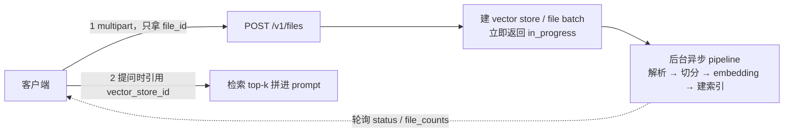

# 10 · 大文件上传与索引：业界基线与优化清单

> 本文回答一个问题：**"8MB 上传要等 1 分钟"到底是哪里慢、我们和 ChatGPT / OpenAI 的做法差在哪、下一步该动什么。**
>
> 与 [`09-验收耗时归因与优化清单`](./09-验收耗时归因与优化清单.md) 的分工：
>
> - **09 只做"耗时"**（一次全套验收的秒数分解、OPT-01~OPT-10 的提速项）；
> - **本文只做"上传 → 索引"这一条链路的功能/正确性/产品行为**，并给出**外部基线对照**。
>   凡是"能快多少秒"的结论仍在 09；本文里的收益一律用**片数 / 字节 / 可见性**这类可复算的量表达。
>
> 记录原则与 09 相同：**每条结论要能指向一次测量（命令 + 数字）**；每条优化项要写清
> **预期收益 / 风险 / 验收方式 / 归属仓库**。凡"大概能快一点"的都不写进来。

---

## 1. 结论摘要

**传输层没有问题，问题全在下游三件事。**

| # | 结论 | 性质 |
| --- | --- | --- |
| ① | 网关的上传实现（`Content-Length` 预检 + `io.Copy` 流式转发 + 透传上游 `202`）**与业界语义一致，无需重做** | ✅ 已对齐 |
| ② | 8MB 不是"8MB"：它是 **305 万 token**（≈2,290 页 ≈ 20 本中文长篇），切分只认 token | ⚠️ 认知问题（不是缺陷） |
| ③ | 有效块长中位只有 **175 token**，而 `CHUNK_SIZE=512` ⇒ 片数被放大 **2.6 倍**（16,969 vs 整篇一次切的 6,527） | ⚠️ 配方问题（改它要重定标召回）⇒ **UP-03 已修（2026-10-02）**：中位 **175 → 490 token**（填充率 34% → 96%）、片数 **16,969 → 6,056**（2.80×，见 §5.2）；**召回重定标仍欠**（§8-2）；**且它不是提速项** —— 实测每 token 更贵、且要多嵌入 70% 的 token，见 [`11-§2.4`](./11-优化项实测记录.md） |
| ④ | 超过 `MAX_DOC_CHUNKS=10000` 时**静默截断**：8MB 丢 **41% 正文**，接口仍回 `202` | ❌ 产品缺陷（假成功）⇒ **UP-01 已修**（`chunks_total` / `truncated` 已通到 API，见 §5.1）；**UP-03 之后 8MB 落在 6,056 片、根本不再触发截断**（护栏保留，用于真正超大的文件） |
| ⑤ | 索引过程**零进度可观测**：客户端只有一个 `task_id`，只能干等 | ❌ 产品缺陷（等待不可见）⇒ **UP-02 已修**（`stage` / `chunks_done` / `chunks_total` 已通到 API） |
| ⑥ | 解析 / 切分 / 哈希三段**已 `asyncio.to_thread`**、索引**已在独立 worker 进程**、embedding **已分批 + 限并发** | ✅ 已具备（**守门项**，不是待办） |

> **⑥ 的口径修正（本节曾写作"同步 CPU 跑在事件循环里 = 架构缺陷"）**：核对当前工作树后，
> 三项都已在位 —— `app/rag/service.py::_ingest_document` 的 `parse_document` / `split_blocks` /
> `_build_chunks` 各有一次 `await asyncio.to_thread(...)`（行 610 / 629 / 664）；
> `app/worker/__main__.py` 提供 `uv run python -m app.worker` 的独立进程；
> `embedding_batch_size=16` / `worker_embed_concurrency` / `torch_num_threads` 均在 `app/core/config.py`。
> **结论：UP-04 / UP-06 / UP-07 只剩"守门"价值（不许退回同步 / 退回同进程 / 退回单批全量），
> 不构成待办工作量。**

一句话：**"慢"不是文件大，是 token 多 + 片数被配方放大 2.6 倍 + 丢了一半还没人说。**

---

## 2. 基线事实（全部可复算）

### 2.1 网关侧：上传接口是健康的

来源：`internal/service/upload.go`、[`docs/08-§8`](./08-实现进度与运行手册.md)、[`docs/09-§2.5`](./09-验收耗时归因与优化清单.md)。

| 项 | 实测 / 现状 | 来源 |
| --- | --- | --- |
| 网关做的事 | 只有三件：前置 `Content-Length` 判限 → `io.Copy` 转发字节流 → 透传上游响应 | `internal/service/upload.go` |
| 不落盘 / 不入内存 / 不写 MinIO | ✅ `AC-ORCH-05`：8.00 MB 上传，网关 RSS **139.7 → 140.0 MB，增量 0.4 MB**（文件体积的 5%） | `tools/curl_stage5.ps1` |
| 超限行为 | `413 PAYLOAD_TOO_LARGE`，**只读 `Content-Length`，不读 body** | 同上 |
| 默认上限 | `UPLOAD_MAX_MB` 默认 **50** | `internal/service/upload.go::NewUploadHandler` |
| 扩展名 / 魔数 / 入库 / 建任务 | **全部在 AI 侧**（`docs/04-§8` 明确不重复实现白名单） | `docs/04-§8` |
| 上传耗时 | 秒级返回 `202` + `task_id`；**"上传接口返回" ≠ "索引算完"** | `docs/08-§8` |

⇒ **网关这一侧不在本文的整改范围**（唯一例外是 UP-02 的透传验证与 UP-08 的 P2 通道）。

### 2.2 AI 侧：8MB 的真实体积

来源：[`docs/09-§7.1`](./09-验收耗时归因与优化清单.md)（复刻 `curl_stage5.ps1::New-TextBody` 的正文，走**真实** `parse_document` → `ChunkingService(512/64).split_blocks`）。

| 量 | 实测值 |
| --- | ---: |
| 正文字节 | **8,388,573**（8.00 MiB） |
| 汉字 / token（整篇 `encode`） | 229 万 / **3,053,429** |
| token（分块求和口径） | **2,968,583** |
| 解析出的 block | **84,846** |
| 切分出的 chunk | **16,969** |
| 单块 token | min 170 / 中位 **175** / max 178 |
| **实际入库** | **10,000**（被 `MAX_DOC_CHUNKS` 截断，**丢 41%**） |

两个放大点，都与"文件大不大"无关：

1. **字节 ≠ token。** 中文实测 **1.33 token/汉字**、**2.75 bytes/token**。按 A4 一页 ~1000 汉字算，
   8MB ≈ **2,290 页**。"8MB 不算大"说的是**传输量**（网关只涨 0.4MB），与 token 量是两件事。
2. **测试文本的形状又放大 2.6 倍。** `New-TextBody` 逐行重复同一模板 ⇒ 84,846 个平均 39 字符的碎段，
   而 `_merge_short` 的停止条件是"累到 `chunk_size × 0.3 = 153.6` 就停" ⇒ 片长中位 175 token，
   只填到配额的 **34%**。对照实验：

   | 切法 | 片数 | 说明 |
   | --- | ---: | --- |
   | 整篇一次性切（`create_documents([text])`） | **6,527** | 段边界连续、装箱效率高 |
   | 按 84,846 个 block 切（**真实链路**） | **16,969** | 碎段 + 合并提前停 ⇒ **2.6×** |

   ⇒ **"8MB → 1.7 万片"是测试文本形状的上界**；正常散文同体积约 6,500 片。

   > **UP-03 之后（2026-10-02 实测，同一份正文、同一条链路）**：
   >
   > | 切法 | 片数 | 中位块长 | 填充率 |
   > | --- | ---: | ---: | ---: |
   > | 改前（`0.3` 当停止条件） | **16,969** | 175 | 34% |
   > | **改后（填到 `chunk_size`）** | **6,056** | **490** | **96%** |
   > | 参照：整篇一次性切 | 6,527 | — | — |
   >
   > ⇒ **2.80×**，且 6,056 < `MAX_DOC_CHUNKS=10000`：8MB 不再截断。
   >
   > ⚠️ **这 2.80× 是"片数"，不是"时间"**：真 BGE 实测长块的每 token 成本比短块高 **26~28%**，
   > 而不再截断意味着要嵌入 70% 更多 token ⇒ 8MB 全量嵌入 ≈**101min**（旧形状同内容 ≈81min）。
   > 完整数据（含真 BGE 端到端 A/B、线程数 A/B）见 [`11-优化项实测记录`](./11-优化项实测记录.md)。
   > 改后比"整篇一次切"还少一点，原因是**合并是跨 block 的贪心装箱、且拼接不产生重叠**
   > （见 §5.2 的风险列）。改前那一列由内联复刻的旧停止条件算出，用于自证探针没写错。

### 2.3 "等 1 分钟"的两种口径（先分清是哪一种）

| 现象 | 含义 | 判据 |
| --- | --- | --- |
| `POST .../documents` **本身**卡住约 60s 才返回 | AI 的**事件循环被同步 CPU 占住**。**成因已在当前工作树消除**（`parse_document` / `split_blocks` / `_build_chunks` 三段均已 `await asyncio.to_thread`，见 §1 ⑥）⇒ 现在这条只剩**回归判据**价值：若再次出现，先确认进程跑的是不是当前代码（旧进程 / 未热重载 / worker 与 API 版本不一致），再怀疑 `to_thread` 被改回同步 | AI 日志停在 `embedding.loading` 之后长时间没有 `loaded`；进程在监听但所有请求超时（`docs/09-§7.1` 结论 3） |
| 接口 **<1s 返回 `202`**，文档要 ~60s 后才能检索 | 后台 ingest 的**正常耗时**，缺的是**进度可见性**（本条是当前真实待办） | `202` 响应体里有 `task_id`，但没有任何"处理到哪一步"的字段 |

这两条对应**完全不同的优化项**（前者 UP-04，后者 UP-02），**不要混着改**。

---

## 3. 业界基线：OpenAI 的 `file_search` / vector store

**来源与口径**：`platform.openai.com` 官方文档站于 2026-09-30 直连返回 **403**（无法直接引用），
本节数字取自 **Microsoft Learn《How to use Azure OpenAI Assistants file search (classic)》**
（`ms.date: 2026-08-21`，页面 `updated_at: 2026-09-10`）—— 该页是 OpenAI Assistants `file_search`
规范的镜像（同一套 `vector_stores` / `file_batches` 对象）。**引用时以"业界公开文档口径"对待，
不当作精确契约**；需要精确值时回官方站复核。

### 3.1 机制：上传、索引、对话三件事解耦



- **索引进度是显式状态机**：`in_progress → completed`，客户端**轮询 `status` / `file_counts`**。
  文档明确"adding files to vector stores is an **async** operation"，并**建议在创建 run 之前先轮询到 `completed`**。
- **run 前有 60s fallback 等待**：若 thread 的 vector store 里仍有文件在处理，
  run 最多等 **60 秒**再继续（且该 fallback **只对 thread vector store 生效，对 assistant vector store 不生效**）。
- Thread vector store 有**默认 7 天过期策略**（成本控制）。

### 3.2 参数与上限

| 项 | 业界值 | 我方现状 | 差在哪 |
| --- | --- | --- | --- |
| chunk size | 默认 **800 token**（可配） | `CHUNK_SIZE=512` | 配置本身合理 |
| chunk overlap | 默认 **400 token**（= chunk/2） | `CHUNK_OVERLAP=64` | 我方 overlap 偏小 |
| **有效块长** | 由配置直接决定 | 中位 **175**（配置的 34%） | ❌ 配方放大片数 |
| 入上下文块数 | 最多 **20** 块（并 rerank） | `RAG_CONTEXT_TOKEN_BUDGET` | 口径不同，需单独对齐 |
| 单文件上限 | **512 MB / 5,000,000 token** | 网关 `UPLOAD_MAX_MB=50` | 我方更保守（合理） |
| 每 vector store | **10,000 _files_** | `MAX_DOC_CHUNKS=10000` **_chunks_** | ⚠️ **见下方勘误** |
| 超限行为 | **报错**（`last_error`） | **静默截断 + 仍回 202** | ❌ **假成功** |
| 批次大小 | 单批最多 500 files | 单请求单文件 | 无差距 |

> ⚠️ **勘误（2026-09-30，本文首次记录）**：此前口述与笔记里把业界上限说成
> **"向量库最多 10,000 chunks"** —— **是错的**，官方口径是 **10,000 _files_ / vector store**。
> 这个区别决定了两件事：
> ① **不要拿"业界也是 1 万"来给我们保留 `MAX_DOC_CHUNKS=10000`**：那把尺子量的是**文件数**，不是块数；
> ② 业界的块数是由 **chunk 参数 + "最多 20 块入上下文" + rerank** 控制的，
> 而不是靠一个"总块数硬上限"。我们的 `MAX_DOC_CHUNKS` 是**自己的护栏**（防超大文件打爆向量库），
> 保留它没问题，**但它不该是静默的**。

### 3.3 对我方最要紧的三条

1. **异步是对的，但异步必须配"可见性"。** 他们给了 `status` / `file_counts`，甚至给 run 加了 60s fallback 等待；
   我们给了 `202` + 空进度（UP-02，已补）。
2. **上限是"报错"，不是"少存一点"。** 超限时调用方必须能看见（UP-01，已补字段；"报错"与否待 SRS 定，UP-05）。
3. **重活不在 API 的事件循环里。** 这一点我方**已经对齐**：解析/切分/哈希三段均已 `to_thread`，
   索引跑在独立 worker 进程（UP-04 / UP-06 属**守门项**，不是待办）。

---

## 4. 差距分析

| # | 环节 | 我方现状 | 业界做法 | 差距性质 | 归属 |
| --- | --- | --- | --- | --- | --- |
| G1 | 上传接口语义 | `202` + `task_id`，秒回，流式转发（RSS +0.4MB/8MB） | `file_id` + vector store，异步 + 轮询 | **无差距** | — |
| G2 | 索引进度 | ~~无任何进度字段~~ ⇒ **已补** `stage` + `chunks_done`/`chunks_total`（UP-02） | `status` / `file_counts` 可轮询 + run 前 60s fallback | **产品缺陷 → 已修**（仅剩契约回写 04/07） | AI 出字段；网关已有 `/tasks` 透传 |
| G3 | 上限行为 | ~~**静默**截断（8MB 丢 41%）~~ ⇒ **已可见**（`truncated` + `chunks_total`，UP-01）；**仍回 `202`** | 超限**报错** | **假成功 → 半修**（可见性已补，"是否拒收"待 UP-05/SRS） | AI 侧 |
| G4 | 有效块长 | 中位 **175 token**（配置 512 的 34%）⇒ **已修为 490 token / 96%**（UP-03，2026-10-02） | 由 chunk 参数直接决定（默认 800） | **配方问题（已改，待召回重定标）** | AI 侧 |
| G5 | 片数 | 8MB → **16,969**（整篇一次切只有 6,527）⇒ **已修为 6,056**（2.80×） | — | 由 G4 派生，**已修** | AI 侧 |
| G6 | 重活位置 | 解析/切分/哈希 3 段**均已 `to_thread`**；索引在独立 worker 进程 | 索引是独立 pipeline，API 不参与 | **无差距**（降级为守门项） | AI 侧 |
| G7 | 主机资源 | torch 默认吃满逻辑核 ⇒ 整机慢 2~3 倍 | — | **已修**（`TORCH_NUM_THREADS` + `embedding_batch_size` + `worker_embed_concurrency`）。**2026-10-02 补**：`TORCH_NUM_THREADS` 的默认值从 `0`（不干预）改成 **逻辑核数的一半** —— 默认关掉的开关等于默认吃满整机 | AI 侧 |
| G8 | 超大文件通道 | 无（单请求 `UPLOAD_MAX_MB=50`） | 512 MB/文件 | 设计上属 **P2**（`docs/04-§8` 已有方案） | 网关 |

---

## 5. 优化清单（UP-01~UP-10）

> 命名用 `UP-`（Upload Pipeline）前缀，**与 `docs/09` 的 `OPT-` 互不冲突**：
> `OPT-*` 是"让验收/接口更快"，`UP-*` 是"让上传—索引这条链路正确、可见、可扩展"。
> 每条完成的条件都一样：**改完要能对上验收方式里那句话**，并保证全套验收基线不减少
> （[`docs/08-§9.6`](./08-实现进度与运行手册.md)：**477 PASS / 0 FAIL / 1 SKIP**；
> UP-01 落地前的基线是 474）。

**实施状态（截至本文最后修订，2026-10-02）**：`UP-01` / `UP-02` **已实现并完成端到端验收**
（容器环境已就绪，断言已进 `curl_stage5.ps1`，见 §8-7）；`UP-03` **已实现（2026-10-02）** ——
片数 16,969 → 6,056（2.80×），**召回重定标仍欠**（§8-2）；`UP-04` / `UP-06` / `UP-07`
**经核对为"已具备"⇒ 降级为守门项**（§1 ⑥），其中 `UP-06` 补齐了"默认档"（模板从
`inline` 改成 `kafka`）、`UP-07` 把 `TORCH_NUM_THREADS` 的默认值从 `0` 改成核数的一半；
`UP-05` **有意未做**（等 SRS 口径，§8-1）；`UP-09` 的配置表口径已随 UP-03 一并落进
`docs/10-§7.5` 与 `docs/06-§4.3`；`UP-08` / `UP-10` 未动。

### 5.1 P0 —— 先把"假成功"和"干等"变成可观测

| ID | 目标 | 手段 | 预期收益 | 风险 | 验收方式 | 归属 |
| --- | --- | --- | --- | --- | --- | --- |
| **UP-01** | **截断不再静默** | ✅ **已实现（AI 侧）**。字段落在**文档**与**任务**两处，命名以实际代码为准（**没有** `chunks_kept` 这个字段）：<br>· `document.chunks_total` = 截断**前**产出的片数（`None` = 未计算）<br>· `document.truncated` = 是否因 `MAX_DOC_CHUNKS` 丢了尾部<br>· **保留量沿用既有 `document.chunk_count`** ⇒ `truncated=true` 时 `chunk_count < chunks_total`<br>· `task.chunks_total` 同步一份，便于只拿 `task_id` 的调用方判断<br>接口侧**未**引入 `truncated_expected` / 4xx —— 那属于 UP-05，SRS 口径未定（§8-1）。网关侧**零改动**（`task_id`/`doc_id` 原样透传是硬约束） | 把"丢 41% 正文"从**一条 warning** 变成**调用方可见的事实**；`AC-ORCH-10` 的 `GET /tasks` 立刻可断言 | 低（纯加字段，**向后兼容**：旧客户端忽略新键即可） | **已落地（2026-10-01 实测）**：`GET /knowledge-bases/{kb}/documents` 读到 `chunks_total=16969` / `truncated=True` / `chunk_count=0`；`curl_stage5.ps1` 加了 3 条断言（§8-7）。单测由 `tests/unit/test_ingest_facts.py`（截断/未截断/失败三条路径）与 `tests/contract/test_tasks.py` 覆盖。<br>⚠️ **口径易写错**：`document.chunks_total` = 16969（截断**前**），而 `task.chunks_total` = **10000**（截断**后**，即本轮要处理的片数）—— 断言"截断事实"要用**前者**；拿 `task.chunks_total` 去比 16969 会**恒假** | AI 侧出字段；网关仅验证透传 |
| **UP-02** | **索引进度可观测** | ✅ **已实现（AI 侧）**：`task.stage` + `task.chunks_done` / `task.chunks_total`。`stage` 取值**直接复用文档状态枚举**：`PARSING → CHUNKING → EMBEDDING → INDEXED`（不另造 `parsing/done` 一套小写别名）；`GET /tasks/{id}/events` 的 SSE `progress` 帧带 `chunks_done` / `chunks_total`（`chunks_total=0` 时省略，保证非 ingest 任务的帧**逐字节不变**）。网关**复用已有的 `/tasks*` 透传**，未新增端点、未建副本表（`REQ-ORCH-007` 硬约束） | **直击"等 1min"的体感**：从"不知道在干什么"变成可显示进度条；接口 P95 不变 | 低。**网关侧零改动**是本条最大的价值；风险在 AI 侧任务字段的稳定性 | 上传后 1s 内 `GET /tasks/{task_id}` 能查到 `stage` 且 `chunks_done` **单调递增**；完成后 `stage=INDEXED`、`chunks_done==chunks_total`。**已实测（2026-10-01，直连 AI 8000）**：`GET /api/v1/tasks?limit=5` 读到 `stage=EMBEDDING` / `chunks_total=10000` / `chunks_done` 在两次采样间 1216 → 1232（确实在动）。注意这是**直连 AI** 读的，**不能**当作网关透传的证明；透传证据在 UP-01（`curl_stage5.ps1` 走网关读 `chunks_total`/`truncated`，已绿）。注意 `progress` 在 EMBEDDING 段会**饱和在 95**，只有 `chunks_done` 继续动 ⇒ SSE 去重键必须带上 `chunks_done`（`tests/unit/test_task_stream.py::test_progress_frames_after_saturation_are_not_deduped` 专门守这一点）。<br>**缺口**：「单调递增 + 终态 `chunks_done==chunks_total`」仍只有单测覆盖，**没进 `curl_stage5.ps1`** —— 原因是它要求等到终态，而 1 万片在 CPU 上要几分钟（§8-7） | AI 侧字段；网关透传验证 |

> **为什么 UP-01/UP-02 排 P0**：这两条**不动算法、不动检索配方、不改网关**，
> 只把已有的事实（截断了多少、处理到哪一步）报出来，却是"8MB 要等 1 分钟"这件事里
> **用户唯一能感知到差别**的部分。同理，它们是本清单里**风险最低、收益/成本比最高**的两条。

### 5.2 P1 —— 正确性与配方

| ID | 目标 | 手段 | 预期收益 | 风险 | 验收方式 | 归属 |
| --- | --- | --- | --- | --- | --- | --- |
| **UP-03** | 有效块长回到配置附近 | ✅ **已实现（2026-10-02，AI 侧）**。改动只有一处语义：把「`chunk_size × 0.3`」从**停止条件**降回它的本意——**下限**。新增 `MERGE_FILL_RATIO = 1.0`（`app/rag/chunking.py`）：合并一直继续到「再加一块就超 `chunk_size`」为止，`ChunkingService.merge_target_tokens = min(chunk_size × 1.0, max_chunk_tokens)`。`SHORT_CHUNK_RATIO` 仍在，但只表达「低于它的块 MUST 合并」这条 MUST（合并范围是它的**超集**，所以该 MUST 自动满足）。`CHUNK_SIZE` / `CHUNK_OVERLAP` / 有效块长的口径已写进 `docs/10-§7.5` 配置表与 `docs/06-§4.3`（含「overlap 业界惯例是 chunk/2，我方 64 偏小」的取舍说明）<br>**实测（同一份 8MB 正文，复刻 `curl_stage5.ps1::New-TextBody` + 真实 `parse_document`，本机 2026-10-02）**：blocks 84,846 / token 2,968,583（与 `docs/09-§7.1` 逐字节同源）；**改前 16,969 片（中位 175 token，填充率 34%）→ 改后 6,056 片（中位 490 token，填充率 96%）= 2.80×**，且 **6,056 < `MAX_DOC_CHUNKS=10000` ⇒ 8MB 不再截断**。改前那一列是用**内联复刻的旧停止条件**算出来的（不是照抄旧文档），所以它同时验证了探针本身没写错 | 片数 **16,969 → 6,056**（原估 6,500~7,000，实测落在更快的一侧 —— 合并是**跨 block 贪心装箱且不产生重叠**，因此比「整篇一次切」的 6,527 还少一点）⇒ 向量化时间按片数线性下降（**≈2.8×**：70min → **约 25min —— ⚠️ **已被实测证伪，见 [`11-§2.4`](./11-优化项实测记录.md)：块变长后每 token 成本 +26~28%、且不再截断要多嵌入 70% 的 token ⇒ 8MB 全量 ≈101min（旧形状同内容 ≈81min）。本条是正确性项，不是提速项****），8MB **不再触发截断**（丢掉的那 41% 正文回来了） | **中**。这是**检索质量的配方**，不是性能 bug：改它等于改召回粒度与上下文预算（中位块长 175 → 490，即"更少但更完整"的片段），**必须连同 `AC-RAG-*` + 召回评测一起重定标** —— 本次**没有**做召回评测，`docs/09-§5` 的评测集仍是空的（§8-2 已记）。另一个已知副作用：合并产生的块之间**没有重叠**（合并是拼接，不是重新切分），块变大后这一点的相对影响变小，但它是本改动唯一"没变好也没变坏"的口径 | 同一份 8MB 正文：`chunks` 落到 6,000 附近（复现脚本见 `docs/09-§5`）；单测 `tests/unit/test_chunking.py::test_merge_target_is_chunk_size_not_a_third_of_it`（钉常量）与 `::test_fragment_blocks_are_packed_close_to_chunk_size`（钉行为：填充率 ≥ 70%、单块不超 `chunk_size`、片数接近装箱下界）；反向验证：把 `MERGE_FILL_RATIO` 改回 0.3 两条立刻红。**检索评测集上召回指标不下降 —— 仍未验证** | AI 侧 |
| **UP-04** | 三段同步 CPU 离开事件循环 | 把 `parse_document` / `split_blocks` / `_build_chunks` 各包一层 `await asyncio.to_thread(...)`（`app/rag/service.py::_ingest_document`） | 上传接口与 `/chat` **不再被大文档阻塞**；消除"进程在监听但所有请求超时" | 低（已落地，**本条是守门项**） | `tests/unit/test_rag_ingestion_threads.py` 断言三段跑在非事件循环线程上（用**线程 id** 而非计时 —— 本机只剩 ~1.7GB 可用，时序断言必然间歇假红）；反向验证：改回同步必须立刻红 | AI 侧 |
| **UP-05** | 收下之前先粗估 | AI 侧在解析前按**字节 / 语言粗估** token 与预估片数（`bytes ÷ 2.75 ≈ token`，`token ÷ 448 ≈ 片数下限`），超过 `MAX_DOC_CHUNKS` 则在 `202` **之前**给出可区分的响应（4xx 或 202 + 明确降级标记，二选一由 SRS 定） | 把"收下 8MB 再丢 41%"变成**明确的契约**；避免"后端白算 10,000 片" | 中。粗估必然有误差 ⇒ 必须给出**保守系数**并文档化；错误口径会让正常文件被误拒 | 8MB 测试正文命中"预估超限"分支；1MB（2,141 片）**不受影响**；边界样本（恰好 10,000 片）有单测 | AI 侧（网关只透传错误信封） |

### 5.3 P2 —— 架构与通道

| ID | 目标 | 手段 | 预期收益 | 风险 | 验收方式 | 归属 |
| --- | --- | --- | --- | --- | --- | --- |
| **UP-06** | 索引执行与 API 进程分离 | ✅ **已具备**：`app/worker/__main__.py`（`uv run python -m app.worker`）是独立进程，API 只入队（Redis 任务存储共享）。<br>**2026-10-02 补齐"默认档"**：此前 `inline` 是 `.env.example` 的出厂值 —— 能力在位但**默认不用**，等于把守门项留在了最容易被绕过的位置。现在模板给的是 `TASK_RUNNER=kafka` + `INFRA_BACKEND=real`（隔离档），`inline` + `memory` 降级为注释里明写的"单进程开发档"；`app/core/config.py` 的**库内默认**仍是 `inline`（测试与零依赖开发）。见 `ai-platform/README.md` 快速开始、`docs/13-§9.5`、`deploy/infra/compose.yml` 头部 | 大文件**永不阻塞在线请求**；与业界"索引是独立 pipeline"对齐 | 低（**守门项**：不许把 ingest 搬回 API 进程；注意 Worker 的 `METRICS_PORT` 必须与 API 不同） | 灌一个大文档的同时 `GET /api/v1/health` 与 `/chat` 的**中位延迟不劣化**；`tests/unit/test_worker_main.py` 守住进程契约 | AI 侧 |
| **UP-07** | embedding 分批 + 限并发 | ✅ **已具备**：`_embed_and_upsert` 按 `embedding_batch_size`（默认 **16**）分批；`worker_embed_concurrency`（默认 1）限并发；`torch_num_threads` 配合 `app/rag/torch_threads.py`。<br>**2026-10-02 修正**：`torch_num_threads` 的默认值**不再**是"0 = 不干预"，而是 `max(1, os.cpu_count() // 2)`（本机 20 逻辑核 ⇒ **10**）—— 默认关掉的开关等于默认吃满整机，那条 2~3 倍放大只是"可以避免"而不是"不会发生"。显式写 `0` 仍是不干预 | 不再吃满整机核（此前实测**整机慢 2~3 倍**，连带 MySQL/Redis/网关一起）；且**默认就生效**（不需要谁记得去配） | 低（**守门项**） | 向量化期间同机 Redis PING 中位（基线 1.11ms）不劣化超过既定阈值；`tests/unit/test_torch_threads.py` 守住线程数语义与默认值（`test_default_is_half_of_logical_cores` / `test_settings_pick_up_the_cpu_based_default`）。<br>**2026-10-02 端到端实测（真 BGE + 真持久化，同一份 150KB 文档，只改这一个变量）**：`TORCH_NUM_THREADS=10` ⇒ 入库 **156.8~178.5s**、`/health` 中位 **39.1~43.0ms**、最大 **69~130ms**；`=20` ⇒ 入库 **223.9s**、中位 **66.2ms**、最大 **3731ms**。**两边都变好**（本机可用内存仅 ~1.7GB，20 线程会打满内存带宽并抖动）；但独立进程视角下，"饿死"只从 **2.88×** 缓解到 **2.57×** —— 剩下的瓶颈是内存带宽，不是核数。见 [`11-§3.4`](./11-优化项实测记录.md) | AI 侧 |
| **UP-08** | 前端直传对象存储 | `docs/04-§8` 已设计的 P2 通道：`POST /uploads/init` + `PUT /uploads/{id}/part` 的 presigned URL，完成后通知 AI（需 AI 新增"按对象键入库"） | 网关彻底脱离大文件路径；支持 >50MB 与断点续传 | 中（跨仓库：网关 + AI + 对象存储） | 分片上传 100MB 文件：网关 RSS 不随体积增长；`AC-ORCH-05` 的相对判据不变 | 网关 + AI |

### 5.4 P3 —— 契约固化

| ID | 目标 | 手段 | 预期收益 | 风险 | 验收方式 | 归属 |
| --- | --- | --- | --- | --- | --- | --- |
| **UP-09** | chunk 参数契约化 | 把 `CHUNK_SIZE` / `CHUNK_OVERLAP` / 有效块长 / 片数换算写进配置表与文档；注明"overlap ≤ chunk/2"的业界惯例与我方取值依据 | 消除"配置是 512、实际是 175"这类**看起来像算错**的口径混用 | 低（纯文档） | 配置表能一处查到全部参数与实测有效值 | AI 侧 + 文档 |
| **UP-10** | 上传响应的轮询契约 | `202` 回包里固化"如何知道索引完成"：`task_id` + **建议轮询间隔 / 上限**（对齐业界的 status 轮询与 60s fallback 语义） | 客户端不必猜"要等多久"；把 UP-02 的字段变成**稳定契约** | 低。注意**不要**在网关侧引入等待语义（网关 MUST NOT 阻塞到索引完成） | `docs/04-§8` 的响应表补上该字段说明；stage5 断言回包含 `task_id` | 网关（文档 + 透传）+ AI（字段） |

---

## 6. 明确不做 / 不在本文范围

| 不做的事 | 原因 |
| --- | --- |
| **把 `-UploadMB` 调回 19/49MB** | 只会更早触发截断（8MB 已丢 41%），且真会把 AI 喂爆：实测 **49MB → 40,475 片 → AI `/health` 10 分钟不应答**（`docs/08-§8`）。`AC-ORCH-05` 是**相对**判据（RSS 增量 < 文件体积），做大分母没有分辨力 |
| **直接放大 `MAX_DOC_CHUNKS`** | 护栏本身要留（防一个超大文件打爆向量库）；放大它等于把 CPU 时间、内存与向量成本一起放大。业界的 10,000 量的是**文件数**，不是块数（见 §3.2 勘误），不能拿来当保留/放宽的依据 |
| 把 `AC-NFR-01` 的 200 次采样降到 50 次 | 原文要求 200 次（`docs/09-§4` 已写明） |
| 用"等窗口过期"以外的方式绕限流（伪造 `X-Forwarded-For` / 打开 `TRUSTED_PROXY_COUNT`） | 为测试放松安全配置 |
| 在网关侧建任务副本表 / 阻塞等待索引完成 | `REQ-ORCH-007` / `docs/04-§8` 硬约束 |
| **"让上传接口直接等到索引完成"** | 与异步语义相反，会把 30~60s 的 CPU 时间变成 HTTP 连接占用；业界的做法是**异步 + 轮询**（§3.1） |

**不在本文范围**：`docs/09` 的秒数级提速（OPT-01~OPT-10）、检索质量评测本身、容器化与部署。

---

## 7. 复现方法

> **完整环境（本机已跑通，2026-10-01）**：依赖与端口、三个环境坑、AI 侧 1616 tests 的
> 基线，全部记在 [`docs/08-§9.6`](./08-实现进度与运行手册.md)。下面只留**最短路径**。

```powershell
# 0) 固定编码（PS 5.1 默认 gb2312，落盘会变二手汉字）
[Console]::OutputEncoding = [System.Text.UTF8Encoding]::new($false)

# 0.5) 起依赖与 AI 侧两进程（AI 侧仓库，不是本仓库）
#      容器：MinIO @9005（!override，别用 !reset）、Redis 6379、Milvus 19530
#      AI：8000（python -m app.main）+ 50051（GRPC_ENABLED=true python -m app.grpc）
#      两个进程都要 HF_HUB_OFFLINE=1 / TRANSFORMERS_OFFLINE=1 / HF_HUB_DISABLE_XET=1
#      ⚠️ 仅本地权重档（EMBEDDING_PROVIDER=bge / RERANKER_PROVIDER=bge）需要；
#         出厂档（云端 embedding + 云端 rerank）进程里不加载本地模型，设了也不起作用。
#      且 METRICS_PORT 必须分开（9106 / 9107）；用 -WindowStyle Hidden 起，别绑控制台。

# 1) 网关侧：8MB 上传 + RSS 增量 + 413 分支 + UP-01 截断字段（AC-ORCH-05 / AC-ORCH-13）
powershell -ExecutionPolicy Bypass -File tools\curl_stage5.ps1 -UploadMB 8

# 1.5) 全套（自拉自清两个网关实例，约 3~8 分钟；耗时随遗留向量化任务浮动）
#      跑前先取消遗留任务，否则 M5 会从 34s 涨到 200s
powershell -ExecutionPolicy Bypass -File tools\run_all_stages.ps1

# 2) AI 侧片数（必须先 cd 到 ai-platform 仓库根、用它的 venv：
#    块数由 parse_document 的形状决定，只算 tiktoken 会得到完全不同的数）
#    脚本正文见 docs\09-§5 的 python 片段（本机曾以一次性探针 $env:TEMP\chunk_probe.py 跑过，
#    它不是仓库资产，不要当依赖；要复现就照 docs\09-§5 重写）
#    UP-03 之后期望 -> blocks 84846 / chunks 6056（中位 490 token，不再超 MAX_DOC_CHUNKS）
python $env:TEMP\chunk_probe.py     # 改前：chunks 16969（超 MAX_DOC_CHUNKS=10000）/ 改后：6056
```

**本机判据提醒**（与 `docs/09-§3` 一致）：本机 16GB 内存只剩 ~1.7GB 可用、回环往返 1~1.7ms，
**"几十 ms"级判据只能取中位数做趋势**，不要把本机数字当容量规划输入。

---

## 8. 未决项

1. **UP-05 的口径未定**：预检超限时是"4xx 拒收"还是"202 + 降级标记"？
   取决于 SRS 对 `REQ-ORCH-005` / `AC-ORCH-05` 的补充口径 ⇒ 需先定 SRS，再动代码（与 `docs/09-§6-5` 同源）。
2. **UP-03（召回定标）—— 代码已改，评测仍欠**：`_merge_short` 的填充目标是召回配方，
   本次（2026-10-02）按既定目标把它从「0.3 当停止条件」改成「填到 `chunk_size`」，
   片数 16,969 → 6,056、中位块长 175 → 490 token（§5.2 有完整实测）。
   **⚠️ 这一条现在是"已改未验"**：`AC-RAG-*` 与召回评测集仍然是空的，
   `docs/09-§7.3-A` 当时写的"在评测就位之前不应单独改"因此**是被显式推翻的**，
   而不是被满足的。补救路径（按代价从低到高）：
   ① 用现有 `GET /knowledge-bases/{kb}/retrieval-debug`（返回召回 + 重排分数）做一个
   20~50 条问题的固定集，记录改动前后的 top-5 命中率；② 补齐 `AC-RAG-*` 的验收条目；
   ③ 若召回变差，调的是 `MERGE_FILL_RATIO`（0.7~1.0）而不是把它退回 0.3 ——
   0.3 的代价已经量化过（2.6 倍片数 + 41% 正文被截断）。
3. ~~**UP-02 依赖 AI 侧任务字段（跨仓库）**~~ ⇒ **已解决**：字段已按 §5.1 落地
   （`stage` 复用 `PARSING/CHUNKING/EMBEDDING/INDEXED`，`chunks_done`/`chunks_total` 随 `progress` 帧下发）。
   网关侧仍然**不建副本表**：契约就是"拿 `task_id` 去 `GET /tasks/{id}`（或订阅 `GET /tasks/{id}/events`）"。
   **遗留**：`docs/04-§8` 的响应表与 `docs/07` 尚未把这两个字段写进正式契约（见 §8-4）。
4. **本文提出的两条新验收**（`AC-ORCH-13` / `AC-ORCH-14`，**尚未回写 04/07 的正式条目**）：
   - `AC-ORCH-13`（提案）：上传 8MB 后，`GET /documents/{doc_id}` 与 `GET /tasks/{task_id}`
     能读到截断事实（`truncated` / `chunks_total`，保留量看 `chunk_count`） —— 对应 UP-01，
     代码已可断言，且 **`curl_stage5.ps1` 已有实现**（§8-7）；
   - `AC-ORCH-14`（提案）：上传后 1s 内 `GET /tasks/{task_id}` 可读到 `stage`，
     且 `chunks_done` 单调递增、完成时 `chunks_done == chunks_total` —— 对应 UP-02，
     代码已可断言（`curl_stage5.ps1` 目前只验了 13，14 的"单调递增 + 终态相等"仍缺端到端断言；
     单测侧由 `tests/unit/test_task_stream.py` 覆盖）。
   > **回写 04/07 的阻塞点**：需要先定这两条的**正式编号与措辞**（是并入 `AC-ORCH-10`
   > 的补充说明，还是独立成条）。在那之前它们只是本文的提案，脚本里的断言不会因此失效。
5. **业务侧对照未抓取**：本文只对照了 OpenAI 一家（且经 Microsoft Learn 镜像，见 §3 口径说明）。
   若要写进对外材料，需回官方站复核或补第二家作为交叉验证。
6. **API 侧的字段落地形态未固化**：本次只改了 AI 侧（`total`/`truncated` 两个新键 + 任务上的两个计数），
   **网关 `GET /documents`、`GET /tasks` 的 Go 结构体是否会漏字段**要靠"透传不改结构"来保证；
   若日后网关改成强类型绑定，必须先补这两个字段，否则会静默丢字段。
7. ~~**端到端验收暂时跑不了（本机环境）**~~ ⇒ **已解决（2026-10-01）**。

   当时判定的阻塞原因是"对象存储不可用"，**归因只对了一半**：主机 `127.0.0.1:9000` 确实不是 MinIO，
   但拿它的不是别的服务，而是 **VS Code 自己的端口转发**（`Get-NetTCPConnection -LocalPort 9000`
   的 `OwningProcess` 是 `Code`，它返回自己的 `404 text/html` 错误页、没有 `Server` 头）。
   Docker 的 `9000:9000` 发布因此**静默失败** —— 容器 `healthy`、`docker port` 却看不到映射。
   修法：加一份本地覆盖文件把 MinIO 挪到 **9005**（`deploy/infra/compose.local.yml`，
   用 `!override` 而非 `!reset` —— 后者在 compose 2.28 会把 `ports` 整段清空），并同步 AI 侧 `.env`。

   **已完成的三件事**：
   - **环境**：MinIO @9005（控制台 9011）、Redis 6379、Milvus 19530 三套容器起来后，
     AI 侧集成层 **63 tests / 0 failed / 8 skipped → 0 skipped**，全量 **1616 tests / 0 failed / 4 skipped**
     （剩下 4 条全是"依赖缺失时优雅降级"的用例，属设计）。
   - **端到端事实**：8MB 上传后 AI 日志给出
     `ingest.chunks_truncated total=16969 limit=10000`，
     `GET /knowledge-bases/{kb}/documents` 读到
     `chunks_total=16969` / `truncated=True` / `chunk_count=0` —— **UP-01 的三个字段全部通到了 API**。
   - **断言已落地**（对应 §8-4 的 `AC-ORCH-13`；**正式编号仍待回写 04/07**）：`curl_stage5.ps1` 在 S4 上传段加了三条 ——
     `文档带 chunks_total（截断前总数）` / `chunks_total > 10000` / `truncated 标记为真`。

   **口径陷阱（差点写错）**：`document.chunks_total` 是**截断前**产出数（16969），
   而 `task.chunks_total` 是**本轮要处理的片数**（截断后 10000）。上游是刻意不混用的两个量
   （`app/tasks/service.py` 有"切片总数不得变更"的不变量守着后者），断言标的必须是**前者**。
   写成后者会"通过但什么都没验到"。

   **断言只等字段出现、不等终态**：1 万片在 CPU 上跑 BGE 要几分钟，而这里要证的是
   "字段通到了 API"，不是"向量化跑完"。同时它顺带成了**网关透传的回归位** ——
   网关若改用强类型 DTO 解上游 JSON（§8-6 的隐患），新字段会被静默丢掉，这三条会立刻红。

   **验收结果**：全套 **477 PASS / 0 FAIL / 0 SKIP**（基线 474 条 + 本次新增 3 条），
   详见 [`docs/08-§9`](./08-实现进度与运行手册.md)。

   **顺带发现并修掉的两个脚本缺陷**（都会让判据**静默降级**，比报错更危险）：
   1. `curl_stage5.ps1` 的 RSS 采样**把端口写死成 18080**：单跑（默认 `BaseUrl`）正常，
      一旦被 `run_all_stages.ps1` 以 `18086` 调用，`AC-ORCH-05` 的两条判据就降级成 SKIP。
      症状是"M5 少了 2 条 PASS、多了 1 条 SKIP"，看起来像断言数波动，**实际是判据根本没跑**。
      修法：从 `-BaseUrl` 派生端口（`$MainPort`）。
   2. `Start-RssSampler` 的**冷启动竞态**：`Start-Job` 返回后作业尚未调度，采样窗口只有
      上传本身那么长（实测个位数秒），偶发在第一次探测前就收到停止信号 ⇒ 返回 `-1`。
      修法：加**握手**（作业探测到端口写握手文件，主线程 `Wait-Handshake` 后再上传）。
   3. （同批）`internal/data/mysql/roundtrip_live_test.go` 的预热 `QueryContext` 丢弃了 `*sql.Rows`
      且未 Close，在同一 `*sql.Conn` 上永久占住写锁 ⇒ 用例挂死 11 分钟被 kill。
