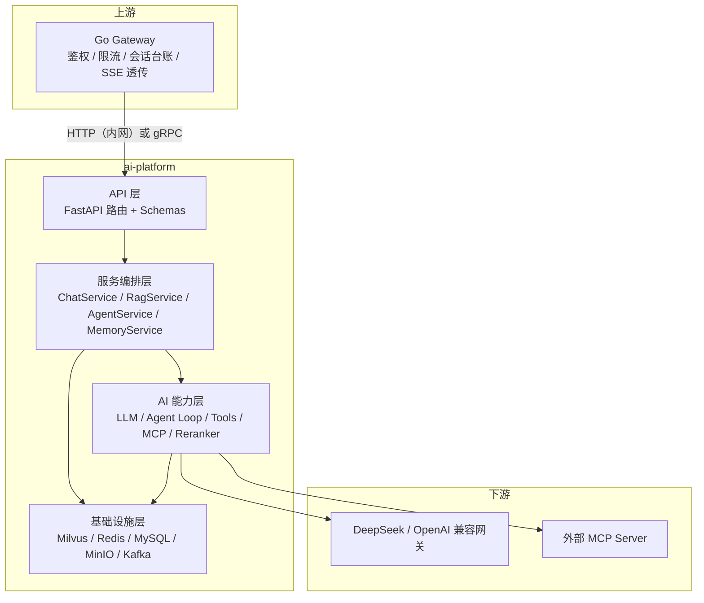

# 01 · 总体需求与范围

## 1. 背景与目标

`ai-platform` 是个人智能助手平台的 **AI 应用服务**。它把「LLM 调用」升级为「可检索、可调工具、可记忆、可异步」的应用能力，对上游（Go Gateway）暴露统一的 HTTP/SSE 接口。

### 1.1 业务目标

| 编号 | 目标 | 可度量结果 |
| --- | --- | --- |
| `REQ-GEN-001` | 提供稳定的多轮流式对话能力 | 首 token P95 ≤ 1.5s；流式中断率 < 0.5% |
| `REQ-GEN-002` | 让模型能基于个人知识库回答 | 知识库内问题 recall@5 ≥ 0.85，答案引用可溯源 |
| `REQ-GEN-003` | 让模型能调用外部工具完成多步任务 | 单轮 Agent 支持 ≥ 8 次工具调用，含 MCP 工具 |
| `REQ-GEN-004` | 长对话不爆上下文 | 100 轮对话上下文 token 稳定在预算内（≤ 8k） |
| `REQ-GEN-005` | 重活不阻塞接口 | 文档入库等耗时操作 100% 走异步任务，接口 P95 ≤ 200ms |
| `REQ-GEN-006` | 可观测、可排障 | 任一请求可按 `trace_id` 串起 LLM / 检索 / 工具全链路 |

### 1.2 设计原则

| 原则 | 说明 |
| --- | --- |
| **能力内聚** | LLM/Agent/RAG/Memory 全部收敛在 Python 服务，Go 侧只做编排与透传 |
| **可独立验收** | 服务可脱离 Go 独立启动并用 curl / Swagger 完成全部验收 |
| **外部依赖可替换** | LLM 走 OpenAI 兼容协议、向量库走抽象层、工具走 MCP 协议 |
| **失败可降级** | RAG 挂了要能纯 LLM 回答；MCP 挂了要能只用内置工具；摘要失败要能退回原文截断 |
| **异步优先** | 任何 > 1s 且非交互必需的计算都进任务队列 |
| **租户硬隔离** | 所有检索、记忆查询 MUST 带 `user_id` 过滤，禁止跨用户召回 |

## 2. 系统定位与边界

### 2.1 上下游关系

### 2.2 明确不做的需求（Out of Scope）

- 用户注册/登录、密码、OAuth：由 Go 侧负责，Python 只做 JWT 校验。
- 会话列表、消息历史分页的业务接口：Go 侧负责；Python 只提供「上下文」与「摘要」视图。
- 前端 UI、Markdown 渲染、引用高亮：客户端职责。
- 计费与配额扣减：Go 侧职责；Python 只上报 token 用量。
- 模型训练/微调：只做推理与向量化。
- 生产级 K8s 多集群方案：本 SRS 只要求「容器化 + 12-Factor 配置 + 优雅退出」。

## 3. 角色与典型场景

| 角色 | 说明 |
| --- | --- |
| 终端用户 | 通过客户端提问、上传文档、查看引用来源 |
| Go Gateway（系统） | 本服务的唯一外部调用方，传递 `user_id`、`conversation_id`、`traceparent` |
| 运维/开发 | 查看健康状态、任务队列、指标与链路 |

### 3.1 核心场景

| ID | 场景 | 触发 | 期望结果 | 关联需求 |
| --- | --- | --- | --- | --- |
| S1 | 普通多轮对话 | 用户提问 | 流式逐 token 返回，且能记住前几轮 | `REQ-CHAT-001/002`、`REQ-MEM-001` |
| S2 | 知识库问答 | 用户提问并指定 KB | 返回答案 + 引用 chunk 列表 | `REQ-CHAT-003`、`REQ-RAG-006/009` |
| S3 | 多步工具任务 | 「查一下我 KB 里 X 的结论，再算一下同比增长」 | Agent 依次调用检索工具与计算工具后汇总 | `REQ-AGENT-001/002` |
| S4 | 文档入库 | 上传 PDF | 立即返回 `task_id`，任务完成后该文档可被检索 | `REQ-RAG-004`、`REQ-TASK-001` |
| S5 | 超长对话 | 对话 > 50 轮 | 自动摘要早期内容，token 不超预算且不丢关键信息 | `REQ-MEM-003` |
| S6 | 偏好记忆 | 用户说「以后回答都用表格」 | 后续会话自动遵守该偏好 | `REQ-MEM-004/006` |
| S7 | 接入新工具 | 配置一个新的 MCP Server | 无需改代码即出现在 `/tools` 并可被调用 | `REQ-MCP-002/003` |
| S8 | 失败降级 | Milvus 不可用 | 对话仍可返回（纯 LLM），响应带 `degraded` 标记 | `REQ-CHAT-007`、`REQ-NFR-004` |
| S9 | 任务重试 | 入库任务因网络失败 | 自动重试至多 3 次；仍失败可手动重试 | `REQ-TASK-004` |
| S10 | 排障 | 用户反馈答错 | 用 `trace_id` 查到召回 chunk、rerank 分数、LLM 原始响应 | `REQ-NFR-010` |

## 4. 功能范围与优先级

优先级定义：**P0** = MVP 必须有；**P1** = 完整体验必需；**P2** = 增强项，可延后。

| 模块 | 功能 | 优先级 | 需求 ID | 详见 |
| --- | --- | --- | --- | --- |
| 对话 | 非流式对话 | P0 | `REQ-CHAT-001` | [03](./03-对话与流式输出.md) |
| 对话 | SSE 流式对话 | P0 | `REQ-CHAT-002` | [03](./03-对话与流式输出.md) |
| 对话 | RAG 增强对话 + 溯源 | P0 | `REQ-CHAT-003` | [03](./03-对话与流式输出.md) |
| 对话 | 上下文组装与 token 预算 | P0 | `REQ-CHAT-004/005` | [03](./03-对话与流式输出.md) |
| 对话 | 客户端断连取消 / 超时 | P1 | `REQ-CHAT-006` | [03](./03-对话与流式输出.md) |
| 对话 | 降级策略 | P1 | `REQ-CHAT-007` | [03](./03-对话与流式输出.md) |
| Agent | Agent Loop 多步编排 | P0 | `REQ-AGENT-001` | [04](./04-Agent与工具调用.md) |
| Agent | 工具注册表与发现 | P0 | `REQ-AGENT-002/003` | [04](./04-Agent与工具调用.md) |
| Agent | 内置工具集 | P0 | `REQ-AGENT-004` | [04](./04-Agent与工具调用.md) |
| Agent | 循环护栏（步数/超时/重复检测） | P0 | `REQ-AGENT-005` | [04](./04-Agent与工具调用.md) |
| Agent | 工具执行的安全与并发 | P1 | `REQ-AGENT-006/007` | [04](./04-Agent与工具调用.md) |
| MCP | 多 Server 连接管理 | P1 | `REQ-MCP-001/002` | [05](./05-MCP接入.md) |
| MCP | 工具发现与命名空间 | P1 | `REQ-MCP-003` | [05](./05-MCP接入.md) |
| MCP | 运行期重载与健康检查 | P2 | `REQ-MCP-004/005` | [05](./05-MCP接入.md) |
| RAG | 知识库 CRUD | P0 | `REQ-RAG-001` | [06](./06-RAG知识库.md) |
| RAG | 文档上传与解析 Chunk | P0 | `REQ-RAG-003/004` | [06](./06-RAG知识库.md) |
| RAG | Embedding 与 Milvus 索引 | P0 | `REQ-RAG-005` | [06](./06-RAG知识库.md) |
| RAG | 检索 + Rerank | P0 | `REQ-RAG-006` | [06](./06-RAG知识库.md) |
| RAG | 引用溯源 | P0 | `REQ-RAG-009` | [06](./06-RAG知识库.md) |
| RAG | 文档去重与级联删除 | P1 | `REQ-RAG-007/010` | [06](./06-RAG知识库.md) |
| RAG | 检索调试接口 | P1 | `REQ-RAG-008` | [06](./06-RAG知识库.md) |
| Memory | 短期上下文读写 | P0 | `REQ-MEM-001` | [07](./07-Memory.md) |
| Memory | 上下文 token 预算与裁剪 | P0 | `REQ-MEM-002` | [07](./07-Memory.md) |
| Memory | 对话摘要压缩 | P1 | `REQ-MEM-003` | [07](./07-Memory.md) |
| Memory | 长期记忆抽取/CRUD/检索注入 | P1 | `REQ-MEM-004/005/006` | [07](./07-Memory.md) |
| Memory | 隐私与遗忘（清空/过期） | P1 | `REQ-MEM-007` | [07](./07-Memory.md) |
| 异步 | 任务模型与状态机 | P0 | `REQ-TASK-001/002` | [08](./08-异步任务.md) |
| 异步 | 任务查询/取消/重试接口 | P0 | `REQ-TASK-003` | [08](./08-异步任务.md) |
| 异步 | 重试、幂等、死信 | P0 | `REQ-TASK-004/005` | [08](./08-异步任务.md) |
| 异步 | Worker 并发与背压 | P1 | `REQ-TASK-006` | [08](./08-异步任务.md) |
| 数据 | 存储模型与索引 | P0 | `REQ-DATA-001..005` | [09](./09-数据存储模型.md) |
| 数据 | 租户隔离与级联删除 | P0 | `REQ-DATA-006/007` | [09](./09-数据存储模型.md) |
| 非功能 | 性能与容量 | P0 | `REQ-NFR-001..003` | [10](./10-非功能需求与可观测性.md) |
| 非功能 | 降级/熔断/重试 | P1 | `REQ-NFR-004/005` | [10](./10-非功能需求与可观测性.md) |
| 非功能 | 安全与 Prompt 注入防护 | P0 | `REQ-NFR-006..009` | [10](./10-非功能需求与可观测性.md) |
| 非功能 | 可观测性（trace/metric/log） | P1 | `REQ-NFR-010..013` | [10](./10-非功能需求与可观测性.md) |
| 非功能 | 配置与部署 | P0 | `REQ-NFR-014/015` | [10](./10-非功能需求与可观测性.md) |

## 5. 非功能需求摘要

完整指标见 [10-非功能需求与可观测性](./10-非功能需求与可观测性.md)，此处只列必须记住的红线：

| 项 | 红线 |
| --- | --- |
| 对话首 token 延迟 | P95 ≤ 1.5s（不含冷启动模型加载） |
| 非流式对话总延迟 | P95 ≤ 15s（单轮、无工具、8k 上下文） |
| 检索接口延迟 | P95 ≤ 300ms（向量召回）；≤ 1.5s（含 CPU Rerank） |
| 文档入库接口 | P95 ≤ 200ms（只建任务，不等处理） |
| 单文件上限 | 50 MB，页数 ≤ 500 |
| 单用户并发对话 | ≥ 5 路并发不互相阻塞 |
| 上下文 token 预算 | 默认 8192，可配置 |
| 可用性 | 单实例无外部依赖故障时 99.9%（月度） |
| 数据隔离 | 任何检索 MUST 携带 `user_id` 过滤 |

## 6. 约束与假设

### 6.1 技术约束

| 约束 | 说明 |
| --- | --- |
| Python | 3.12（`.python-version` 固定，避免 torch/transformers 生态滞后） |
| 依赖管理 | uv（`pyproject.toml` 唯一事实来源，`uv.lock` 入库） |
| Web 框架 | FastAPI + Uvicorn，异步优先（禁止在请求路径里做同步阻塞调用） |
| LLM 协议 | OpenAI 兼容（`langchain-openai.ChatOpenAI`），默认 DeepSeek |
| Embedding | 默认走**云端向量化**（硅基流动 `Qwen/Qwen3-Embedding-0.6B`，1024 维，端点支持真批量）；另可切方舟多模态档与本地 `BAAI/bge-m3` 档。DeepSeek 不提供 embedding |
| Reranker | 默认走**云端**（硅基流动 `Qwen/Qwen3-Reranker-0.6B`，20 条候选实测 320ms）；另可切本地 `BAAI/bge-reranker-v2-m3`（CPU 上 20 条实测 70~83s，不可上线） |
| 向量库 | Milvus（Standalone 本地开发，集群为部署目标） |
| 工具协议 | MCP Python SDK（stdio 为主，HTTP/SSE 为辅） |
| 质量门槛 | `ruff check`、`ruff format --check`、`mypy app`、`pytest` 全绿 |

### 6.2 假设

- A1：Go Gateway 已完成 JWT 签发，Python 可通过共享密钥或 JWKS 校验。
- A2：`user_id`、`conversation_id` 的**唯一性由 Go 侧保证**，Python 不做跨用户去重。
- A3：内网调用，安全边界在网关；Python 侧仍 MUST 校验 JWT 以防御内网横向访问。
- A4：模型权重首次加载允许慢（可接受分钟级），但 MUST NOT 阻塞应用启动。
- A5：开发机可能只有 CPU，故所有 P0 功能 MUST 能在纯 CPU 下跑通（允许慢）。
- A6：Milvus/Redis/MySQL/MinIO/Kafka 均可通过 `docker compose` 本地拉起。

## 7. 里程碑与交付物

| 阶段 | 范围 | 出口标准 | 对应需求 |
| --- | --- | --- | --- |
| M1 骨架可用 | 配置补齐、错误码、健康探活、日志 | `/health/ready` 反映依赖状态；错误信封统一 | `REQ-API-*`、`REQ-NFR-014` |
| M2 对话闭环 | 非流式 + 流式对话、最短上下文（内存态） | S1 场景跑通，首 token 达标 | `REQ-CHAT-001/002/004` |
| M3 RAG 闭环 | 上传 → 解析 → 向量化 → 检索 → 重排 → 溯源 | S2、S4 跑通，recall@5 达标 | `REQ-RAG-*`、`REQ-TASK-001..005` |
| M4 Agent 闭环 | Agent Loop + 内置工具 + `/tools` | S3 跑通，S8 降级可用 | `REQ-AGENT-*` |
| M5 Memory | 短期 + 摘要 + 长期记忆 | S5、S6 跑通，token 稳定 | `REQ-MEM-*` |
| M6 MCP 与可观测 | MCP 多 Server、OTel/Prometheus | S7、S10 跑通，指标可在 Grafana 看到 | `REQ-MCP-*`、`REQ-NFR-010..013` |

**每个里程碑的交付物**：可运行代码 + 接口文档（Swagger 自动生成）+ 验收用例执行结果 + README 更新。

## 8. 需求追踪矩阵

| 需求 ID | 模块文档 | 验收用例（见 11） | 里程碑 |
| --- | --- | --- | --- |
| `REQ-GEN-001..006` | 01（本文件 §1.1） | 由各模块 `AC-*` 与 `AC-NFR-01` 间接覆盖 | 各里程碑 |
| `REQ-CHAT-001..007` | 03 | `AC-CHAT-01..12` | M2 / M4 |
| `REQ-AGENT-001..007` | 04 | `AC-AGENT-01..09` | M4 |
| `REQ-MCP-001..005` | 05 | `AC-MCP-01..07` | M6 |
| `REQ-RAG-001..011` | 06 | `AC-RAG-01..16` | M3 |
| `REQ-MEM-001..007` | 07 | `AC-MEM-01..10` | M5 |
| `REQ-TASK-001..006` | 08 | `AC-TASK-01..09` | M3 |
| `REQ-API-001..010` | 02 | `AC-API-01..08` | M1 |
| `REQ-DATA-001..007` | 09 | `AC-DATA-01..06` | M3 |
| `REQ-NFR-001..015` | 10 | `AC-NFR-01..12` | M1 / M6 |

> 追踪规则：11 中的每条验收用例 MUST 反向引用至少一个需求 ID；实现新需求时先补 ID 再写代码，避免「做了但没要求」。
