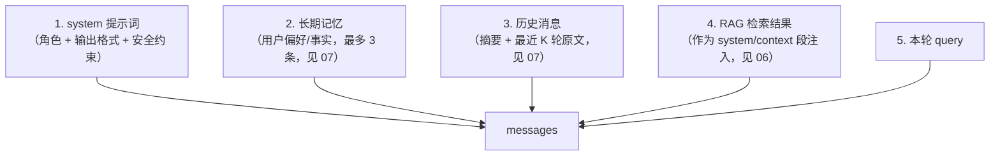

# 03 · 对话与流式输出

> 关联：需求 ID `REQ-CHAT-*`；公共契约见 [02](./02-接口规范与错误码.md)；上下文裁剪规则见 [07 Memory](./07-Memory.md)；引用结构见 [06 RAG](./06-RAG知识库.md)。

## 1. 接口清单

| 方法 | 路径 | 说明 | 优先级 |
| --- | --- | --- | --- |
| `POST` | `/chat` | 非流式对话（一次性返回完整答案） | P0 |
| `POST` | `/chat/stream` | 流式对话（SSE） | P0 |
| `GET` | `/models` | 列出可用模型与其能力（是否支持工具、上下文窗口） | P2 |

> 现有 `app/schemas/chat.py` 的 `ChatRequest.stream` 字段保留但**语义固化**：`/chat` 只接受 `stream=false`（传 `true` 返回 `400 INVALID_ARGUMENT`，提示改用 `/chat/stream`）。这样流式与非流式的响应体类型不会混淆，OpenAPI 也能正确生成两份 schema。

## 2. 对话请求上下文来源

一次对话的 messages 由四部分拼装，顺序固定（`REQ-CHAT-004`）：



| 片段 | 来源 | 是否可截断 | 说明 |
| --- | --- | --- | --- |
| system 提示词 | 代码内置模板 + KB 级自定义提示 | 否 | 必保，长度 ≤ 1000 token |
| 长期记忆 | MySQL `user_memory` 语义检索 top-3 | 是（整条丢弃） | 单条 ≤ 200 token |
| 摘要 | Redis/MySQL `conversation_summary` | 是（降级为更短） | 默认 ≤ 1200 token |
| 历史原文 | Redis `ctx:{conversation_id}` | 是（从最旧开始丢） | 默认保留最近 10 轮 |
| RAG context | Milvus 召回 + rerank | 是（减少 chunk 数） | 默认 top 5 chunk，≤ 2500 token |
| 本轮 query | 请求体 | 否 | 超长直接 `400 CONTEXT_TOO_LONG` |

> **`REQ-CHAT-005`**：拼装后的 Prompt token 总数 MUST ≤ `context_token_budget`（默认 8192）。超出时 MUST 按 [07-§4.2](./07-Memory.md) 定义的**确定性顺序**裁剪（历史 → RAG → 记忆 → 摘要），且 MUST NOT 截断 `system` 与本轮 `query`；裁剪后仍在超限则返回 `400 CONTEXT_TOO_LONG` 并在 `details` 给出各片段实际 token。

## 3. `POST /chat`

### 3.1 请求

`Content-Type: application/json`

| 字段 | 类型 | 必填 | 默认 | 约束 | 说明 |
| --- | --- | --- | --- | --- | --- |
| `query` | `string` | 是 | — | 去空白后 1..8000 字符 | 用户提问 |
| `conversation_id` | `string \| null` | 否 | `null` | `^cv_[0-9A-HJKMNP-TV-Z]{26}$` | 为空时**不落上下文**（单轮问答） |
| `history` | `ChatMessage[]` | 否 | `[]` | ≤ 200 条 | 客户端自带历史；当 `use_memory=false` 时使用 |
| `use_rag` | `boolean` | 否 | `true` | — | 是否启用知识库检索 |
| `kb_ids` | `string[]` | 否 | `[]` | ≤ 10 个，元素为 `kb_*` | 指定检索的知识库；为空且 `use_rag=true` 时检索该用户全部 KB |
| `use_memory` | `boolean` | 否 | `true` | — | 是否读写会话上下文与长期记忆 |
| `use_tools` | `boolean` | 否 | `false` | — | 是否启用 Agent Loop（=true 时走 [04](./04-Agent与工具调用.md) 的流程） |
| `stream` | `boolean` | 否 | `false` | 必须为 `false` | 兼容字段，见第 1 节 |
| `model` | `string \| null` | 否 | `null` | 必须在 `/models` 白名单内 | 覆盖默认 `llm_model` |
| `temperature` | `number \| null` | 否 | `null` | 0.0..2.0 | 覆盖默认值 |
| `top_k` | `integer \| null` | 否 | `null` | 1..100 | 覆盖默认召回数（默认 20） |
| `rerank_top_n` | `integer \| null` | 否 | `null` | 1..20 | 覆盖默认重排保留数（默认 5） |
| `score_threshold` | `number \| null` | 否 | `null` | 0.0..1.0 | 重排后最低分，低于则丢弃 |
| `metadata` | `object` | 否 | `{}` | 键值均 ≤ 64 字符 | 透传埋点（如 `client`、`session_tag`），不进 Prompt |

`ChatMessage`（沿用现有模型）：

| 字段 | 类型 | 约束 | 说明 |
| --- | --- | --- | --- |
| `role` | `"system" \| "user" \| "assistant" \| "tool"` | 枚举 | 角色；`tool` 仅用于回注工具结果 |
| `content` | `string` | ≤ 32000 字符 | 内容 |

### 3.2 响应 `200`

| 字段 | 类型 | 说明 |
| --- | --- | --- |
| `answer` | `string` | 完整回答（Markdown） |
| `conversation_id` | `string \| null` | 回显；请求未传且 `use_memory=true` 时由服务端**新建并返回** |
| `message_id` | `string` | 本条回答的 ID（`msg_*`） |
| `references` | `Reference[]` | 引用来源（结构见 06-§5）；无引用时 `[]` |
| `tool_calls` | `ToolCallTrace[]` | 本轮工具调用轨迹；未启用工具时 `[]` |
| `usage` | `Usage` | `prompt_tokens` / `completion_tokens` / `total_tokens` |
| `finish_reason` | `string` | `stop` / `length` / `max_steps` |
| `model` | `string` | 实际使用的模型名（以上游 `response_metadata.model_name` 为准） |
| `degraded` | `boolean` | 是否发生降级 |
| `degraded_reasons` | `string[]` | 降级原因码：`rag_unavailable` / `memory_unavailable` / `rerank_skipped` / `mcp_unavailable` |
| `elapsed_ms` | `integer` | 服务端总耗时 |

`ToolCallTrace`：

| 字段 | 类型 | 说明 |
| --- | --- | --- |
| `call_id` | `string` | 模型给出的调用 ID |
| `name` | `string` | 工具名（含 MCP 命名空间） |
| `arguments` | `object` | 实际执行参数 |
| `status` | `"ok" \| "error" \| "timeout" \| "forbidden"` | 结果状态 |
| `summary` | `string` | 结果摘要（≤ 500 字符，超长截断并加 `…`） |
| `elapsed_ms` | `integer` | 工具耗时 |

`Usage`：| `prompt_tokens` \| `completion_tokens` \| `total_tokens` \| → 均为 `integer`，上游缺省时置 0 并记警告。

### 3.3 示例

请求：

```json
{
  "query": "我们的退款政策是多少天？",
  "conversation_id": "cv_01J8ZQ3K7N9P2V6R4T8W1Y5B3C",
  "use_rag": true,
  "kb_ids": ["kb_01J8ZQ3K7N9P2V6R4T8W1Y5B3C"],
  "use_memory": true
}
```

响应：

```json
{
  "answer": "根据《售后政策 v3》，自签收之日起 **7 个自然日** 内可无理由退款。[1]",
  "conversation_id": "cv_01J8ZQ3K7N9P2V6R4T8W1Y5B3C",
  "message_id": "msg_01J8ZR5M2Q7X4C9T6B3N8V1K0D",
  "references": [
    {
      "index": 1,
      "chunk_id": "chk_01J8ZQ9F4H2L7P3T6R8V1B5N0C",
      "doc_id": "doc_01J8ZQ1A2B3C4D5E6F7G8H9J0K",
      "kb_id": "kb_01J8ZQ3K7N9P2V6R4T8W1Y5B3C",
      "doc_name": "售后政策 v3.pdf",
      "page": 4,
      "score": 0.8123,
      "snippet": "自签收之日起 7 个自然日内，商品未拆封可申请无理由退款……"
    }
  ],
  "tool_calls": [],
  "usage": { "prompt_tokens": 812, "completion_tokens": 64, "total_tokens": 876 },
  "finish_reason": "stop",
  "model": "deepseek-flash",
  "degraded": false,
  "degraded_reasons": [],
  "elapsed_ms": 2043
}
```

### 3.4 错误

| code | HTTP | 触发 |
| --- | --- | --- |
| `QUERY_EMPTY` | 400 | `query` 去空白为空 |
| `INVALID_ARGUMENT` | 400 | `stream=true`、`rerank_top_n > top_k`、`kb_ids` 含非法 ID |
| `CONVERSATION_NOT_FOUND` | 404 | `conversation_id` 不属于当前用户 |
| `CONTEXT_TOO_LONG` | 400 | 裁剪后仍超预算（详见 07-§4） |
| `UPSTREAM_LLM_ERROR` | 502 | 上游非超时错误 |
| `UPSTREAM_TIMEOUT` | 504 | 上游超时（默认 60s） |
| `RATE_LIMITED` / `OVERLOADED` | 429 / 503 | 见 02-§7.3 |

### 3.5 需求

| ID | 需求 |
| --- | --- |
| `REQ-CHAT-001` | 服务 MUST 提供非流式对话接口，一次返回完整答案、引用、用量 |
| `REQ-CHAT-004` | messages 的拼装顺序 MUST 固定为「system → 长期记忆 → 摘要 → 历史 → RAG context → query」，且各片段受独立 token 预算约束（见 07-§4） |
| `REQ-CHAT-007` | 任一检索/记忆/重排组件失败 MUST NOT 让整个对话失败，而是跳过该片段并置 `degraded=true` + 原因码 |

## 4. `POST /chat/stream`

### 4.1 请求

与 `/chat` **完全相同的 body**，但 `stream` MUST 为 `true`（或省略，以 `/stream` 路径为准）。

响应头：

```http
HTTP/1.1 200 OK
Content-Type: text/event-stream; charset=utf-8
Cache-Control: no-cache, no-transform
Connection: keep-alive
X-Accel-Buffering: no
```

### 4.2 事件序列

| 顺序 | event | 说明 |
| --- | --- | --- |
| 1 | `meta` | 首帧，含 `conversation_id`/`message_id`/`model`/`created_at` |
| 2..n | `reference` | **在首个 `token` 之前**推送检索结果，便于前端先渲染「正在阅读的资料」 |
| 2..n | `tool_call` / `tool_result` | `use_tools=true` 时可能出现 |
| ..n | `token` | 增量文本 |
| n | `usage` | 结束前用量 |
| n+1 | `done` | 末帧 |

完整示例（含工具与引用）：

```text
event: meta
data: {"conversation_id":"cv_01J8...","message_id":"msg_01J8...","model":"deepseek-flash","created_at":"2026-09-28T10:00:00.123Z","degraded":false}

event: reference
data: {"references":[{"index":1,"chunk_id":"chk_01J8...","doc_name":"售后政策 v3.pdf","page":4,"score":0.8123,"snippet":"自签收之日起 7 个自然日……"}]}

event: tool_call
data: {"call_id":"call_abc","name":"calculator","arguments":{"expression":"128*1.15"}}

event: tool_result
data: {"call_id":"call_abc","name":"calculator","status":"ok","summary":"147.2","elapsed_ms":3}

event: token
data: {"delta":"128 元同比增长 15% 后为 "}

event: token
data: {"delta":"147.2 元。"}

event: usage
data: {"prompt_tokens":912,"completion_tokens":22,"total_tokens":934}

event: done
data: {"finish_reason":"stop","elapsed_ms":3187}

```

### 4.3 需求

| ID | 需求 |
| --- | --- |
| `REQ-CHAT-002` | 服务 MUST 提供 SSE 流式对话，逐增量推送 token；首帧 `meta` 到首个 `token` 的延迟计入首 token 指标 |
| `REQ-CHAT-006` | 客户端断连 MUST 在 1s 内停止上游 LLM 调用并取消在途工具任务；已生成部分内容 SHOULD 以 `partial=true` 落库 |
| `REQ-CHAT-003` | `use_rag=true` 时 MUST 先推送 `reference` 帧再生成回答，且回答中的 `[n]` 序号与 `references[].index` 一一对应 |

### 4.4 取消与超时的验收口径

| 场景 | 期望 |
| --- | --- |
| 客户端在收到 3 个 token 后断开 | 服务端 1s 内记录 `canceled`，上游流被取消，Prometheus 记 `ai_chat_canceled_total` |
| 上游 25s 不出 token | 15s 处收到 `ping`，30s 首字节超时后发 `error(code=UPSTREAM_TIMEOUT)` 并结束 |
| 总时长到 300s | 发 `done(finish_reason=length)`，日志 warning |

## 5. `GET /models`

| 字段 | 类型 | 说明 |
| --- | --- | --- |
| `items[].name` | `string` | 模型名，可直接用于 `ChatRequest.model` |
| `items[].provider` | `string` | `deepseek` / `openai` / `moonshot` / `local` |
| `items[].supports_tools` | `boolean` | 是否支持 function calling |
| `items[].supports_stream` | `boolean` | 是否支持流式 |
| `items[].context_window` | `integer` | 上下文窗口 token 数 |
| `items[].is_default` | `boolean` | 是否为当前默认模型 |

实现方式：静态配置表（`llm_models` 配置项），不做运行时探测。**默认模型名 MUST 来自一次真实调用的 `model_name` 校验**（见用户经验：不要只信配置读到了，要发最小真实调用确认模型被上游接受）。

## 6. 非功能指标（对话）

| 指标 | 目标 | 说明 |
| --- | --- | --- |
| 首 token 延迟 | P50 ≤ 700ms，P95 ≤ 1.5s | 不含冷启动；冷启动单独记指标 |
| 非流式总延迟 | P95 ≤ 15s | 8k 上下文、无工具 |
| 流式吞吐 | ≥ 20 token/s（上游允许时） | 代理层不得缓存 |
| 并发 | 单实例 ≥ 5 路并发对话不互相阻塞 | 受 `llm_max_concurrency` 限制 |
| 上下文 token | ≤ `context_token_budget`（默认 8192） | 超限前必须先裁剪，不允许靠上游报错兜底 |

## 7. 验收标准

| ID | 关联需求 | 验收点 |
| --- | --- | --- |
| `AC-CHAT-01` | `REQ-CHAT-001` | `/chat` 返回 `answer`/`usage`/`finish_reason`，`usage.total_tokens = prompt + completion` |
| `AC-CHAT-02` | `REQ-CHAT-001` | `stream=true` 请求 `/chat` 返回 400 `INVALID_ARGUMENT` |
| `AC-CHAT-03` | `REQ-CHAT-002` | `/chat/stream` 事件序列满足 `meta → token* → done`，且 `meta` 为第一帧、`done` 为最后一帧 |
| `AC-CHAT-04` | `REQ-CHAT-002` | 用 `curl -N` 观察输出为**逐段到达**（非一次性），且响应无 `Content-Encoding: gzip` |
| `AC-CHAT-05` | `REQ-CHAT-003` | 引用 `[1]` 对应的 `references[0].chunk_id` 能在 Milvus 中查到，且 `snippet` 是该 chunk 的前缀 |
| `AC-CHAT-06` | `REQ-CHAT-004` | 断言发送给 LLM 的 prompt 中片段顺序为 system→memory→summary→history→rag→query（用 mock LLM 捕获 messages 校验） |
| `AC-CHAT-07` | `REQ-CHAT-005` | 构造 12k token 的历史，请求成功且实际 prompt token ≤ 8192 |
| `AC-CHAT-08` | `REQ-CHAT-007` | 停掉 Milvus 后 `/chat`（`use_rag=true`）仍返回 200，`degraded=true`、`degraded_reasons` 含 `rag_unavailable` |
| `AC-CHAT-09` | `REQ-CHAT-006` | 客户端 3 个 token 后断开：服务端日志出现 `canceled`，上游调用被取消（mock LLM 侧记录到 abort） |
| `AC-CHAT-10` | `REQ-CHAT-002` | 心跳：mock 上游 20s 不发 token，客户端在此期间能收到 `ping` |
| `AC-CHAT-11` | `REQ-CHAT-001` | 连发 6 路并发 `/chat`，全部成功且 P95 延迟增幅 ≤ 2 倍 |
| `AC-CHAT-12` | `REQ-CHAT-004` | 长期记忆关闭（`use_memory=false`）时 prompt 中不出现 memory/summary 片段，只使用请求体 `history` |
