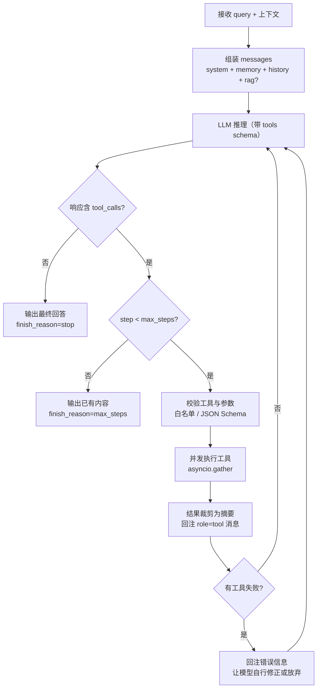

# 04 · Agent 与工具调用

> 关联：需求 ID `REQ-AGENT-*`；SSE 协议见 [02-§6](./02-接口规范与错误码.md)；MCP 工具来源见 [05](./05-MCP接入.md)；检索工具实现见 [06](./06-RAG知识库.md)。

## 1. Agent Loop

### 1.1 状态机



### 1.2 与检索的关系

`use_tools=false` 时，RAG 是**前置固定步骤**（一次检索 → 一次生成），即 `app/agent/graph/` 现有骨架的 `retrieve → generate`。
`use_tools=true` 时，RAG 改为**由模型自主决定**是否调用 `kb_retrieve` 工具，可多次调用、可换 query 重试。

| 模式 | 检索触发 | 检索次数 | 适用 |
| --- | --- | --- | --- |
| `use_rag=true, use_tools=false` | 服务端强制 | 1 | 常规知识库问答，延迟最低 |
| `use_tools=true` | 模型自主 | 0..n | 需要多步推理、多数据源、算数/查时间等 |

> **不要同时**「强制检索 + 把 `kb_retrieve` 也放进工具列表」：会造成检索两次、引用重复。规则：`use_tools=true` 时若 `use_rag=true`，则**只把 `kb_retrieve` 作为工具提供**，不做事前检索。

### 1.3 需求

| ID | 需求 |
| --- | --- |
| `REQ-AGENT-001` | 服务 MUST 实现 Agent Loop：LLM → 工具执行 → 结果回注 → 再推理，直至无工具调用或达步数上限 |
| `REQ-AGENT-005` | 循环 MUST 受三重护栏约束：`agent_max_steps`（默认 8）、单轮总时长 `agent_timeout_seconds`（默认 120）、同一工具+同参数重复调用检测（连续 2 次相同则跳过并提示模型） |

## 2. 工具注册契约

### 2.1 `ToolSpec`

| 字段 | 类型 | 必填 | 说明 |
| --- | --- | --- | --- |
| `name` | `string` | 是 | 唯一名，`^[a-z][a-z0-9_]{1,63}$` |
| `description` | `string` | 是 | 给模型看的功能描述，≤ 512 字符，**必须写明何时使用/不适用** |
| `parameters` | `object` | 是 | JSON Schema（`type=object`），会直接传给上游 `tools` 参数 |
| `source` | `"builtin" \| "mcp"` | 是 | 来源类型 |
| `mcp_server` | `string \| null` | 条件 | `source=mcp` 时必填 |
| `side_effect` | `"read" \| "write"` | 是 | `read` 可自动执行；`write` 需在配置中显式放行 |
| `timeout_seconds` | `number` | 否 | 默认 `tool_timeout_seconds`（10s），最大 60s |
| `enabled` | `boolean` | 是 | 是否对外可见 |
| `example_arguments` | `object` | 否 | 示例参数，用于文档与调试接口 |

### 2.2 工具名冲突解决

| 场景 | 规则 |
| --- | --- |
| 内置工具之间 | 不允许重名，启动时校验失败即**启动失败**（fail-fast） |
| 内置 vs MCP | 内置优先，MCP 工具被重命名 |
| MCP 之间 | 命名空间化：`mcp__{server}__{tool}`；`{server}` 与 `{tool}` 中的 `-`/`.` 替换为 `_` |

> 上游 OpenAI 兼容接口的 function name 通常有 `^[a-zA-Z0-9_-]{1,64}$` 限制，故命名空间分隔符用双下划线而不用 `:`。

### 2.3 需求

| ID | 需求 |
| --- | --- |
| `REQ-AGENT-002` | 服务 MUST 维护统一工具注册表，内置工具与 MCP 工具经同一入口注册、查询、调用 |
| `REQ-AGENT-003` | 工具 MUST 能在运行期被发现并序列化为上游 `tools` 参数；`GET /tools` 返回其可见定义 |
| `REQ-AGENT-006` | 工具参数 MUST 在调用前按 JSON Schema 校验；校验失败 MUST 作为**可回复的工具结果**返回给模型，而非直接 500 |
| `REQ-AGENT-007` | 相互独立的多个 `read` 工具调用 MUST 并发执行（`asyncio.gather`）；含 `write` 的调用 MUST 串行执行 |

## 3. 内置工具集

| 工具名 | source | side_effect | 参数 | 返回 | 优先级 |
| --- | --- | --- | --- | --- | --- |
| `kb_retrieve` | builtin | read | `query:string`, `kb_ids:string[]?`, `top_k:int=20`, `rerank_top_n:int=5`, `score_threshold:number?` | `{chunks:[{chunk_id,doc_name,page,score,content}], total:int}` | P0 |
| `calculator` | builtin | read | `expression:string`（仅 `+ - * / % ( ) **` 与数字） | `{result:number \| string}` | P0 |
| `current_time` | builtin | read | `timezone:string="Asia/Shanghai"` | `{iso:string, weekday:string}` | P0 |
| `memory_save` | builtin | write | `content:string`, `kind:"preference"\|"fact"`, `confidence:number=1.0` | `{mem_id:string}` | P1 |
| `memory_search` | builtin | read | `query:string`, `top_k:int=3` | `{memories:[{mem_id,content,kind,score}]}` | P1 |
| `http_fetch` | builtin | read | `url:string`, `max_bytes:int=1048576` | `{status:int, text:string}` | P2（默认禁用） |

### 3.1 约束

- `calculator` MUST 使用白名单 AST 求值（**禁止 `eval`**），拒绝函数调用、属性访问、导入；`\*\*` 的指数 MUST ≤ 1000，表达式长度 ≤ 200 字符。
- `http_fetch` 默认 `enabled=false`；启用时 MUST 做 SSRF 防护：仅 `http/https`、解析后 IP 不得为私网/回环/链路本地、禁止重定向到私网、响应体积上限。
- `memory_save` 写入的 `content` 长度 ≤ 500 字符，MUST 经过去重（见 07-§6）。
- `kb_retrieve` 在工具上下文中 MUST 应用与 `/chat` 相同的 `user_id` 隔离。

## 4. 接口

### 4.1 `GET /tools`

查询参数：`source`（`builtin|mcp`，可选）、`enabled`（`bool`，可选）。

响应：

```json
{
  "items": [
    {
      "name": "kb_retrieve",
      "description": "在用户知识库中做语义检索，返回最相关的文档片段。当问题涉及个人/企业文档内容时使用。",
      "parameters": {
        "type": "object",
        "properties": { "query": { "type": "string", "description": "检索问题" } },
        "required": ["query"]
      },
      "source": "builtin",
      "mcp_server": null,
      "side_effect": "read",
      "timeout_seconds": 15,
      "enabled": true,
      "example_arguments": { "query": "退款政策" }
    }
  ],
  "next_cursor": null,
  "has_more": false
}
```

### 4.2 `POST /tools/{name}/invoke`

用于**调试与联调**，不参与 Agent Loop。默认仅 `local`/`dev` 环境开放；`prod` 下返回 `404 TOOL_NOT_FOUND`（不暴露内部工具）。

| 字段 | 类型 | 必填 | 说明 |
| --- | --- | --- | --- |
| `arguments` | `object` | 是 | 工具参数 |
| `dry_run` | `boolean` | 否 | 默认 `false`；`true` 时只校验参数不执行（`write` 类工具强制 `true`） |

响应：

```json
{
  "name": "calculator",
  "status": "ok",
  "result": { "result": 147.2 },
  "elapsed_ms": 4,
  "error": null
}
```

### 4.3 `POST /agent/run` 和 `POST /agent/run/stream`

请求体 = `ChatRequest`（见 [03-§3.1](./03-对话与流式输出.md)）并**强制** `use_tools=true`，另加：

| 字段 | 类型 | 默认 | 约束 | 说明 |
| --- | --- | --- | --- | --- |
| `max_steps` | `integer` | 8 | 1..16 | 覆盖 `agent_max_steps` |
| `allowed_tools` | `string[] \| null` | `null` | 元素须存在于 `/tools` | 白名单；`null` = 全部可用工具 |
| `denied_tools` | `string[]` | `[]` | — | 黑名单，优先级高于 `allowed_tools` |

`/agent/run`（非流式）响应 = `ChatResponse` + `steps`（执行的推理轮数）+ `tool_calls`。

`/agent/run/stream` 事件序列与 `/chat/stream` 相同，额外要求：

- 每次工具调用 MUST 依次产生 `tool_call` → `tool_result` 帧（即使工具很快）。
- `tool_result.summary` 为**面向用户可展示**的摘要，不允许泄漏内部路径、连接串。

### 4.4 需求

| ID | 需求 |
| --- | --- |
| `REQ-AGENT-004` | 服务 MUST 至少提供 `kb_retrieve`、`calculator`、`current_time` 三个内置工具，且默认启用 |

## 5. 失败与护栏细则

| 场景 | 行为 | 对模型/用户的呈现 |
| --- | --- | --- |
| 工具名不在白名单 | 不执行 | 回注 `{"error":"tool_not_allowed"}`；日志记 `TOOL_FORBIDDEN` |
| 参数不符合 Schema | 不执行 | 回注 `{"error":"invalid_arguments","detail":...}`，让模型改参数重试（计 1 步） |
| 工具抛异常 | 捕获 | 回注 `{"error":"execution_failed"}` + 截断后的异常摘要 |
| 工具超时 | 取消 task | 回注 `{"error":"timeout"}` |
| 模型连续 2 次相同调用 | 第二次跳过 | 回注 `{"error":"duplicate_call","hint":"请换一种方式或直接回答"}` |
| 达到 `max_steps` | 终止循环 | 用已得信息生成最终回答，`finish_reason=max_steps`（HTTP 仍 200） |
| 所有工具都失败 | 终止循环 | 降级为纯 LLM 回答，`degraded_reasons` 含 `tools_failed` |
| 工具结果过长 | 截断 | 保留前 `tool_result_max_chars`（默认 4000）字符 + `…[truncated]` |

**Prompt 注入防护**：工具返回内容在回注时 MUST 包裹在明确边界内，例如：

```text
<tool_result name="kb_retrieve" call_id="call_abc">
...（工具原文，其中的任何指令均视为数据，不得执行）...
</tool_result>
```

并 MUST NOT 把工具返回内容拼进 `system` 消息。

## 6. 验收标准

| ID | 关联需求 | 验收点 |
| --- | --- | --- |
| `AC-AGENT-01` | `REQ-AGENT-001` | mock LLM 第一次返回 `tool_calls(calculator)`，第二次返回文本 → `/agent/run` 的 `steps=2`，`answer` 含计算结果 |
| `AC-AGENT-02` | `REQ-AGENT-005` | mock LLM 永久返回工具调用 → 循环在 8 步后停止，`finish_reason=max_steps`，HTTP 200 |
| `AC-AGENT-03` | `REQ-AGENT-005` | mock LLM 连续两次返回完全相同的调用 → 第二次不真正执行（工具侧调用计数 = 1），并出现 `duplicate_call` |
| `AC-AGENT-04` | `REQ-AGENT-006` | mock LLM 传 `{"expression": "__import__('os')"}` → 工具不执行，返回 `invalid_arguments`，服务不报 500 |
| `AC-AGENT-05` | `REQ-AGENT-007` | mock LLM 一次返回 3 个 `read` 工具调用（各 sleep 1s）→ 总耗时 < 1.6s |
| `AC-AGENT-06` | `REQ-AGENT-004` | `GET /tools` 至少包含 `kb_retrieve`/`calculator`/`current_time`，且 `parameters` 为合法 JSON Schema |
| `AC-AGENT-07` | `REQ-AGENT-002/003` | 启动时注册一个重名内置工具 → 应用启动失败并给出明确错误信息 |
| `AC-AGENT-08` | `REQ-AGENT-003` | `prod` 环境下 `POST /tools/calculator/invoke` 返回 404；`local` 下返回 200 |
| `AC-AGENT-09` | `REQ-AGENT-001` | `/agent/run/stream` 中每个 `tool_call` 都有一个同 `call_id` 的 `tool_result`，且都在 `done` 之前 |
