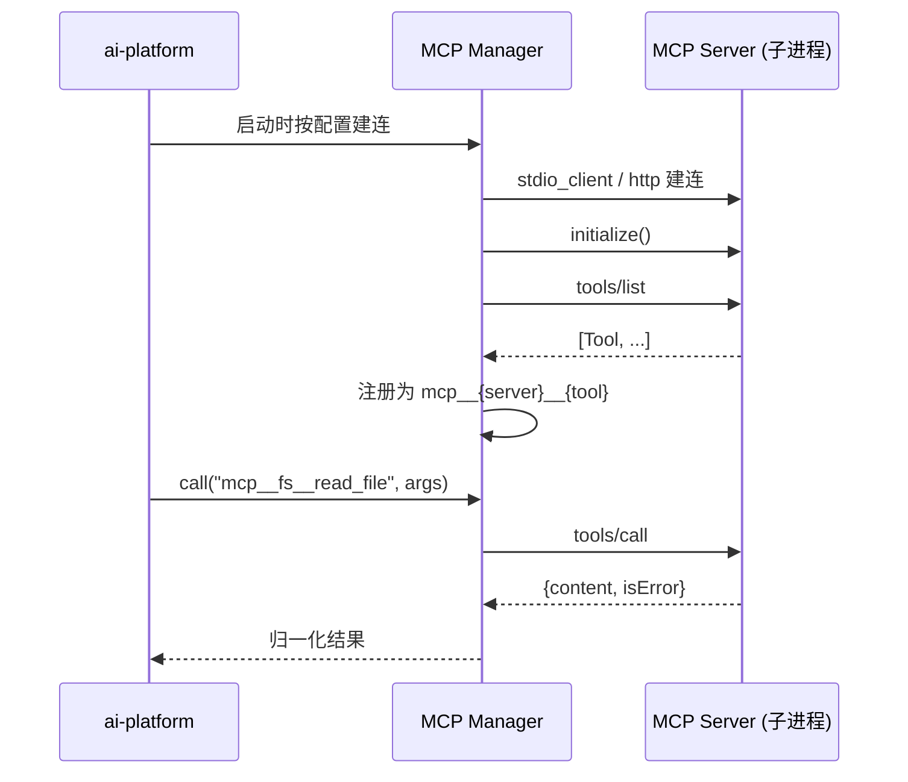

# 05 · MCP 接入

> 关联：需求 ID `REQ-MCP-*`；工具注册契约见 [04-§2](./04-Agent与工具调用.md)；配置项见 [10-§7](./10-非功能需求与可观测性.md)。

## 1. 目标与边界

**目标**：让外部工具以 MCP 协议标准化接入，做到「加一个 MCP Server 只需改配置，不改代码」。

**边界**：

| 做 | 不做 |
| --- | --- |
| 作为 MCP **Client** 连接外部 Server | 自己实现一个 MCP Server（可选，非本 SRS 要求） |
| 发现并注册 Server 暴露的工具/资源 | 代理 MCP 的 `prompts` / `sampling` 能力（P2 再议） |
| 工具调用与结果回注 | 管理 Server 的部署与升级 |
| 连接健康检查与重载 | 跨进程共享 Server 实例（每个 Server 独立子进程/连接） |

## 2. 连接模型

### 2.1 传输方式

| transport | 配置字段 | 适用 | 优先级 |
| --- | --- | --- | --- |
| `stdio` | `command` + `args` + `env` | 本地工具（`uv run xxx`、`npx -y @xxx/mcp`） | P0 |
| `streamable_http` | `url` + `headers` | 远端/容器化 Server | P1 |



### 2.2 配置结构

沿用现有 `Settings.mcp_servers: dict[str, Any]`，但**收紧为固定 Schema**（`REQ-MCP-001`）：

| 字段 | 类型 | 必填 | 默认 | 说明 |
| --- | --- | --- | --- | --- |
| `transport` | `"stdio" \| "streamable_http"` | 否 | `stdio` | 传输方式 |
| `command` | `string` | stdio 必填 | — | 可执行文件，如 `uv` / `npx` / `python` |
| `args` | `string[]` | 否 | `[]` | 参数 |
| `env` | `object` | 否 | `{}` | 追加环境变量（**不覆盖**父进程 env） |
| `url` | `string` | http 必填 | — | Server 地址 |
| `headers` | `object` | 否 | `{}` | 附加请求头（鉴权令牌） |
| `enabled` | `boolean` | 否 | `true` | 是否启用 |
| `tools_allowlist` | `string[] \| null` | 否 | `null` | 只注册这些工具；`null` = 全部 |
| `tools_denylist` | `string[]` | 否 | `[]` | 明确禁用（优先级高于 allowlist） |
| `write_tools` | `string[]` | 否 | `[]` | 声明哪些工具是**写操作**（`side_effect=write`）；未声明的工具一律按 `read` 处理，写操作未被声明会导致**漏审计** |
| `timeout_seconds` | `number` | 否 | `30` | 单次 `tools/call` 超时（上限 60） |
| `connect_timeout_seconds` | `number` | 否 | `10` | 握手超时 |
| `required` | `boolean` | 否 | `false` | `true` 时连不上则**应用启动失败** |

补充规则：

- 必填项随 `transport` 变化：`stdio` 必须有 `command`，`streamable_http` 必须有 `url`；
- 未知字段一律报错并指出 Server 名与字段名（`AC-MCP-04`）；
- 字符串值支持 `${ENV_VAR}` 引用（如 `"${GITHUB_TOKEN}"`），引用未定义时**启动失败**，
  而不是把字面量当令牌发出去；
- Server 名受 `^[a-z0-9][a-z0-9_-]{0,31}$` 限制 —— 它会被拼进工具名，
  含大写/空格/点的名字会污染命名空间；
- 配置整体通过环境变量 `MCP_SERVERS`（JSON）注入，建连总超时用
  `MCP_STARTUP_TIMEOUT_SECONDS`（默认 15s）。

`.env` 示例（JSON 对象）：

```dotenv
MCP_SERVERS={"filesystem":{"command":"npx","args":["-y","@modelcontextprotocol/server-filesystem","D:/docs"],"tools_allowlist":["read_file","list_directory"]},"fetch":{"transport":"streamable_http","url":"http://localhost:3100/mcp","headers":{"Authorization":"Bearer xxx"}}}
```

### 2.3 需求

| ID | 需求 |
| --- | --- |
| `REQ-MCP-001` | MCP 配置 MUST 有固定 Schema 与启动期校验；未知字段 MUST 报错（MCP 配置写错比忽略更危险） |
| `REQ-MCP-002` | 服务 MUST 支持同时连接多个 MCP Server；任一非 `required` Server 连接失败 MUST NOT 阻塞启动，只记状态为 `unavailable` |

## 3. 生命周期与就绪

| 阶段 | 行为 |
| --- | --- |
| **启动（lifespan startup）** | 按配置并发建连（总超时 `mcp_startup_timeout_seconds`，默认 15s）→ `initialize` → `tools/list` → 注册工具。`required=true` 的失败 → 抛异常使启动失败 |
| **运行中** | 懒重连：调用时若连接已断，先尝试重连 1 次（指数退避 0.5s/1s/2s），仍失败返回 `MCP_SERVER_UNAVAILABLE` |
| **关闭（lifespan shutdown）** | 先取消在途调用，再关闭连接并等待子进程退出（上限 5s，超时强杀） |
| **重载** | `POST /mcp/servers/{name}/reload` 关闭旧连接并重建，成功后刷新注册表工具 |

> **stdio 子进程 MCP 必须显式关停**，否则 Uvicorn `--reload` 会积累僵尸进程。启动失败时（如 `required` Server 未就绪）也要回收已建连接。

### 3.1 状态取值

| 状态 | 含义 |
| --- | --- |
| `connected` | 已握手且工具列表已获取 |
| `connecting` | 正在建连（重载期间） |
| `unavailable` | 建连失败或运行中断开 |
| `disabled` | 配置 `enabled=false` |

## 4. 工具映射规则

| 规则 | 说明 |
| --- | --- |
| 名称 | `mcp__{server}__{tool}`，非 `[a-zA-Z0-9_]` 字符替换为 `_`；总长 ≤ 64，超长则截断 `{server}` 并追加 6 位哈希 |
| 描述 | 原样沿用 Server 提供的 `description`；为空时用 `"[{server}] {tool}"` 占位 |
| 参数 | 直接使用 `inputSchema` 作为 JSON Schema；`inputSchema` 缺失时退化为 `{"type":"object","additionalProperties":true}` 并记警告 |
| `side_effect` | 由配置 `write_tools` 列表声明（默认 `[]`，即全部按 `read` 处理）；未声明的写操作工具在被 Agent 调用时 MUST 记审计日志 |
| 超时 | `ToolSpec.timeout_seconds` 取 Server 配置的 `timeout_seconds`，且 MUST ≤ 60s |
| 结果归一化 | MCP `CallToolResult` 的 `content[]` 拼接为文本（`text` 类型取 `text`，其他类型取 JSON 序列化）；`isError=true` → `status="error"` |
| 结果上限 | 拼接后超过 `tool_result_max_chars`（4000）则截断 |

## 5. 接口

### 5.1 `GET /mcp/servers`

```json
{
  "items": [
    {
      "name": "filesystem",
      "transport": "stdio",
      "status": "connected",
      "required": false,
      "tools_count": 2,
      "last_error": null,
      "last_connected_at": "2026-09-28T10:00:00.123Z",
      "latency_ms": 182
    }
  ],
  "next_cursor": null,
  "has_more": false
}
```

| 字段 | 类型 | 说明 |
| --- | --- | --- |
| `status` | `"connected" \| "connecting" \| "unavailable" \| "disabled"` | 见 3.1 |
| `tools_count` | `integer` | allowlist/denylist 过滤**之后**的注册数 |
| `last_error` | `string \| null` | 最近一次失败原因（**不含** token/路径等敏感信息） |
| `latency_ms` | `integer \| null` | 最近一次 `tools/list` 或 `tools/call` 往返耗时 |

### 5.2 `GET /mcp/servers/{name}/tools`

返回该 Server 注册后的 `ToolSpec[]`（与 `/tools?source=mcp` 一致，便于单 Server 排障）。

### 5.3 `POST /mcp/servers/{name}/reload`

| 项 | 说明 |
| --- | --- |
| 请求体 | `{ "force": boolean }`（默认 `false`；`true` 时忽略缓存强制重连） |
| 响应 | 与 5.1 的单个 item 结构相同 |
| 错误 | `MCP_SERVER_NOT_FOUND`(404)、`MCP_SERVER_UNAVAILABLE`(503) |
| 幂等 | 是：`connecting` 状态下重复调用返回当前状态，不并发重建 |
| 影响 | 重载期间该 Server 的工具**不可用**（`TOOL_EXECUTION_FAILED`），已有 Agent 会话不受影响（只是该工具调用失败） |

### 5.4 需求

| ID | 需求 |
| --- | --- |
| `REQ-MCP-003` | MCP 工具 MUST 以命名空间方式注册进统一工具表，可从 `GET /tools?source=mcp` 发现并被 Agent 调用 |
| `REQ-MCP-004` | 服务 MUST 提供 Server 列表查询与运行期重载接口；重载 MUST NOT 影响其它 Server |
| `REQ-MCP-005` | 服务 MUST 在健康检查中反映 MCP 状态：存在 `required=true` 且状态非 `connected` 的 Server 时 `/health/ready` 返回 503 |

## 6. 安全要求

| 项 | 要求 |
| --- | --- |
| 进程启动 | `command` MUST 来自服务端配置，**禁止**由请求参数决定要启动什么命令 |
| 环境变量 | 子进程 env = 父进程 env + 配置 `env`；MUST NOT 传递 `OPENAI_API_KEY` 等密钥，除非 Server 显式声明需要 |
| 文件系统类工具 | SHOULD 通过工具自身的路径参数限制在工作目录内；应用侧不做路径校验（属 MCP Server 责任），但 `tools_allowlist` SHOULD 只放必要工具 |
| 网络类工具 | 与 04-§3.1 `http_fetch` 相同的 SSRF 底线（若自建此类 MCP Server，责任在该 Server） |
| 审计 | 所有 `side_effect=write` 的 MCP 工具调用 MUST 落审计日志：`user_id`、`tool`、参数摘要（脱敏）、结果状态、耗时 |
| 密钥 | `headers`/`env` 中的密钥 MUST 支持 `${ENV_VAR}` 引用形式，避免明文写进配置文件；日志中的 `headers` MUST 脱敏为 `***` |

## 7. 验收标准

| ID | 关联需求 | 验收点 |
| --- | --- | --- |
| `AC-MCP-01` | `REQ-MCP-002` | 配置 1 个可用 + 1 个不可用（非 required）Server → 应用正常启动，`/mcp/servers` 分别显示 `connected` / `unavailable` |
| `AC-MCP-02` | `REQ-MCP-002` | 将不可用的 Server 设为 `required=true` → 应用启动失败并给出含 Server 名的错误 |
| `AC-MCP-03` | `REQ-MCP-003` | 注册后 `GET /tools?source=mcp` 出现 `mcp__{server}__{tool}`，且 `/agent/run` 能被脚本化 LLM 选到并执行成功。**自动化验证用仓库内替身**（`tests/support/fake_mcp.py`，注入 `open_session` 替换真实传输层），因此不需要 `npx`/外网；官方 `@modelcontextprotocol/server-filesystem` 只作为**手工冒烟**的可选项 |
| `AC-MCP-04` | `REQ-MCP-001` | 配置里写错字段名（如 `comand`）→ 启动期报错，指出未知字段 |
| `AC-MCP-05` | `REQ-MCP-004` | `POST /mcp/servers/filesystem/reload` 返回 `connected`；调用期间另一个 Server 的工具仍可正常调用 |
| `AC-MCP-06` | `REQ-MCP-005` | `required` Server 运行中断开 → `/health/ready` 返回 503 且 `mcp` 明细中该 Server 为 `unavailable` |
| `AC-MCP-07` | `REQ-NFR-009` | MCP 调用日志中 `headers` 显示为 `***`，且日志中不出现 `Authorization` 原文 |
