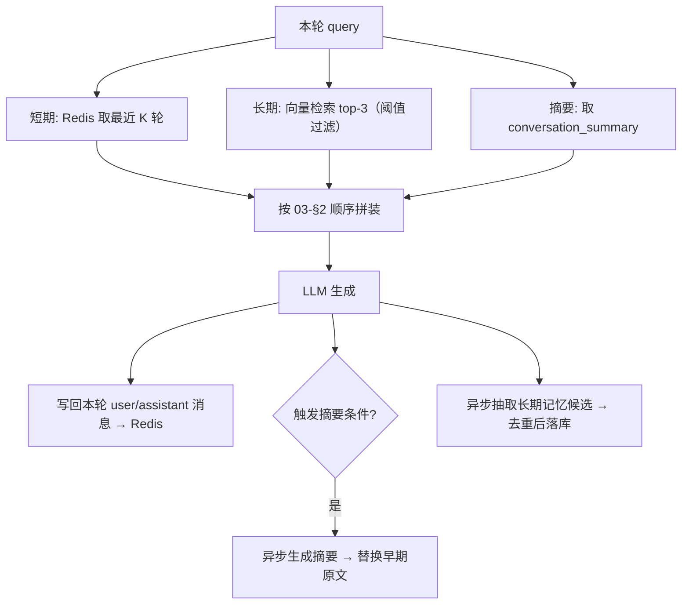

# 07 · Memory

> 关联：需求 ID `REQ-MEM-*`；上下文拼装顺序见 [03-§2](./03-对话与流式输出.md)；存储结构见 [09-§3/§4](./09-数据存储模型.md)；记忆写入由工具 `memory_save` 触发，见 [04-§3](./04-Agent与工具调用.md)。

## 1. 三层结构

| 层 | 载体 | 内容 | 生命周期 | 读取时机 |
| --- | --- | --- | --- | --- |
| **短期 Memory** | Redis `ctx:{conversation_id}` | 当前会话最近若干轮原始消息 | TTL 7 天 / 200 条上限 | 每次对话 |
| **Conversation Summary** | MySQL `conversation_summary` + Redis 缓存 | 早期对话的 LLM 摘要 | 与会话同生命周期 | 每次对话（有则注入） |
| **长期 Memory** | MySQL `user_memory` + Milvus `ai_platform_memories` | 跨会话的用户偏好与事实 | 长期（可删除/可过期） | 每次对话按语义检索 top-3 |



### 1.1 需求

| ID | 需求 |
| --- | --- |
| `REQ-MEM-001` | 服务 MUST 以 `conversation_id` 为键维护短期上下文，支持读写、追加、清空，且 MUST NOT 把全量历史直接塞进 Prompt |

## 2. 短期上下文

### 2.1 存储结构

| 项 | 约定 |
| --- | --- |
| Key | `ctx:{conversation_id}` |
| 类型 | Redis List（`RPUSH` 追加，`LRANGE` 读取），元素为 JSON 字符串 |
| 元素结构 | `{"role":"user\|assistant","content":"...","message_id":"msg_*","tokens":123,"created_at":"..."}` |
| 保留策略 | `LTRIM` 只保留最近 `memory_max_messages`（默认 200）条 |
| TTL | `memory_ttl_days`（默认 7 天），每次写入刷新 |
| 并发 | 同一 `conversation_id` 的写 MUST 用 Redis 分布式锁 `lock:ctx:{conversation_id}`（TTL 5s）串行化，防交错 |

### 2.2 读取规则

1. 取最近 `memory_recent_turns`（默认 10）轮的 user+assistant 消息。
2. 若存在摘要，则摘要覆盖「已被摘要的消息」，原文只取摘要生成时间之后的消息（用 Redis 元素里的 `created_at` 与 `summary.covered_until` 比较）。
3. 丢弃单条 `content` 为空的消息。
4. 读取失败（Redis 不可用）→ 记 `degraded_reasons += memory_unavailable`，退化为「只用请求体 `history`」继续对话，**不报错**。

### 2.3 写入规则

- 对话成功结束后写入两条：`user` 消息（原文）与 `assistant` 消息（完整回答，流式场景在 `done` 时一次性写入）。
- 写入 MUST 在响应结束后进行（或异步），**不得阻塞首 token**。
- 流式中断（`canceled`）时 SHOULD 写入 `partial=true` 的 assistant 消息。

## 3. 对话摘要

### 3.1 触发条件（任一满足）

| 条件 | 阈值 |
| --- | --- |
| 短期上下文 token 超过预算 | `history_trim_trigger_ratio` × 历史原文预算（默认 0.8 × 2400 ≈ 1920 token） |
| 距上次摘要新增消息数 | ≥ `summary_min_new_messages`（默认 20） |
| 手动触发 | `POST /conversations/{id}/summary/rebuild` |

防抖：同一会话 5 分钟内最多生成 1 次（Redis `lock:summary:{conversation_id}`，失败则跳过本轮）。

### 3.2 生成规则

| 项 | 约定 |
| --- | --- |
| 输入 | 待摘要消息（保留最近 `summary_keep_recent_turns`=10 轮不动）+ **上一版摘要**（增量合并，避免信息丢失） |
| 输出结构 | 固定四段：`用户目标` / `已确认事实` / `未决问题` / `用户偏好` |
| 长度 | ≤ `summary_max_tokens`（默认 1200） |
| 模型 | 使用 `llm_model`，`temperature=0.0` |
| 落库 | `conversation_summary(conversation_id, content, covered_until, source_message_count, token_count, updated_at)` |
| 失败 | 记 `degraded_reasons += summary_failed`，本轮退化为「从最旧丢原文」；**不阻塞对话** |
| 异步 | MUST 由异步任务执行（`task_type=summary_build`），不占用对话响应时间 |

### 3.3 需求

| ID | 需求 |
| --- | --- |
| `REQ-MEM-003` | 服务 MUST 支持对话摘要压缩：满足触发条件时异步生成结构化摘要，并在后续对话中以摘要替代已被覆盖的原始消息 |

## 4. Token 预算与裁剪（`REQ-MEM-002`）

### 4.1 预算分配

| 片段 | 配额（token） | 可裁剪 |
| --- | --- | --- |
| `system` 提示词 | 1000 | 否（超限即视为配置错误，启动期校验） |
| 长期记忆（≤3 条） | 600 | 是（整条丢弃） |
| 摘要 | 1200 | 是（降级为前 400 token） |
| 历史原文 | 2400 | 是（从最旧丢弃） |
| RAG context | 2500 | 是（按分数从低丢弃） |
| 本轮 `query` | 实际长度 | 否 |
| **Prompt 合计硬上限** | `context_token_budget` = 8192 | — |
| 输出预留 | `max_output_tokens` = 2048 | 否（与 Prompt 分开计算） |

> 配额之和（≤ 7700 + query）刻意**略小于**硬上限，保证 query 很长时仍有空间。

### 4.2 裁剪顺序（确定性，不允许随机）

```text
① 历史原文：从最旧的一条开始删，直到满足预算
② RAG context：按 score 升序删除 chunk（保护 score 最高的 1 条）
③ 长期记忆：按 score 升序删除记忆条目
④ 摘要：降级为摘要前 400 token
⑤ 若仍超限 → 400 CONTEXT_TOO_LONG（details 给出各片段实际 token）
```

- 裁剪 MUST NOT 让 `system` 或 `query` 被截断。
- 裁剪后 MUST 在日志中记录 `trimmed: {history: 3, rag: 2, memory: 1}`，便于排障。
- Token 计数 MUST 使用与目标模型一致的 tokenizer（不可用字符数粗估）。

## 5. 长期记忆

### 5.1 抽取

| 项 | 约定 |
| --- | --- |
| 触发 | 每轮对话结束后异步执行（`task_type=memory_extract`）；也可由 Agent 调用 `memory_save` 主动写入 |
| 抽取模型 | `llm_model`，要求输出 JSON 数组：`[{"content":"...","kind":"preference\|fact","confidence":0.9}]` |
| 保留条件 | `confidence ≥ memory_min_confidence`（默认 0.7）；`content` 长度 5..500 字符 |
| 过滤 | MUST NOT 抽取：一次性任务信息、敏感凭证（密码/密钥/身份证）、疑问句、模型自身推测 |

### 5.2 去重与合并（`REQ-MEM-005`）

1. 精确去重：`content_sha256` 命中同一用户的已有记忆 → 计数 `hit_count+1`、刷新 `updated_at`，不新增。
2. 语义去重：与已有记忆的向量相似度 ≥ `memory_dedupe_threshold`（默认 0.92）→ 视为同一记忆，用 `updated_at` 较新者覆盖 `content`。
3. 冲突处理：相似度 ∈ [0.85, 0.92) 时**不合并**，两条并存（宁可冗余也不丢信息）。

### 5.3 检索与注入（`REQ-MEM-006`）

| 项 | 约定 |
| --- | --- |
| 检索方式 | 用本轮 `query` 在 `ai_platform_memories` 做向量检索，过滤 `user_id` |
| 数量 | `memory_top_n`（默认 3） |
| 阈值 | `score ≥ memory_score_threshold`（默认 0.45） |
| 注入格式 | 追加为独立的 `system` 消息（**不混入主 system**）：`{用户长期偏好与已知事实}\n- ...\n（以上为用户历史信息，如与当前问题冲突，以当前对话为准）` |
| 优先级 | 低于当前对话中的明确指令；Prompt MUST 声明该规则以免陈旧记忆覆盖新指令 |
| 失败 | 记 `degraded_reasons += memory_unavailable`，跳过该片段 |

### 5.4 生命周期与隐私（`REQ-MEM-007`）

| 项 | 约定 |
| --- | --- |
| 过期 | `kind=fact` 的记忆 SHOULD 支持 `expires_at`；到期后不再注入（保留记录，标记 `expired=true`） |
| 用户清空 | `DELETE /memories?all=true` 清空该用户全部记忆（MySQL + Milvus 双删），并在 24h 内不重新抽取旧内容 |
| 会话清空 | `DELETE /conversations/{id}/context` 清 Redis 上下文 + 标记摘要失效；**不删**长期记忆 |
| 关闭能力 | `memory_enabled=false`（用户级设置）时 MUST 既不写入也不读取长期记忆 |
| 审计 | 记忆的新增/修改/删除 MUST 记审计日志（谁、何时、哪条、来源会话） |

## 6. 接口

| 方法 | 路径 | 说明 | 成功码 |
| --- | --- | --- | --- |
| `GET` | `/conversations/{conversation_id}/context` | 查看当前上下文（消息列表 + 各片段 token 占用 + 是否已摘要） | 200 |
| `DELETE` | `/conversations/{conversation_id}/context` | 清空短期上下文（幂等） | 204 |
| `GET` | `/conversations/{conversation_id}/summary` | 取摘要；未生成返回 `404 SUMMARY_UNAVAILABLE` | 200 |
| `POST` | `/conversations/{conversation_id}/summary/rebuild` | 手动重建摘要，返回 `task_id` | 202 |
| `GET` | `/memories` | 分页列出长期记忆（可按 `kind`、`expired` 过滤） | 200 |
| `POST` | `/memories` | 手动新增记忆（`Idempotency-Key` 支持） | 201 |
| `GET` | `/memories/{mem_id}` | 详情 | 200 |
| `PATCH` | `/memories/{mem_id}` | 修改 `content`（触发重新向量化） | 200 |
| `DELETE` | `/memories/{mem_id}` | 删除单条 | 204 |
| `DELETE` | `/memories?all=true` | 清空全部（`all=true` 必填，防误删） | 204 |
| `GET` / `PUT` | `/memory-settings` | 查询/更新 `memory_enabled`、`memory_top_n` | 200 |

### 6.1 `GET /conversations/{conversation_id}/context` 响应

```json
{
  "conversation_id": "cv_01J8ZQ3K7N9P2V6R4T8W1Y5B3C",
  "message_count": 24,
  "messages": [
    { "role": "user", "message_id": "msg_01J8...", "content": "退款政策多少天？", "tokens": 12, "created_at": "2026-09-28T10:00:00.123Z" }
  ],
  "summary": { "exists": true, "covered_until": "2026-09-28T09:30:00.000Z", "token_count": 843 },
  "budget": {
    "context_token_budget": 8192,
    "used": { "system": 412, "memory": 208, "summary": 843, "history": 1204, "rag": 1873, "query": 12 },
    "total_tokens": 4552,
    "trimmed": { "history": 0, "rag": 0, "memory": 0 }
  }
}
```

> `budget` 字段是**排障关键**：能直接看出「模型为什么没看到某条信息」。

### 6.2 `POST /memories` 请求

| 字段 | 类型 | 必填 | 默认 | 约束 |
| --- | --- | --- | --- | --- |
| `content` | `string` | 是 | — | 5..500 字符 |
| `kind` | `"preference" \| "fact"` | 否 | `fact` | 枚举 |
| `confidence` | `number` | 否 | `1.0` | 0..1（手动新增默认 1.0） |
| `expires_at` | `string \| null` | 否 | `null` | RFC3339，必须晚于当前时间 |

### 6.3 需求

| ID | 需求 |
| --- | --- |
| `REQ-MEM-004` | 服务 MUST 支持从对话中异步抽取长期记忆（偏好/事实），并按 `confidence` 与内容规则过滤 |
| `REQ-MEM-005` | 长期记忆写入 MUST 经精确 + 语义两层去重；相似但不等价的记忆 MUST 并存而非合并 |

## 7. 验收标准

| ID | 关联需求 | 验收点 |
| --- | --- | --- |
| `AC-MEM-01` | `REQ-MEM-001` | 同 `conversation_id` 连续两轮对话，第二轮请求发往 LLM 的 messages 含第一轮的 user+assistant |
| `AC-MEM-02` | `REQ-MEM-001` | 空 `conversation_id` 的请求不写 Redis（`KEYS ctx:*` 无新增） |
| `AC-MEM-03` | `REQ-MEM-003` | 构造 30 条历史 → 触发 `summary_build` 任务；完成后 `GET /summary` 返回四段结构且 `covered_until` 合理 |
| `AC-MEM-04` | `REQ-MEM-003` | 摘要生成失败（mock LLM 报错）时对话仍成功，`degraded_reasons` 含 `summary_failed` |
| `AC-MEM-05` | `REQ-MEM-002` | 构造超预算上下文 → 用 mock LLM 捕获 messages，断言 `total_tokens ≤ 8192`，且 `system` 与 `query` 完整未被截断 |
| `AC-MEM-06` | `REQ-MEM-002` | 裁剪顺序可验证：超出 200 token 时优先少 1 条历史而非少 1 条 RAG chunk（构造边界用例） |
| `AC-MEM-07` | `REQ-MEM-004` | 对话中说「我喜欢简洁回答，不要用列表」→ 出现 `memory_extract` 任务，`GET /memories` 新增一条 `kind=preference` |
| `AC-MEM-08` | `REQ-MEM-005` | 同一句话抽两次 → `GET /memories` 仍只有 1 条，且 `hit_count=2`；语义相近（相似度 0.95）的两句话 → 合并为 1 条 |
| `AC-MEM-09` | `REQ-MEM-006` | 新会话中提问，mock LLM 的 messages 中出现独立的记忆 system 段且含该偏好 |
| `AC-MEM-10` | `REQ-MEM-007` | `DELETE /memories?all=true` 后：MySQL 该用户记忆为 0 条、Milvus 该 `user_id` 向量为 0 条、下次对话 messages 中无记忆段；未带 `all=true` 返回 400 |
