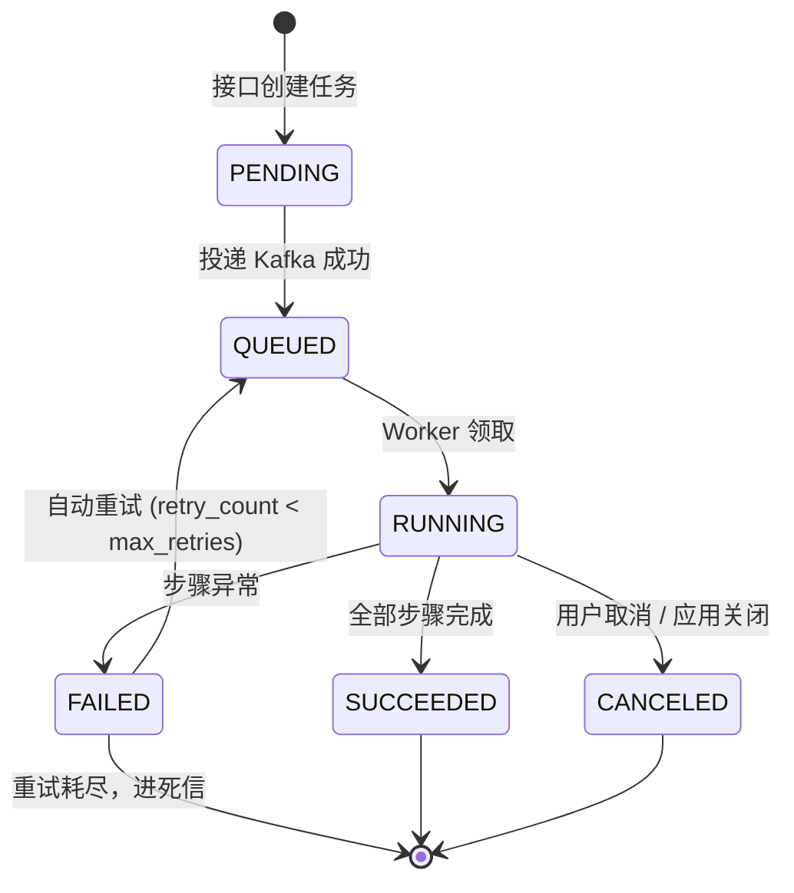

# 08 · 异步任务

> 关联：需求 ID `REQ-TASK-*`；任务触发的业务场景见 [06 文档入库](./06-RAG知识库.md)、[07 摘要与记忆抽取](./07-Memory.md)；表结构见 [09-§2](./09-数据存储模型.md)；Kafka 约定见 [09-§5](./09-数据存储模型.md)。

## 1. 适用范围

以下操作 MUST 异步执行（同步接口只做校验与建任务）：

| 任务类型 | 触发入口 | 产物 |
| --- | --- | --- |
| `document_ingest` | `POST /knowledge-bases/{kb_id}/documents` | MinIO 对象 + chunk 记录 + Milvus 向量 |
| `document_delete` | `DELETE /documents/{doc_id}` | 清理三处存储 |
| `kb_reindex` | `POST /knowledge-bases/{kb_id}/reindex`（P1） | 重建全部向量 |
| `summary_build` | 摘要触发条件 / `POST /conversations/{id}/summary/rebuild` | `conversation_summary` 更新 |
| `memory_extract` | 每轮对话结束 | `user_memory` 新增/合并 |
| `memory_delete` | `DELETE /memories?all=true` | 双存储清理 |

## 2. 任务状态机



| 状态 | 含义 | 终态 |
| --- | --- | --- |
| `PENDING` | 已入库，尚未投递 MQ | 否 |
| `QUEUED` | 已投递，等待 Worker | 否 |
| `RUNNING` | Worker 正在执行 | 否 |
| `SUCCEEDED` | 成功 | 是 |
| `FAILED` | 失败（可能还会自动重试） | 条件性 |
| `CANCELED` | 已取消 | 是 |

**不变式**：

- `PENDING → QUEUED` MUST 在**数据库事务提交后**投递（避免「投递成功但事务回滚」产生幽灵任务）。
- 终态不可变更；`FAILED` 仅在 `retry_count < max_retries` 且 `retry_requested_at` 已设置时可回到 `QUEUED`。
- 状态变更 MUST 用乐观锁（`WHERE status = :expected AND version = :v`）更新，防 Worker 重复执行导致状态抖动。

### 2.1 需求

| ID | 需求 |
| --- | --- |
| `REQ-TASK-001` | 服务 MUST 为所有耗时操作提供任务实体，包含 `id`/`type`/`status`/`progress`/`stage`/`error`/`retry_count`，状态机符合第 2 节 |
| `REQ-TASK-002` | Worker MUST 分阶段上报 `stage` 与 `progress`（0–100），供客户端展示进度 |

## 3. 任务模型

| 字段 | 类型 | 说明 |
| --- | --- | --- |
| `id` | `string` | `task_*` |
| `type` | `string` | 见第 1 节枚举 |
| `status` | `string` | 见第 2 节 |
| `user_id` | `string` | 属主，用于隔离 |
| `resource_type` | `"document" \| "knowledge_base" \| "conversation" \| "memory"` | 关联资源类型 |
| `resource_id` | `string` | 关联资源 ID |
| `payload` | `object` | 任务参数快照（如 `doc_id`,`chunk_size`,`chunk_overlap`） |
| `progress` | `integer` | 0..100 |
| `stage` | `string \| null` | **实际取值就是 `document.status` 那套枚举**：`PARSING` / `CHUNKING` / `EMBEDDING` / `INDEXED`（非 ingest 任务为 `null`）。本节早先写的 `parsing`/`chunking`/… 小写别名**未实现**，不要按它对接 |
| `chunks_total` | `integer` | **本次待向量化的切片数**（截断**后**）；`0` = 不是 ingest 任务或还没算出来 |
| `chunks_done` | `integer` | **已完成向量化的切片数**；`EMBEDDING` 段单调递增 |
| `retry_count` | `integer` | 已重试次数 |
| `max_retries` | `integer` | 默认 3 |
| `error` | `object \| null` | `{code, message, detail, at}` |
| `idem_key` | `string` | 幂等键（唯一索引） |
| `queued_at` / `started_at` / `finished_at` | `string \| null` | RFC3339 |
| `created_at` / `updated_at` | `string` | RFC3339 |

## 4. 接口

### 4.1 `GET /tasks`

查询参数：`status`（可多值）、`type`、`resource_id`、`limit`、`cursor`。响应为分页列表，元素结构同 3。

### 4.2 `GET /tasks/{task_id}`

```json
{
  "id": "task_01J8ZQ7Y3M5R9T2W6B4N8V0C1D",
  "type": "document_ingest",
  "status": "RUNNING",
  "resource_type": "document",
  "resource_id": "doc_01J8ZQ1A2B3C4D5E6F7G8H9J0K",
  "progress": 65,
  "stage": "EMBEDDING",
  "chunks_total": 10000,
  "chunks_done": 6500,
  "retry_count": 0,
  "max_retries": 3,
  "error": null,
  "created_at": "2026-09-28T10:00:00.123Z",
  "queued_at": "2026-09-28T10:00:00.180Z",
  "started_at": "2026-09-28T10:00:02.400Z",
  "finished_at": null
}
```

### 4.3 `POST /tasks/{task_id}/cancel`

| 项 | 说明 |
| --- | --- |
| 允许状态 | `PENDING` / `QUEUED` / `RUNNING` |
| 行为 | `PENDING/QUEUED` 直接置 `CANCELED`；`RUNNING` 置 Redis 取消标记 `cancel:{task_id}`，Worker 在**下一个检查点**（每批处理前）退出并置 `CANCELED` |
| 不立即生效 | 单批 Embedding（≤ 30s）不可中断，最多等待一批完成 |
| 错误 | 终态调用 → `409 TASK_NOT_CANCELABLE` |
| 幂等 | 重复调用返回当前状态 |

### 4.4 `POST /tasks/{task_id}/retry`

| 项 | 说明 |
| --- | --- |
| 允许状态 | 仅 `FAILED` |
| 行为 | `retry_count += 1`，重置 `progress=0`、`stage=null`、`chunks_total=0`、`chunks_done=0`、`error=null`，置 `QUEUED` 并投递 |
| 上限 | `retry_count ≥ max_retries` → `409 TASK_NOT_RETRYABLE` |
| 幂等 | `QUEUED/RUNNING` 状态下调用返回当前任务（不重复投递） |

### 4.5 `GET /tasks/{task_id}/events`（SSE，P1）

事件类型、payload 与终止规则：

| event | data 字段 | 何时推送 | 是否关闭连接 |
| --- | --- | --- | --- |
| `progress` | `stage`(可空), `progress`(0..100), `chunks_done`/`chunks_total`（**仅 ingest 任务**，无值时**整个键不出现**） | 订阅时的快照 + 每次 `report_progress` | 否 |
| `error` | `code`, `message`, `retryable` | 任务进入 `FAILED`（含快照） | **否** —— 见下 |
| `done` | `status`, `finished_at` | 任务进入 `SUCCEEDED`/`CANCELED` | 是（最后一帧） |
| `ping` | `ts` | 15s 无任何事件 | 否 |

> **为什么 `progress` 帧要多带 `chunks_done`**：`progress` 在 `EMBEDDING` 段是**饱和**的
> （从 55 爬到 95 后不再动），一个十万片的大文档会在这个区间里保持同一个 `progress` 值上千秒。
> 若去重键只取 `(stage, progress)`，客户端就会看到**进度条卡死**。
> 所以去重键是 `(stage, progress, chunks_done)`；没有分片计数的任务三者的行为与以前完全一致
> （键不存在 ⇒ 等价于旧行为）。守这一点的用例：`tests/unit/test_task_stream.py::test_progress_frames_after_saturation_are_not_deduped`。

三条必须写死的规则：

1. **订阅前已是终态** → 立即推 `done` 并关闭（避免客户端永久等待）；
2. **`FAILED` 不关流**：`FAILED → QUEUED` 是合法迁移（第 2 节），自动重试可能随后发生，
   关掉会让客户端错过后续进度。所以 `error` 之后连接保持打开，直到再次 `progress` 或兜底超时；
3. **`error` 与 `done` 互斥**（[02-§6.3](./02-接口规范与错误码.md)）：一帧 `error` 之后 MUST NOT 再发 `done`。

`error.retryable` 的判据是**两个条件同时成立**：错误码本身值得重试（见 5.2 的不可重试清单）
**且** 任务的重试预算还没用尽。只判预算会把 `UNPROCESSABLE_DOCUMENT` 报成「可重试」，
客户端于是重试三次拿到同一个错误（`docs/02` §5.3 已把该码标为 `retryable=false`）。

心跳、帧格式、`X-Accel-Buffering` 等响应头遵循 [02-§6](./02-接口规范与错误码.md)；
快照是权威、增量是尽力而为（总线可能丢帧），客户端断线重连等价于「重读一次快照」。

### 4.6 需求

| ID | 需求 |
| --- | --- |
| `REQ-TASK-003` | 服务 MUST 提供任务查询（单个/列表）、取消、重试接口，且列表 MUST 支持按 `status`/`type`/`resource_id` 过滤并分页 |

## 5. 投递、重试与幂等

### 5.1 投递

| 项 | 约定 |
| --- | --- |
| 消息队列 | Kafka |
| Topic | `ai.task.document_ingest`、`ai.task.document_delete`、`ai.task.summary_build`、`ai.task.memory_extract`、`ai.task.dlq`（死信） |
| 分区键 | `resource_id`（保证同一文档的任务有序、不并发处理同一资源） |
| 消费组 | `ai-platform-worker` |
| 至少一次 | Kafka 语义为 at-least-once，故消费端 MUST 幂等（见 5.3） |
| 投递失败 | `PENDING → QUEUED` 投递失败 → 任务保持 `PENDING` 并由**补偿扫描**（每 30s 扫 `PENDING` 且 `created_at < now-60s`）重投；重投 3 次仍失败 → `FAILED` + `MQ_UNAVAILABLE` |

### 5.2 重试（`REQ-TASK-004`）

| 项 | 约定 |
| --- | --- |
| 自动重试次数 | `max_retries=3`（可配置） |
| 退避 | 指数 + 抖动：`1s, 4s, 16s` × `[0.8, 1.2]` 随机 |
| 重试实现 | **不阻塞 Worker**：重试时把消息投递到延迟 topic 或写 Redis ZSET `retry:zset` 由调度线程到期重投 |
| 可重试错误 | 网络/超时/上游 5xx、Milvus/Redis 连接失败 |
| 不可重试错误 | `UNSUPPORTED_FILE_TYPE`、`UNPROCESSABLE_DOCUMENT`、`VECTOR_DIM_MISMATCH`、参数非法 → 直接 `FAILED`，`max_retries` 视为 0 |
| 死信 | 重试耗尽 → 复制消息到 `ai.task.dlq` 并保留 `task_id` + 最后错误，供人工排查 |

### 5.3 幂等（`REQ-TASK-005`）

| 层级 | 机制 |
| --- | --- |
| 任务创建 | `idem_key = sha256(type + resource_id + version)`，MySQL 唯一索引；重复创建返回已有任务 |
| 消息重复 | Worker 领取后先检查状态：已 `SUCCEEDED`/`CANCELED` → 直接 ack 丢弃 |
| 处理步骤 | 每步幂等：MinIO 按 `doc_id` 覆盖写；Milvus 按 `chunk_id` upsert；MySQL 用 `INSERT ... ON DUPLICATE KEY UPDATE` |
| 进度上报 | 用 `version` 乐观锁，落后版本的上报被丢弃（防乱序覆盖） |

### 5.4 Worker 并发与背压（`REQ-TASK-006`）

| 项 | 约定 |
| --- | --- |
| Worker 进程 | 独立进程 `python -m app.worker`（与 API 进程分离，避免抢 CPU 影响首 token 延迟） |
| 并发 | `worker_concurrency`（默认 2）；Embedding 类任务用 `asyncio.Semaphore` 进一步限制（默认 1，避免 CPU 打满） |
| 单任务超时 | `task_timeout_seconds`（默认 1800s）→ 超时置 `FAILED` 并释放资源 |
| 过载保护 | 未结束任务数**已达到** `ingest_queue_max`（默认 1000）时新任务创建返回 `503 OVERLOADED`；账号维度不区分，先到先服务 |
| 优雅退出 | 收到 SIGTERM 后停止领取新消息，等待当前任务到检查点（最多 30s）后置 `CANCELED` 并提交 offset |
| offset 提交 | MUST 在任务状态落库成功**之后**提交，保证「状态一定被记录」；并发消费时按分区的**连续水位线**提交（按完成顺序提交会跳消息，见 `docs/12` §12.1） |

### 5.5 实现要点（M7 已落地，2026-09-28）

代码位置：`app/worker/`（独立进程）、`app/tasks/{transport,redis_store,events,retry,compensation,stream}.py`、
`app/api/v1/tasks.py`。以下是与本节表格对应的**实现取值**，改代码时以这里为准：

| 项 | 实现 |
| --- | --- |
| Worker 入口 | `python -m app.worker`；`INFRA_BACKEND=memory` 时**拒绝启动**（退出码 2：另一个进程看不见内存 store），`TASK_RUNNER≠kafka` 时只告警 |
| 消费组 | `KAFKA_GROUP_ID`（默认 `ai-platform-worker`），订阅 6 个 `ai.task.*` 主题 |
| 延迟重试 | Redis ZSET `retry:zset`，member=`task_id:attempt`，score=到期毫秒；认领用 **Lua** 把「查到期的 + ZREM」做成原子（否则两个 Worker 会重投同一任务） |
| 补偿扫描 | `TaskCompensator`：API 进程内后台任务（每 30s，仅 `TASK_RUNNER=kafka` 时启动），`PENDING` 超过 60s 未投递则重投，失败 3 次或超 `TASK_PENDING_MAX_AGE_SECONDS` → `FAILED` |
| 事件总线 | Redis pub/sub 频道 `task:events:<task_id>`，**不重放历史帧**（重连先读快照）；进程内后端用内存总线 |
| 状态存储 | Redis Hash `task:<id>`（JSON 字段 + `version` CAS）、`task:idem:<key>`（`SET NX`）、`task:user:<uid>`（ZSET）、`task:open`（ZSET，过载判断与滞留扫描用）、`cancel:<id>`（TTL 24h） |
| 事件发布点 | 只在 `TaskService`（状态变更的唯一入口）：`report_progress`/`succeed`/`fail`/`cancel`/`retry`/`requeue`。发布失败只记日志（权威状态在任务表） |
| 兜底时长 | SSE 单连接上限 = `TASK_TIMEOUT_SECONDS + 60s`，到点推 `error(UPSTREAM_TIMEOUT)` 并关流 |


## 6. 验收标准

| ID | 关联需求 | 验收点 |
| --- | --- | --- |
| `AC-TASK-01` | `REQ-TASK-001` | 上传文档后立刻查询任务：状态为 `PENDING` 或 `QUEUED`，且该行在 MySQL 中已提交（事务与投递顺序正确） |
| `AC-TASK-02` | `REQ-TASK-002` | 入库 100 页 PDF 期间轮询任务：至少观察到 3 个不同 `stage`，`progress` 单调不减且终值为 100 |
| `AC-TASK-03` | `REQ-TASK-003` | `GET /tasks?status=FAILED&type=document_ingest` 能过滤；用另一 `user_id` 查询返回 404 |
| `AC-TASK-04` | `REQ-TASK-003` | 取消 `RUNNING` 任务 → 状态在 30s 内变 `CANCELED`；对已成功任务调用 cancel 返回 `409 TASK_NOT_CANCELABLE` |
| `AC-TASK-05` | `REQ-TASK-004` | mock Milvus 前 2 次写入抛异常 → 任务最终 `SUCCEEDED`，`retry_count=2`，且重试间隔符合退避（观察日志时间差） |
| `AC-TASK-06` | `REQ-TASK-004` | 上传不可解析文档 → `retry_count=0` 直接 `FAILED`（不重试），`error.code=UNPROCESSABLE_DOCUMENT` |
| `AC-TASK-07` | `REQ-TASK-005` | 同一消息投递 3 次（手动重放 Kafka）→ Milvus 中该 `doc_id` 向量条数不变，任务仅 1 条 `SUCCEEDED` |
| `AC-TASK-08` | `REQ-TASK-005` | 用相同 `Idempotency-Key` 上传同一文件两次 → 任务表仅 1 条，`task_id` 相同 |
| `AC-TASK-09` | `REQ-TASK-006` | `SIGTERM` 停止 Worker（有任务在跑）→ 当前任务变 `CANCELED`、进程在 35s 内退出、重启后该任务可被 `retry` 且不重复产生向量 |
