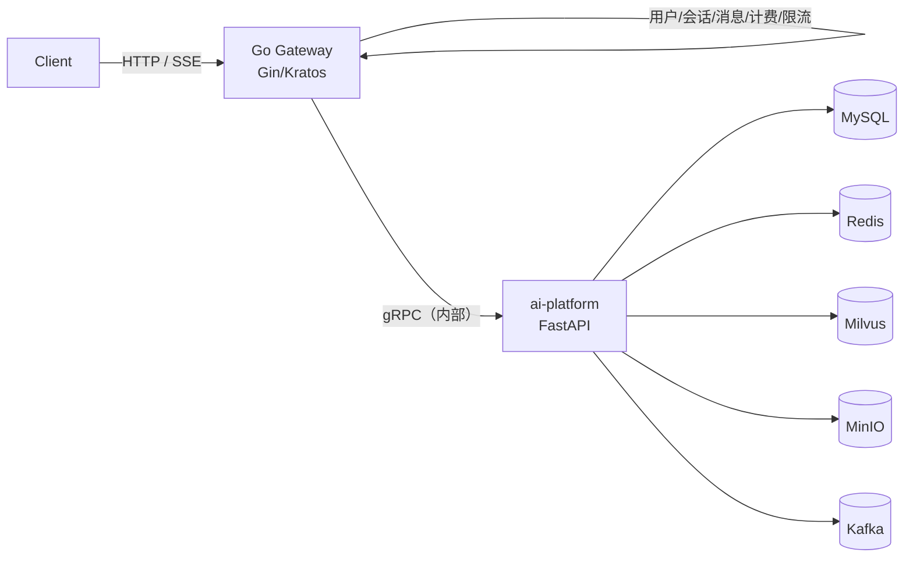

# ai-platform 需求规格说明书（SRS）

> 本目录是 **Python AI 服务 `ai-platform`** 的需求规格说明书。
>
> - 上游输入：[`../../预期设计文档.md`](../../预期设计文档.md)（Go + Python 全平台高层设计）
> - 本文档集只覆盖设计文档中的 **AI 应用域**：LLM 编排与流式输出、Agent / Tool Calling、MCP、RAG 知识库、Memory、异步任务。

## 1. 范围边界

| 项目 | 说明 |
| --- | --- |
| **覆盖** | `ai-platform`（Python / FastAPI）对外 HTTP 接口契约、SSE 协议、数据存储模型、AI 能力编排规则、非功能指标、验收标准 |
| **不覆盖** | Go Gateway、用户中心与鉴权中心的实现、会话/消息业务表、前端、K8s 编排清单、CI 流水线脚本 |
| **引用但不在本范围** | 用户身份（由 Go 侧签发的 JWT 提供）、业务侧会话与消息持久化（Go 侧 MySQL）、客户端 SSE 透传 |

### 1.1 与 Go Gateway 的分工

| 能力 | 归属 | 备注 |
| --- | --- | --- |
| 鉴权、限流、配额 | Go | Python 只校验 JWT 并信任 `sub` 作为 `user_id` |
| 会话与消息的**业务台账** | Go（MySQL） | Python 通过 `conversation_id` 关联，不重复存全量消息 |
| LLM 调用、Agent 循环、工具执行 | **Python** | 本 SRS 主体 |
| RAG 全链路（上传 → 解析 → 向量化 → 检索 → 重排） | **Python** | 原文存 MinIO，向量存 Milvus |
| Memory（短期/长期/摘要） | **Python** | Redis + MySQL + Milvus |
| 异步任务（解析 / 向量化 / 索引 / 摘要） | **Python** | Kafka + Worker |
| 可观测性埋点 | **Python** | OTel + Prometheus，指标由 Go 侧汇总暴露亦可 |

> **意图**：Python 服务是「AI 能力提供方」，要求它可以**独立启动、独立压测、独立验收**；与 Go 的唯一强耦合是 JWT 约定与 `conversation_id` 语义。

## 2. 文档索引

| # | 文档 | 内容 | 主要需求 ID 前缀 |
| --- | --- | --- | --- |
| — | **README.md**（本文件） | 范围、索引、术语、约定、现状差距 | — |
| 01 | [总体需求与范围](./01-总体需求与范围.md) | 目标、场景、功能范围与优先级、里程碑、追踪矩阵 | `REQ-GEN` |
| 02 | [接口规范与错误码](./02-接口规范与错误码.md) | 通用约定、鉴权、统一错误信封、错误码总表、SSE 通用帧、分页 | `REQ-API` |
| 03 | [对话与流式输出](./03-对话与流式输出.md) | `/chat`、`/chat/stream`、上下文组装、引用溯源 | `REQ-CHAT` |
| 04 | [Agent 与工具调用](./04-Agent与工具调用.md) | Agent Loop 状态机、工具注册契约、内置工具、`/tools` | `REQ-AGENT` |
| 05 | [MCP 接入](./05-MCP接入.md) | MCP 连接生命周期、命名空间、`/mcp/servers` | `REQ-MCP` |
| 06 | [RAG 知识库](./06-RAG知识库.md) | 知识库/文档 CRUD、Chunk 策略、检索与重排、溯源 | `REQ-RAG` |
| 07 | [Memory](./07-Memory.md) | 短期上下文、摘要压缩、长期记忆抽取与注入 | `REQ-MEM` |
| 08 | [异步任务](./08-异步任务.md) | 任务状态机、重试与幂等、`/tasks` | `REQ-TASK` |
| 09 | [数据存储模型](./09-数据存储模型.md) | MySQL 表、Milvus 集合、Redis Key、MinIO 路径、Kafka Topic | `REQ-DATA` |
| 10 | [非功能需求与可观测性](./10-非功能需求与可观测性.md) | 性能、可靠性、安全、埋点、配置项全表 | `REQ-NFR` |
| 11 | [验收标准与测试策略](./11-验收标准与测试策略.md) | 验收用例、RAG 效果评估、测试分层、CI 门槛 | `REQ-TEST` |
| 12 | [实现问题记录](./12-实现问题记录.md) | 实现中实际踩到的坑：症状 / 根因 / 修法 / 防线 | — |
| 13 | [技术设计说明](./13-技术设计说明.md) | 分层、装配、错误处理、各链路设计、扩展点与已知取舍 | — |
| 14 | [接口 curl 示例](./14-接口%20curl%20示例.md) | 每个对外接口的 curl 命令 + 真实依赖下的实测响应 + 一键全量验证脚本 | — |
| 15 | [代码注释规范](./15-代码注释规范.md) | 注释的取舍标准、**豁免裁决**、禁止项、文件头政策（许可证待定）与机器守门测试 | — |

> 12 / 13 / 14 / 15 与 01–11 的区别：01–11 是**需求**（应该是什么），
> 12 是**故障史**（我们曾写错成什么、为什么错、留下了什么防线），
> 13 是**设计**（怎么做、为什么这么定），
> 14 是**实测**（照这样发请求真的会得到什么，含非 2xx 的正确负例），
> 15 是**工程约定**（注释怎么写、哪些可以不写、怎么被机器守住）。
> 12 里的每条坑，在 13 里都能找到对应的「所以设计成这样」。

## 3. 阅读路径

- **只想知道要做什么** → 01 → 各模块文档的「功能需求」小节
- **要开始写代码** → 02（先把错误码/SSE 定死）→ 03 → 06 → 09
- **要把服务跑起来并逐个接口试** → 14（含依赖清单、建表脚本、一键验证脚本）
- **要做验收/答辩** → 14 → 11 → 10
- **要接新工具/新数据源** → 04 → 05
- **要评估工作量** → 01 的优先级表 + 各文档末尾「验收标准」

## 4. 术语表

| 术语 | 含义 |
| --- | --- |
| KB / 知识库 | Knowledge Base，一组文档的逻辑容器，检索的最小隔离单元 |
| Chunk | 文档切片，向量化与检索的最小单位 |
| Agent Loop | LLM 推理 → 工具调用 → 结果回注 → 再推理的循环 |
| Tool Calling | 由模型输出结构化调用意图、由宿主执行并回注结果的机制 |
| MCP | Model Context Protocol，外部工具的标准接入协议 |
| Rerank | 对向量召回结果用交叉编码器重新打分排序 |
| 短期 Memory | 当前会话的原始上下文（Redis） |
| 长期 Memory | 跨会话保留的用户偏好/事实（MySQL + Milvus） |
| Conversation Summary | 对早期对话的 LLM 压缩摘要，用于替换原始消息 |
| Task | 异步任务实体，具有状态机与重试语义 |
| Citation / 溯源 | 回答中引用的 chunk 元数据，供前端展示来源 |
| Token 预算 | 单次请求允许占用的上下文 token 上限，按模块分配 |

## 5. 文档约定

- 需求关键词遵循 RFC 2119：**MUST（必须）/ SHOULD（应该）/ MAY（可选）**。
- 需求 ID 形如 `REQ-<模块>-<三位序号>`，全文档唯一，可被测试用例反向引用（见 11）。
- 接口路径以 `api_prefix`（默认 `/api/v1`）为前缀；本文档中的路径 **省略前缀**，例如 `/chat` 实际为 `/api/v1/chat`。
- JSON 字段一律 `snake_case`（与现有 Pydantic 模型保持一致）。
- 时间戳一律 RFC 3339 UTC，形如 `2026-09-28T10:00:00.123Z`。
- 资源 ID 为**带前缀的字符串**：`kb_` / `doc_` / `chk_` / `task_` / `mem_` / `msg_` / `srv_`，后接 26 位 Crockford Base32（ULID）。示例：`doc_01J8ZQ3K7N9P2V6R4T8W1Y5B3C`。
- 所有长度为「字符数」而非字节数，除非显式说明。
- 表格中「默认值」列取自 `app/core/config.py` 现状；新增配置项在 10 中标注 **【新增】**。

## 6. 现状与差距（截至 2026-09-28，M1–M7 已完成）

| 模块 | 代码现状 | 需求状态 | 差距 |
| --- | --- | --- | --- |
| 应用装配 | `create_app(settings)` + lifespan + CORS + 幂等装配点（`app.state`） | 满足 | — |
| 配置 | `app/core/config.py` 覆盖 LLM/Embedding/Reranker/Milvus/MySQL/Redis/MinIO/Kafka/Memory/Agent/MCP + `validate_for_startup()` | 满足 | prod 强制 `INFRA_BACKEND=real`；MySQL 仓储未实现，但 `real` 下由 `app/infrastructure/storage/unavailable.py` 返回 `503 DEPENDENCY_UNAVAILABLE`（不再启动即崩）（M5/M6） |
| 健康检查 | `GET /health`、`/health/live`、`/health/ready`（依赖探活注册表） | 满足 | `INFRA_BACKEND=memory` 时依赖项返回 skipped |
| 错误与鉴权 | 统一错误信封、错误码总表、JWT 校验、trace_id 贯通 | 满足 | — |
| 对话 | `POST /chat`、`POST /chat/stream`、`GET /models` 已实现；`use_rag=true` 注入片段与 `references`；`use_tools=true` 转交 Agent 链路 | 满足（`REQ-CHAT-001/002/004/005/006/007`） | — |
| 上下文装配 | 顺序 system→memory→summary→history→rag→query；按 07-§4.2 确定性裁剪；长期记忆作为**独立** system 段注入 | 满足（`REQ-CHAT-004/005`、`REQ-MEM-002/006`） | — |
| Agent | `app/agent/loop.py`（三重护栅：步数 / 总时长 / 重复调用）+ `POST /agent/run`、`/agent/run/stream` | 满足（`REQ-AGENT-001..007`） | chat 图谱 `app/agent/graph/` 保留为占位（未接入） |
| 工具调用 | `app/tools/`（`ToolSpec` + 注册表 + 执行器 + 服务）+ 6 个内置工具（含 `memory_save` / `memory_search`）、`GET /tools`、`POST /tools/{name}/invoke`（仅 local/dev） | 满足（`REQ-AGENT-006/007`、`AC-AGENT-01..09`） | `http_fetch` 默认关闭 |
| MCP | `app/mcp/`：配置校验（`extra="forbid"` + `${VAR}` 展开）、stdio 与 `streamable_http` 两种传输、多 Server 并发启动与总超时、状态机与懒重连、行内熔断（`mcp:{server}`）、工具命名空间 `mcp__{server}__{tool}`、allowlist/denylist/`write_tools` 审计；接口 `GET /mcp/servers`、`GET /mcp/servers/{name}/tools`、`POST /mcp/servers/{name}/reload` | 满足（`REQ-MCP-001..005`、`AC-MCP-01..07`） | 未代理 MCP 的 `prompts` / `sampling` 能力（SRS 明示不做） |
| RAG | 解析（pdf/docx/md/html/txt，扩展名 + 魔数双校验）、结构感知切片、入库编排（上传 → 解析 → 切片 → 嵌入 → 落库）、真实检索（召回 → 合并相邻 → 重排 → token 预算裁剪）、引用溯源（`[n]` ↔ `references[].index` + `content_sha256`） | 满足（`REQ-RAG-001..016`） | 重排默认接 BGE；Milvus 实现已就绪但默认 `INFRA_BACKEND=memory` 走进程内实现 |
| Memory | 三层齐备：短期上下文（`ConversationStore`，内存 + Redis 实现）、摘要压缩（四段结构 / 增量合并 / 5 分钟防抖）、长期记忆（哈希 + 语义两层去重、`0.85/0.92` 双阈值、过期与清空 24h 冷静期）；接口 `/memories`、`/memory-settings`、`/conversations/{id}/context`（含 summary）；轮末抽取与摘要走 `memory_extract` / `summary_build` 任务 | 满足（`REQ-MEM-001..007`、`AC-MEM-01..10`） | MySQL 仓储与 Milvus 集合未提供，`real` 下退化为进程内实现并告警（M6） |
| 异步任务 | 任务状态机（显式迁移白名单 + 乐观锁 + 幂等键）、内存与 **Redis** 两套仓储、三个执行器（`none` / `inline` / `kafka`）、退避重试 ZSET（Lua 原子认领）、补偿扫描、独立 Worker 进程（`python -m app.worker`）、事件总线（内存 / Redis pub/sub）、`/tasks` 四个接口 + `GET /tasks/{id}/events`（SSE 进度） | 满足（`REQ-TASK-001..007`） | `INFRA_BACKEND=real` 下 KB/文档/切片仍是 `503` 占位（仓储未实现），所以「上传入库」链路只能在 `memory` 下真跑（M7） |
| 可观测性 | 结构化日志 + 脱敏 + trace/span 上下文；`app/infrastructure/observability/`：Prometheus 指标全量（20 个）+ 独立指标端口（主应用不暴露 `/metrics`）+ OTel 链路（**trace id 与日志/响应头同值**）+ 熔断器；`deploy/observability/` 一键起 Jaeger + Prometheus + Grafana（18 面板看板） | 满足（`REQ-NFR-010..013`、`AC-NFR-09..11`） | 采样率、告警规则需按部署环境调（默认 `0.1`） |

> 该表用于排查「需求写了但代码没有」的项；实现推进时同步更新「需求状态」列。

## 7. 版本记录

| 版本 | 日期 | 变更 |
| --- | --- | --- |
| v1.0 | 2026-09-28 | 首版，依据 `预期设计文档.md` 拆解为 11 篇接口级 SRS |
| v1.1 | 2026-09-28 | M3 RAG 闭环完成：解析/切片/入库/检索/引用溯源、知识库与文档与任务接口；
`INFRA_BACKEND=real` 下的 MySQL 仓储改为 `503` 占位 |
| v1.2 | 2026-09-28 | M4 Agent 闭环完成：工具层（Spec/注册表/执行器/服务 + 4 个内置工具）、
Agent Loop 三重护栅、`/agent/run` 与 SSE、`/tools` 与调试调用；
新增 [12-实现问题记录](./12-实现问题记录.md)（含 M4 新增 13 条）与
[13-技术设计说明](./13-技术设计说明.md)（含 M4 设计回填） |
| v1.3 | 2026-09-28 | M5 Memory 闭环完成：短期上下文（Redis 实现 + 分布式锁 + 摘要覆盖过滤）、
摘要压缩（四段结构 / 增量合并 / 防抖）、长期记忆（哈希 + 语义去重、双阈值并存、
过期与清空冷静期、独立 system 段注入）、`memory_save` / `memory_search` 工具、
`TaskDispatcher` 按类型分派；新增 6 个记忆接口；
12 补 M5 新增 17 条（收尾动作只接流式、幂等键粒度、防抖被记成失败、
工具参数名与 SRS 不符等），13 补 §10 Memory 链路设计 |
| v1.4 | 2026-09-28 | M6 MCP 与可观测完成：MCP 配置校验 / 两种传输 / 多 Server 编排 / 状态机与熔断 / 工具命名空间与审计 + 3 个 `/mcp/servers*` 接口；Prometheus 20 指标 + 独立指标端口 + OTel 链路 + `deploy/observability/` 一键观测栈；
12 补 M6 新增条目，13 补 §11–§12 设计 |
| v1.5 | 2026-09-28 | M7 异步任务与 Worker 完成：**Kafka 投递 + 独立 Worker 进程**（自拒错误配置，`exit 2`）、Redis 任务仓储与事件总线、退避重试 ZSET（Lua 原子认领）、补偿扫描、`GET /tasks/{id}/events`（SSE 进度：快照 + 增量 + 心跳）、`deploy/infra/compose.yml`、`tools/kafka_e2e_check.py`；
新增测试分层 `tests/integration/`（真 Redis，不可达时快速 skip）；
12 补 §12 共 12 条（含真机验证证据），13 补 §9.5–§9.10 与 §15 取舍表更新 |
