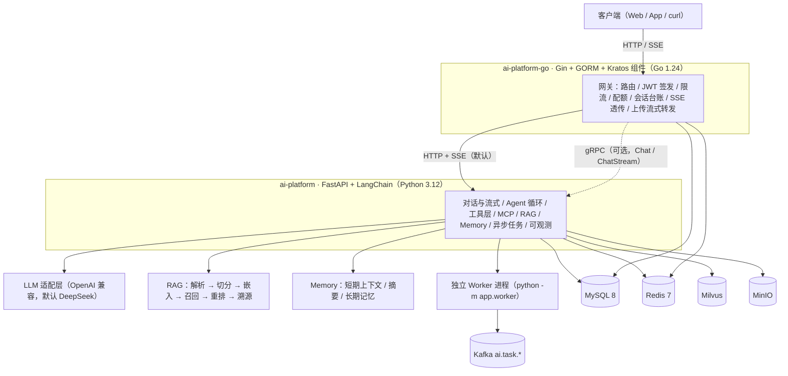

# 项目实现总结 · 接口 / 实现 / 设计取舍 / 优化建议

> **这份文档的定位**：AI 平台（Go 网关 + Python AI 服务）的 **一页式全景**。
> 需求条文在 `ai-platform/docs/01–11` 与 `ai-platform-go/docs/01–07`，故障史在 `ai-platform/docs/12`，
> 技术设计在 `ai-platform/docs/13`，实测数字在 `ai-platform-go/docs/11`。
> 本文不重复它们，只回答四个问题：**对外给了哪些接口、内部怎么实现、为什么这么设计、下一步该优化什么。**
>
> 记录纪律（沿用两个仓库的既有约定）：**每条结论都指向可复算的东西**（命令 / 数字 / 代码位置），
> 凡 "大概能快一点" 都不写。文档日期：2026-10-02。

---

## 0. 一句话结论

**两端共 100 条对外路由（Go 网关 59 + AI 服务 41）+ 2 个 gRPC 方法，143 个 Python 源文件、
234 个 Go 测试函数、1,147 个 Python test 函数（参数化展开 ~1,616 用例）、全套 curl 验收 477 PASS / 0 FAIL。**
分工是 "**一份数据只有一个权威属主**"：Go 管用户 / 会话 / 消息 / 配额 / JWT，Python 管 LLM 应用能力
（Agent / RAG / Memory / MCP / 异步任务），两者用 HTTP + SSE（默认）或 gRPC（可选）衔接。
**当前最大的工程杠杆不是接口，而是入库链路的向量化成本**（CPU 上 1.45~2.06 ms/token，
8MB ≈ 72~101min），以及 **缺失的检索评测集**（它挡着换模型/改切分这类配方变更）。详见 §7。

---

## 1. 全景

| 组件 | 语言 / 框架 | 规模（实测） | 端口 |
| --- | --- | --- | --- |
| `ai-platform`（AI 服务） | Python 3.12 / FastAPI + Uvicorn + LangChain | 143 源文件 / 41 HTTP 路由 / 19 个 `ai_*` 指标 / **128 个配置项** | HTTP 8000 · 指标独立端口（默认 9100）· gRPC 50051（可选） |
| `ai-platform-go`（网关） | Go 1.24 / Gin 1.11 + GORM + Kratos v2 组件 | `cmd` 2 + `internal` 5 层 + `pkg` 11 包 / 59 路由 / 27 个 `gw_*` 指标 | HTTP 18080 · 指标独立端口（默认 9111） |
| 基础设施 | Docker Compose | Redis · Kafka（`--profile kafka`）· MinIO · Jaeger · Prometheus · Grafana（18 面板） | 6379 / 9092 / 9005（本机覆盖文件）· 4317 / 9090 / 3000 |

**Go 侧分层**（`internal/`）：`server`（路由 + 中间件）→ `service`（HTTP 出入参）→ `biz`（领域逻辑）
→ `data`（MySQL / Redis / AI 客户端），横切的 `pkg/`（`jwtx` `cryptox` `errs` `metricsx` `otelx` `ssex` …）。
**Python 侧分层**：`api`（路由 + 依赖注入）→ `application`（Chat / Agent / Memory / Context 编排）
→ `agent` `rag` `memory` `mcp` `tools` `tasks`（能力域）→ `infrastructure`（MySQL / Redis / 存储 / 可观测）
+ `core`（配置 / 错误 / 中间件 / SSE / token / 安全）。

---

## 2. 数据权威归属（越界的代价最大，所以单列）

| 数据 / 能力 | 权威属主 | Python 侧怎么看 |
| --- | --- | --- |
| 用户、凭据、刷新令牌 | **Go** | 只读 JWT 的 `sub` 当 `user_id`，不建用户表 |
| 会话 `conversation`、消息台账 `message` | **Go** | 只持 `conversation_id` 引用 |
| 对话摘要、短期上下文 `ctx:{id}`、长期记忆 | **Python** | Go 只透传，不碰该 Key 空间 |
| 知识库 / 文档 / 切片元数据、AI 任务 `task` | **Python** | Go 侧 **不建任务副本表**（`REQ-ORCH-007`），只透传 |
| 原始文件（MinIO）、向量（Milvus）、队列（Kafka） | **Python 独占** | Go 侧不引入这三个客户端 |
| 配额、用量、计费 | **Go** | Python 只上报 `usage`，不扣减 |

---

## 3. 用户侧接口清单

### 3.1 Go 网关（59 条路由 = 6 条健康 + 53 条业务；`internal/server/http.go`）

| 分组 | 方法与路径 | 说明 |
| --- | --- | --- |
| 健康 | `GET /health` `GET /health/live` `GET /health/ready`（同时挂 `/api/v1/health/*`） | 存活 / 就绪 / 综合；就绪含依赖探测 |
| 鉴权（免鉴权） | `POST /api/v1/auth/register` · `POST /api/v1/auth/login` · `POST /api/v1/auth/refresh` | 登录两级限流（单 IP 10/min + 单账号 20/h）；JWT HS256 签发 |
| 鉴权（需鉴权） | `POST /api/v1/auth/logout` · `POST /api/v1/auth/password` | 改密后旧令牌失效（版本号校验） |
| 用户 | `GET /api/v1/me` · `PATCH /api/v1/me` | 资料读写 |
| 配额 | `GET /api/v1/me/quota` · `GET /api/v1/me/usage` | 配额与用量（`REQ-AUTH-007`） |
| 会话 | `POST/GET /api/v1/conversations` · `GET/PATCH/DELETE /api/v1/conversations/{id}` · `POST .../archive` · `POST .../unarchive` | 创建带幂等键中间件；软删 + 归档 |
| 消息 | `GET/POST /api/v1/conversations/{id}/messages` · `POST .../messages/stream`（SSE）· `GET/DELETE /api/v1/messages/{id}` | 流式经网关透传；断连传播到上游 |
| 记忆 / 摘要（透传） | `/conversations/{id}/context`（GET/DELETE）· `/conversations/{id}/summary`（GET）· `.../summary/rebuild`（POST） | 语义属 Python，Go 只做属主校验 + 转发 |
| 知识库（透传） | `POST/GET /knowledge-bases` · `GET/PATCH/DELETE /knowledge-bases/{kb}` · `GET /{kb}/documents` · `POST /{kb}/search` | 检索调试接口直通 |
| 文档上传 | `POST /api/v1/knowledge-bases/{kb_id}/documents` | **流式转发**：`Content-Length` 预检 → `io.Copy` → 透传 `202`；8MB 上传网关 RSS 增量 0.4MB（`AC-ORCH-05`） |
| 文档（透传） | `GET /documents/{doc}` · `GET /documents/{doc}/chunks` · `DELETE /documents/{doc}` | 切片调试可读 `chunks_total` / `truncated`（UP-01 透传回归位） |
| 记忆（透传） | `/memories`（GET/POST/DELETE）· `/memories/{id}`（GET/PATCH/DELETE）· `/memory-settings`（GET） | — |
| 工具 / MCP（透传） | `GET /tools` · `POST /tools/{name}/invoke` · `GET /mcp/servers` · `GET /mcp/servers/{name}/tools` · `POST /mcp/servers/{name}/reload` | 调试面默认只在 local/dev 暴露 |
| 任务（透传） | `GET /tasks` · `GET /tasks/{id}` · `POST /tasks/{id}/cancel` · `POST /tasks/{id}/retry` | **不建副本表**；进度流由 AI 的 `/tasks/{id}/events` 提供 |
| 模型 | `GET /api/v1/models` | 与 AI 的模型白名单一致 |

> 中间件链：`recovery → trace/otel → logging → metrics → cors → 幂等键 → 鉴权 → 限流`。
> 指标标签取 **gin 的路由模板**（`routeTemplates()`），避免高基数（`docs/06-§5.2` 明令禁止）。

### 3.2 Python AI 服务（41 条路由，`GET /openapi.json` 实测导出）

| 能力域 | 端点 | 关键点 |
| --- | --- | --- |
| 健康 | `GET /api/v1/health` · `/health/live` · `/health/ready` | 综合检查含 storage/embedding/milvus/redis/mysql/mcp 的 `ok` 与 `latency_ms` |
| 对话 | `POST /api/v1/chat` · `POST /api/v1/chat/stream` | 非流式 / SSE（`meta → reference* → token* → usage → done`） |
| 模型 | `GET /api/v1/models` | 静态能力表（`supports_tools` / `context_window`） |
| Agent | `POST /api/v1/agent/run` · `/agent/run/stream` | 工具调用轨迹 + 降级原因 |
| 工具 | `GET /api/v1/tools` · `POST /api/v1/tools/{name}/invoke` | 调试调用（`app_env in (local, dev)` 才开放） |
| 知识库 | `POST/GET /api/v1/knowledge-bases` · `GET/PATCH/DELETE /{kb_id}` · `POST /{kb_id}/documents`（上传） · `GET /{kb_id}/documents` · `POST /{kb_id}/search` | 每 KB 可冻结 `chunk_size/overlap`；检索调试返回召回与重排分数、耗时 |
| 文档 | `GET /api/v1/documents/{doc_id}` · `GET /{doc_id}/chunks` · `DELETE /{doc_id}` | 切片列表 `limit ≤ 100` + 游标；`truncated`/`chunks_total` 是 UP-01 的字段 |
| 任务 | `GET /api/v1/tasks` · `GET /tasks/{id}` · `POST /tasks/{id}/cancel` · `POST /tasks/{id}/retry` · `GET /tasks/{id}/events`（SSE） | 任务带 `stage` / `chunks_done` / `chunks_total`（UP-02） |
| 记忆 | `/memories`（GET/POST/DELETE）· `/memories/{id}`（GET/PATCH/DELETE）· `/memory-settings`（GET/PUT） | 清空有冷静期；设置按用户持久化 |
| 会话上下文 | `/conversations/{id}/context`（GET/DELETE） · `/conversations/{id}/summary`（GET） · `/conversations/{id}/summary/rebuild`（POST） | 语义属 Python，会话属 Go |
| MCP | `GET /api/v1/mcp/servers` · `GET /mcp/servers/{name}/tools` · `POST /mcp/servers/{name}/reload` | 单 Server 状态机 + 懒重连 + 行内熔断 |

**gRPC（可选）**：`ChatServicer.Chat` / `ChatStream`（`app/grpc/server.py`，proto 在
`ai-platform-go/proto/aiplatform/v1`，生成物在 `app/grpc/aiplatform/v1/`）。
默认关闭（`GRPC_ENABLED=false`），且 **默认只听回环**（`GRPC_HOST=127.0.0.1`）——
"忘了配鉴权就暴露到 0.0.0.0" 是最常见的事故来源，容器里要显式改。

---

## 4. 内部实现（按能力域）

### 4.1 对话与流式

* 入口：`app/api/v1/chat.py` → `app/application/chat.py`（`ChatService`）。
* **上下文确定性装配**：`system → memory → summary → history → rag → query`，逐段在 token 预算内裁剪
  （`context_token_budget=8192`、`history_token_budget=2400`、`memory_token_budget=600`、
  `rag_context_token_budget=2500`、`system_prompt_token_budget=1000`）。
* **溯源**：回答里的 `[n]` 与 `references[].index` 一一对应；越界标注被剔除并记 warning
  （`AC-RAG-14`）；`snippet` 是切片内容前缀且带 `content_sha256` 供前端去重。
* **流式**：自研 SSE 帧构造 + 心跳 + 断连收尾（`app/core/sse.py`）；取消是 **检查点式**
  （每批 embedding 之前检查），因此 "取消延迟 ≥ 一个未完成批次" 是结构下界。
* **不变量**：装配顺序、裁剪后不超预算、断连必须停掉上游（都有单测/契约测守门）。

### 4.2 Agent 循环与工具层

* `app/agent/loop.py`：推理 → 工具调用 → 结果回注 → 再推理；**三重护栅**
  （`agent_max_steps=8` / `agent_timeout_seconds=120` / 重复调用检测），产出完整 `tool_calls` 轨迹与降级原因。
* 工具三件套：`ToolSpec`（pydantic 模型是参数的 **单一事实来源**，`model_json_schema()` 生成）
  + 注册表（重名 fail-fast）+ 执行器（读并发 / 写串行、超时、结果截断 `tool_result_max_chars=4000`、错误归一）。
* 6 个内置工具：`kb_retrieve` / `calculator` / `current_time` / `http_fetch`（默认关）/ `memory_save` / `memory_search`。
* **参数不合法不是错误**：作为 "可回复的结果" 回注给模型，避免把 LLM 的格式失误变成 5xx。
* `app/agent/graph/` 是 LangGraph 的 **未接入占位**（已在 README 的 "现状与差距" 里声明）。

### 4.3 MCP 接入

* 配置校验（`${VAR}` 展开、未知字段报错、密钥只引用不写明文）+ 两种传输（`stdio` / `streamable_http`）。
* 多 Server **并发启动 + 总超时**（`mcp_startup_timeout_seconds=15`）；单 Server 状态机：
  懒重连 + 行内熔断；工具命名空间 `mcp__{server}__{tool}` + allow/deny 名单 + `write_tools` 审计。

### 4.4 RAG（本轮改动最集中的地方）

**写路径**：上传 → 扩展名 + 魔数双校验 → 解析（pypdf / python-docx / BeautifulSoup4 / Markdown / txt）
→ 结构感知切分 → 嵌入 → 落 Milvus + MySQL。

* 切分（`app/rag/chunking.py`）：`RecursiveCharacterTextSplitter`，长度度量是 **token**，
  `keep_separator="end"` 保证不在中文句末标点 **之前** 断开；表格/代码块 `atomic` 整体保留
  （超 `chunk_size × 2` 才内部切）；短块合并 **只限同页同标题**，且合并结果 **不超 `chunk_size`**
  （比 `AC-RAG-07` 的 1.5 倍硬上限更严）。
  * **2026-10-02 改动（UP-03）**：合并的停止条件从 `0.3 × chunk_size` 改为 **填到 `chunk_size`**
    （`MERGE_FILL_RATIO=1.0`）。8MB 实测：片数 **16,969 → 6,056（2.80×）**、中位块长 175 → **490 token**、
     `truncated` 由 `True` 变 **`False`**（不再丢 41% 正文）。
* 三段同步 CPU（`parse_document` / `split_blocks` / `_build_chunks`）**都在 `asyncio.to_thread` 里**，
  `tests/unit/test_rag_ingestion_threads.py` 用线程 id 守门（不用计时，避免假红）。
* 嵌入：`EMBEDDING_PROVIDER=siliconflow|ark|bge|hash`。**出厂档 `siliconflow`** = 硅基流动
  云端（`Qwen/Qwen3-Embedding-0.6B`，**1024 维**，不占本机 CPU/内存）；方舟档是云端多模态
  （`doubao-embedding-vision-251215`，2048 维）；本地档 `bge` = `BAAI/bge-m3`；
  `hash` = 零依赖词法向量（测试默认）。
  两端点的 **批量语义相反**，这是最容易写错的地方：硅基流动的 `/embeddings` 是**真批量
  N 进 N 出**（文档："要在单次请求中处理多个输入，请传递字符串数组"，实测 8/32/64/128 条
  同数量返回、带 `index`），实现是 "分批 + 有限并发"（`app/rag/embedding/siliconflow.py`）；
  方舟多模态端点 **一次请求只返回一条向量**（传 N 条会聚合），实现是 "每片一次 HTTP + 并发池"。
  ⚠️ 还有一个 **与 provider 无关** 的坑：入库循环若 "交一批就 `await` 等返回"，就只维持一个
  请求在飞，provider 的并发池完全空转 —— 实测 8MB **串行 98.2s → 窗口 8 = 40.4s**
  （`INGEST_EMBED_WINDOW`）。**首次编码后核对维度**，不一致立刻报 `VECTOR_DIM_MISMATCH`。
  实测：8MB（5,821 片）入库 **40.4s**（CPU BGE ≈101min、方舟 81.4s）。
* 重排：`RERANKER_PROVIDER=siliconflow|bge`（**显式枚举**，早期按 "模型名含不含 bge" 猜会静默
  退化成不重排）。出厂档云端 `Qwen/Qwen3-Reranker-0.6B`：20 条候选 **320ms**；
  本地档 `bge-reranker-v2-m3` 同条件 **70~83s**（CPU，不可上线）。失败一律 **退化**
  （`applied=false` + `rerank_skipped`），不把可选增强变成硬依赖。
* 向量库：memory（进程内）/ Milvus（HNSW + COSINE + 标量倒排索引支撑多租户过滤）。

**读路径**：向量召回 `top_k=20` → 合并相邻切片 → BGE 交叉编码器重排 `top_n=5` → 阈值 → token 预算裁剪。
重排 **失败即降级**（`applied=false` + `degraded_reasons`），不让可选依赖变成 500。

### 4.5 Memory 三层

| 层 | 存储 | 机制 |
| --- | --- | --- |
| 短期上下文 | 内存 / Redis（LTRIM + TTL） | 分布式锁；摘要覆盖后过滤掉已被摘要吸收的消息 |
| 摘要压缩 | MySQL | 四段结构、增量合并、防抖（同会话 5 分钟最多 1 次）；`summary_trigger_ratio=0.8` |
| 长期记忆 | Milvus + MySQL | **哈希 + 语义双层去重**，`0.92` 合并 / `[0.85, 0.92)` 并存；过期与清空冷静期；以 **独立 system 段** 注入 |

### 4.6 异步任务与 Worker

* 状态机：`PENDING → QUEUED → RUNNING → SUCCEEDED/FAILED/CANCELED`，**显式迁移白名单** +
  幂等键 + 乐观锁（`app/tasks/*`）。
* 三个执行器由 **装配期** 决定（`build_task_runner`）：`none` / `inline` / `kafka`（非运行期 if 分支）。
* 重试：`delay = base × 4^(attempt-1)` ± 抖动，到期时间存 Redis ZSET（Lua 原子认领，退避期间不占并发槽）。
* 补偿扫描：`TaskCompensator` 每 30s 扫滞留 `PENDING`（宽限 60s，最多 3 次，`PENDING` 超 600s 直接 FAILED）。
* Worker：`python -m app.worker`，**自检后拒绝在错误配置下启动**（`INFRA_BACKEND != real` → 退出码 2）。
* 进度流：`GET /tasks/{id}/events`（快照 + 增量 + 心跳）；`progress` 在 EMBEDDING 段饱和在 95，
  此后只有 `chunks_done` 在动 ⇒ SSE 去重键必须带它（有专门单测守这一点）。
* **2026-10-02 改动**：`.env.example` 出厂档改为 `TASK_RUNNER=kafka` + `INFRA_BACKEND=real`
  （隔离档），`inline` + `memory` 降级为注释里明写的单进程开发档。

### 4.7 可观测性

* 19 个 `ai_*` 指标（`metrics.py` 里的唯一名；README 的 "20 指标" 口径未逐一核对）+ 27 个 `gw_*` 指标；
  **指标走独立端口**，主应用不暴露 `/metrics`。
* OTel 链路：Jaeger `trace_id` == 日志 `trace_id` == 响应头（网关侧还有 `gw_trace_mismatch_total` 自查）。
* 熔断器状态机（`ai_circuit_breaker_state` / `gw_circuit_breaker_state`）+ Grafana 18 面板。
* 日志：`user_id` 先 HMAC-SHA256（`api_key_pepper`）再落盘；网关侧 `pkg/logx/redact.go` 做脱敏。

### 4.8 装配与降级（这套代码最 "抗故障" 的部分）

* `create_app(settings)` **支持注入配置**（多实例验收/测试的前提），`build_*` 一族把
  retriever / chat / rag / memory / agent 的依赖装配集中在一处。
* `INFRA_BACKEND=memory|real` 决定整套基础设施形态：`real` 下任一外部依赖初始化失败
  **不会让服务起不来**，对应仓储降级为 `503 DEPENDENCY_UNAVAILABLE`（本机实测：Redis/Milvus/Kafka
  不在线时进程照常启动，`/health` 逐项报状态）。
* MySQL 连接池按 DSN 进程内共享 + 引用计数销毁；可选依赖（redis / kafka / mysql / minio / local）分组声明。

### 4.9 错误、分页与安全

* 统一错误信封 + 错误码注册表（`app/core/exceptions.py` ↔ `pkg/errs/codes.go` 两侧对齐），
  异常处理器把 4xx/5xx 收敛成同一形状。
* 游标分页：`(created_at, id)` 位置键；工具列表无创建时间，用 "固定纪元 + 名字" 复用同一原语。
  切片列表 `limit ∈ [1,100]`（越界 → `400 INVALID_ARGUMENT`）。
* 鉴权：只校验 Go 侧签发的 HS256 JWT；`APP_ENV=prod` 时忽略 `AUTH_ENABLED`（不能当后门）；
  密钥类配置禁止写进 `.env` 提交。

### 4.10 并发 / 线程模型（性能问题的真正现场）

| 环节 | 位置 | 机制 |
| --- | --- | --- |
| 解析 / 切分 / 哈希 | `app/rag/service.py::_ingest_document` | 各包一层 `await asyncio.to_thread(...)` |
| 嵌入 | `app/rag/embedding/base.py::embed_texts` | `await asyncio.wait_for(asyncio.to_thread(provider.embed, ...), timeout=...)` |
| 嵌入闸门 | `worker_embed_concurrency=1`（Worker 内） | 最吃内存的阶段单独限流 |
| torch 线程 | `app/rag/torch_threads.py` | `torch.set_num_threads`；**默认 = 逻辑核数一半**（2026-10-02 起） |
| 任务执行 | 独立 Worker 进程 | `TASK_RUNNER=kafka` 时在线请求与入库完全解耦 |

---

## 5. 关键设计取舍

| 决策 | 选择 | 备选 | 理由 / 代价 |
| --- | --- | --- | --- |
| 向量库 | **Milvus** | Qdrant（设计文档原选） | 生态与 `langchain-milvus` 更顺，且本机已验证；代价是引入 etcd + 自带 MinIO 的额外运维 |
| 内部通信 | **HTTP + SSE（默认）** | gRPC（保留可选） | 少一层 proto 维护；SSE 天然适合流式透传；gRPC 已实现 `Chat/ChatStream` 但仍为可选 |
| 微服务拆分 | Go **单进程多模块** | User / Conversation / Task 三服务 | 三者共享同一 MySQL 事务边界，拆进程引入分布式事务而无收益 |
| 嵌入模型 | **云端 API（默认硅基流动 `Qwen/Qwen3-Embedding-0.6B`，1024 维）** | 本地 BGE 权重 / 方舟多模态 | 本地档要下 ~2GB 权重、CPU 上 8MB 需 70~100min；云端不占本机算力，代价是 **按 token 计费** 与一个容易被忽视的事实——**provider 再快，串行等待也只剩 1 个请求在飞**（实测 98.2s → 40.4s）。`ark`/`bge`/`hash` 三档保留可切 |
| 任务隔离 | **独立 Worker（kafka）为出厂档** | API 内联（inline） | 大文件不再抢在线请求的 CPU；代价是多一个必须先起来的进程（不启就永远 `QUEUED`） |
| 截断行为 | 护栏保留 + `truncated` 可见 | 超限直接报错（UP-05） | "可见" 已落地；"是否拒收" 等 SRS 口径 ⇒ 未决 |
| 切分配方 | 合并填到 `chunk_size` | 保持 `0.3` 停止 | 前者消除 41% 正文丢失；**代价是每 token 向量化成本 +26~28%**（实测，§7） |
| 限流 | 双维度（IP + 账号） | 单维度 | 只按 IP 挡不住分布式撞库，只按账号可被 "多账号分散累加" 绕过 |
| 幂等 | 幂等键中间件（仅写接口） | 全接口 | 读接口天然幂等，归档/删除幂等，挂上去只有成本 |

---

## 6. 质量保障

| 层 | 规模（实测） | 说明 |
| --- | --- | --- |
| Python 单测 | 52 文件 / 871 个 `test_` 函数 | 纯逻辑；外部依赖全部走替身 |
| Python 契约测 | 14 文件 / 213 个 | 接口契约，**默认跑** |
| Python 集成测 | 5 文件 / 63 个 | 真 Redis/MySQL/Milvus/MinIO；不可达 1 秒内 skip |
| Python 合计 | **1,147 个 `test_` 函数 ⇒ 参数化展开 ~1,616 用例 / 4 skip**（`docs/10-§8-7` 口径）；根 README 仍写 1284，属未回写 | `pytest`、`--cov=app` **90%**（门槛 70%） |
| Go | 30 个 `_test.go` / **234** 个 Test/Benchmark/Fuzz 函数 | 含 `*_live_test.go` 真基础设施用例与 `contract_test.go` 契约 |
| 静态门禁 | `ruff format --check` / `ruff check` / `mypy app` | 本机实测：221 files formatted、All checks passed；mypy 仅剩 1 条既有告警（`app/grpc/server.py:315`） |
| 端到端 | `tools/run_all_stages.ps1`（6 阶段 curl） | **477 PASS / 0 FAIL**（M1 99 / M2 198 / M3 29 / M4 51 / M5 40 / M6 57 + 新增 3） |

**三条让这套代码 "可验收" 的纪律**（值得保留）：
1. **替身优先**：脚本化 LLM、确定性向量化（hash）、假 MCP Server、假消息总线 ⇒
   "片段顺序" "断连是否停掉上游" "熔断是否真打开" 都能机械断言，而不是靠人眼看日志。
2. **守门测试而不是注释**：每条曾经踩过的坑都留下一条会红的用例
   （`test_rag_ingestion_threads`、`test_torch_threads`、`test_ingest_facts`、`test_task_stream` …）。
3. **文档即证据**：`docs/12` 是故障史（症状 / 根因 / 修法 / 留下的防线），`docs/11`（Go 侧）
   是实测记录，且 **明确写出与预期不符的结论**。

---

## 7. 可能的更好优化（按 "能不能立刻做" 排序）

> 依据：`ai-platform-go/docs/11-优化项实测记录.md`（本机 2026-10-02 实测，含命令与数字）。
> 所有绝对秒数都在 "可用内存仅 ~1.7GB" 的机器上取得，换机请以 **比率** 为准。

### 7.1 立刻能做（低成本、已实测）

| # | 动作 | 实测依据 | 预期 |
| --- | --- | --- | --- |
| P0-1 | **保持 `TORCH_NUM_THREADS` = 核数一半**，别回退到 0 | 同一份文档、同一台机：入库 223.9s → **156.8~178.5s**；`/health` 中位 66.2 → **39.1~43.0ms**、最大 3731 → **69~130ms** | 自身更快 + 在线请求更稳，双赢 |
| P0-2 | **保持隔离档（Worker 独立进程）**，并给 "Worker 没在跑" 加可见性 | 8MB 入库期间 API `/health` 中位 **27.7ms**；但 **不启 Worker 任务永远 `QUEUED`**（实测 10 分钟无终态） | 建议加一条消费组在线度/滞后指标（或启动期探针），把 "静默排队" 变成可告警事件 |
| P0-3 | **token 计数下沉**：合并期间只累加，chunk 收尾时精确算一次 | 8MB 纯计数 **9s**（`_split_block` 3.62s + `_merge_short` 5.43s，后者每次合并重编码累计文本）；只在 6,056 个最终片上各算一次约 **0.3~0.5s** | 省 ~8s/8MB，且 **不改变已落库口径**（收尾仍精确） |
| P0-4 | 验收脚本的 "关代理" 改动 **保留但不计入收益**；`OPT-01` 先量基线再改 | 记录型代理实验：非回环 2/2 命中代理、**回环 0/2**；IWR 中位 **13.0ms** ≈ urllib 12.9ms < curl 28.6ms | 避免为 "看着合理" 的改动付维护成本 |

### 7.2 需要先有评测/重定标才能动（性价比最高的 "真问题"）

| # | 动作 | 为什么现在不能直接动 |
| --- | --- | --- |
| P1-1 | **搭检索评测集（20~50 题 + top-k 命中率基线）** | 它挡着三件事：改切分配方、换 embedding 模型、调 `MERGE_FILL_RATIO`。**这是当前最大的流程缺口**（换云端模型后更需要它：向量空间变了，历史召回结论全部作废） |
| P1-2 | **给云端 embedding 加 "按片数计费" 的成本视野** | 请求数 = 片数 ⇒ 切分配方直接决定成本；`usage.prompt_tokens` 已能拿到，建议按文档/天累计上报（现在只在 provider 里记 `count`/`elapsed_ms`） |
| P1-3 | **本地档（`bge`）保留但明确标注风险**：切分口径是 `cl100k`（LLM 口径），与模型自己的分词器不同。bge-m3 窗口 8194 无碍；**若切回 `bge-small-zh-v1.5`（窗口 512），cl100k 量出的 490 token 在它的 BERT 词表下大概率 > 512 ⇒ 静默截断** | 换模型必须同步 `EMBEDDING_DIM` + **换集合名/drop 重建**（启动期已校验 "已存在集合的实际维度"）；召回必须重测 |
| P1-4 | `MERGE_FILL_RATIO` 从 1.0 回调到 0.7~0.9 做折中 | 长块每 token 更贵（1.64 → **2.06 ms/token**，+26%，CPU 档）；云端档下 "更贵" 变成了 "更贵且更多请求"，但只要 P1-1 证明召回没掉就值得 |

### 7.3 架构级（收益数量级，成本也数量级）

| # | 动作 | 依据 / 代价 |
| --- | --- | --- |
| P2-1 | **走 Batch 推理 API**（官方 `client.batch.embeddings.multimodal` → `/batch/embeddings/multimodal`）：把 N 条请求写成 JSONL 交 job 跑，异步取结果 | 目前是 "每片一次同步 HTTP"（实测 99 req/s ⇒ 8MB 约 1 分钟）。Batch 通道通常 **半价且不受在线限流**，但 job 延迟是分钟级、且要接一套 "提交-轮询-下载" 的生命周期 ⇒ 属独立工程 |
| P2-2 | **UP-05 上传前粗估**（`bytes ÷ 2.75 ≈ token`）超限即在 `202` 之前给可区分响应 | 现在 "收下 8MB → 算完才知道被截断"；粗估必然有误差 ⇒ 需保守系数并文档化。云端档下它同时是 **成本闸门**（请求数 = 片数） |
| P2-3 | 大文件 **直传对象存储**（presigned URL，`docs/04-§8` 已有设计） | 网关彻底脱离大文件路径，支持 > 50MB 与断点续传；跨三端改动 |
| P2-4 | **K8s 清单 + CI 流水线** | 仓库内目前只有 Docker Compose；README 已把它列为缺口 |
| P2-5 | 把 Go 侧对 AI 的 `gRPC` 通道纳入验收（现在默认 HTTP+SSE） | `internal/data/ai/grpc*.go` + `contract_test.go` 已存在，缺的是端到端验收与 SRS 回写 |
| P2-6 | （本地档才需要）**上 GPU 或 int8** | 若哪天切回 `bge`：CPU 实测 1.45~2.06 ms/token ⇒ 8MB ≈ 72~101min；GPU 通常 10~50×，int8/ONNX 是 CPU 上唯一 "既快又省内存" 的方向 |

### 7.4 明确不做（避免 "为了跑得快把验收放松"）

* 不把 `AC-NFR-01` 的 200 次采样降到 50 次；
* 不用伪造 `X-Forwarded-For` / 打开 `TRUSTED_PROXY_COUNT` 绕限流；
* 不把 `-UploadMB` 调回 19/49MB（只是把相对判据的分母变大，却真能把 AI 喂爆）；
* 不在网关侧建任务副本表、不阻塞等待索引完成（`REQ-ORCH-007`）；
* 不放大 `MAX_DOC_CHUNKS` 当 "解决截断" 的手段（它是护栏，不是质量旋钮）。

---

## 8. 现状与差距（诚实清单）

1. **根 `README.md` 已过期**（三处）：① 写 "Go 侧尚无任何代码"，但 `ai-platform-go/` 现在有
   `cmd/server` + 5 层 `internal` + 11 个 `pkg`、59 条路由、234 个测试函数；② 测试数写 1284，
   `docs/10-§8-7` 的实测口径是 1616；③ 目录结构里没有 `ai-platform-go/` 的实际分层。
   建议一次性回写（子项目状态表 + 目录结构 + 质量门禁数字）。
2. **`ai-platform-go/` 未纳入版本控制**：`git check-ignore` 判定它 **没有被忽略**
   （根 `.gitignore` 只排除了已不存在的 `go-services/`），只是从未 `git add`；
   `git ls-files ai-platform-go` 为 0 ⇒ 一半的实现没有版本历史。建议尽快纳入。
3. **没有检索评测集**（`AC-RAG-*` 的量化验收仍空）⇒ 一切动召回粒度的改动都停在 "能改、不敢改"。
4. **K8s / CI 缺失**（只有本地 Compose）。
5. **占位与不做的能力**：`app/agent/graph/`（LangGraph）未接入；MCP 的 `prompts` / `sampling` 按 SRS 不做。
6. **一处已知既有告警**：`mypy app` 报 `app/grpc/server.py:315 Implicit return`（本次未改动该文件）。
7. **本机环境坑（会伪装成产品缺陷）**：`localhost:9000` 被 VS Code 端口转发占着（返回 Express 404 页），
   MinIO 必须走 9005（`deploy/infra/compose.local.yml`）；集成测 MinIO 用例需
   `AI_TEST_MINIO_ENDPOINT=127.0.0.1:9005`，否则报 "非 XML 响应"。

---

## 9. 文件地图（找代码从这里进）

| 想找什么 | 去哪 |
| --- | --- |
| 对外接口定义 | `ai-platform/app/api/v1/*.py` · `ai-platform-go/internal/server/http.go` |
| 对话/上下文装配 | `ai-platform/app/application/chat.py` · `app/application/context.py` |
| Agent 循环 | `ai-platform/app/agent/loop.py` |
| 工具协议与执行 | `ai-platform/app/tools/{base,registry,executor,service}.py` + `tools/builtin/` |
| RAG 写/读路径 | `ai-platform/app/rag/service.py` · `rag/chunking.py` · `rag/retriever.py` · `rag/vectorstore/` |
| Memory 三层 | `ai-platform/app/memory/{context_store,summary,long_term}.py` |
| 任务与 Worker | `ai-platform/app/tasks/*` · `app/worker/*` |
| 可观测性 | `ai-platform/app/infrastructure/observability/*` · `ai-platform-go/pkg/metricsx` · `pkg/otelx` |
| 配置唯一事实来源 | `ai-platform/app/core/config.py`（+ `.env.example` + `docs/10-§7` 配置表） |
| 网关领域逻辑 | `ai-platform-go/internal/biz/*`（auth / quota / ratelimit / idempotency / circuit / retention） |
| 网关 ↔ AI 客户端 | `ai-platform-go/internal/data/ai/{http,http_stream,grpc,grpc_stream}.go` |
| 实测与故障史 | `ai-platform-go/docs/11-优化项实测记录.md` · `ai-platform/docs/12-实现问题记录.md` |
| 一键验收 | `ai-platform-go/tools/run_all_stages.ps1`（6 阶段）· `ai-platform/tools/curl_e2e.ps1`（45 请求） |
| 本地实测工具 | `ai-platform/tools/ingest_bench.py` · `ai-platform/tools/worker_e2e_check.py` |

---

### 附：读这份文档的三种姿势

* **只想看给了什么**：§3（接口清单）+ §0。
* **想评审实现**：§4（能力域实现）+ §5（取舍）+ §6（质量保障）。
* **想知道下一步**：§7（优化，带实测依据）+ §8（差距）。
